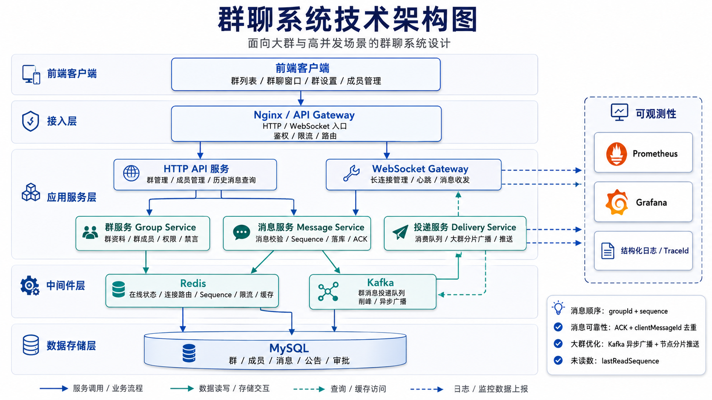

# GroupFlow / 群流

GroupFlow 是一个面向**大群高并发场景**的实时群聊系统。它把"群聊"里最难的部分——一条消息要在毫秒级内扇出（fanout）给成千上万名在线成员——作为第一性问题来设计，而不是把单聊方案简单地套用到群里。

普通群可以在发送链路里直接广播，但当群成员达到数千乃至数万时，同步广播会让发送接口耗时飙升、WebSocket 节点被打爆、Redis 与数据库被在线查询拖垮。GroupFlow 的核心思路是：**消息只存一份、发送与投递彻底解耦、投递按 WebSocket 节点分片批量进行、在线状态与路由全部下沉到 Redis**，从而让"发送"始终是一个轻量、可预测延迟的操作，而把扇出压力交给可异步削峰、可水平扩展的投递链路。

---

## 大群场景下的核心优化

这是 GroupFlow 区别于普通 IM Demo 的地方。下面每一项都已在代码中落地，而非停留在设计文档。

### 1. 消息只存一份，不做写扩散

群消息只写入 `group_message` 一张表，**不为每个成员复制一条收件箱记录**。消息顺序只依赖 `group_id + sequence`，未读数通过 `chat_group.max_sequence - group_member.last_read_sequence` 实时计算。这避免了大群里"一条消息放大成上万条写入"的灾难，也让历史消息天然可补拉、可重放。

### 2. 发送与投递解耦：Kafka 异步削峰

消息服务在发送链路里只做**参数校验、权限校验、幂等去重、生成 sequence、落库、返回 ACK**，随后把消息事件写入 Kafka 就立即返回。它**不查询群成员、不查询在线用户、不循环推送、不等待投递完成**。真正的扇出由独立的 Delivery Service 异步消费 Kafka 完成，发送峰值被队列削平，发送者的 ACK 不会被投递耗时拖慢。

### 3. 投递按 WebSocket 节点分片 + 批量推送

Delivery Service 拿到消息后，先从 Redis 查出群内在线成员，再查每个用户连接所在的 WebSocket 节点（`serverId`），**按节点分组后对每个节点发起一次批量内部推送**，而不是逐个连接 RPC。这把"N 个连接 N 次推送"压缩成"M 个节点 M 次批量推送"。

### 4. Redis 在线路由 + 多节点水平扩展

在线状态与连接路由全部维护在 Redis（`online:user:{userId}`、连接到 `serverId` 的映射）。每个 WebSocket 节点广播自己的内部推送地址（`server:{id}:push_url`），Delivery 据此跨节点路由。这意味着 WebSocket 网关可以无状态水平扩容，新增节点即新增承载能力，单节点部署时行为保持不变。

### 5. Outbox 事务性可靠投递

开启 Kafka 后，消息事件与消息落库在**同一个数据库事务**内写入 `message_outbox`，再由 API 进程内的后台 relay 轮询投递到 Kafka（失败指数退避重试）。这消除了"库写成功但 Kafka 发送失败导致实时漏推"的窗口；即便 relay 短暂落后，消息也已可见、可补拉。

### 6. 规避大群写放大：`@所有人` 不展开

`@某人` 会写入 `group_mention`；但大群里的 `@所有人` **不会同步展开成上万条提醒记录**，只在消息上标记 `mention_all=1`，并通过 Redis 做群维度限频。这同样是对写扩散的刻意规避。

### 7. 慢速模式、限流与热点群保护

慢速模式基于 Redis `rate_limit:group:{groupId}:user:{userId}` 的 TTL 限流实现；大群模式可由管理员开启或按规模自动判定，把消息投递切到异步分片链路。Kafka 以 `groupId` 作为分区 key 保证同群顺序，并预留了热点群拆分 Topic / 子分片的演进路径。

### 8. 游标分页，拒绝深分页

历史消息只支持 `beforeSequence / afterSequence` 游标，群成员只支持 id 游标分页，断线重连按 `afterSequence` 补拉。全链路没有 `OFFSET` 深分页，保证大数据量下的稳定延迟。

### 9. 分表预留

`group_message` 的读写都封装在 Repository 层，`MESSAGE_SHARD_COUNT > 1` 时按 `group_id` 哈希路由到 `group_message_NN` 物理分表，为单表写入瓶颈预留了水平拆分能力。

### 10. 搜索链路与投递主链路隔离

聊天历史搜索由 Elasticsearch 提供，通过**独立的 Kafka 消费者**（独立 consumer group）异步建索引，与实时投递主链路互不影响。即使 ES 故障或重建索引，也不会拖慢消息发送与投递。

---

## 功能概览

- **群管理**：群列表、群详情、创建群、加入群、加群审批（`joinMode=approval`）、解散群、退群
- **成员与权限**：群主 / 管理员 / 普通成员三级角色，成员游标分页，设置管理员、踢人
- **消息**：文本消息、系统消息、WebSocket 实时推送、服务端 ACK、`clientMessageId` 幂等去重、`group sequence` 严格有序
- **历史与未读**：历史消息游标分页、`lastReadSequence`、未读数、断线重连补拉
- **治理**：全员禁言、单人禁言、大群模式、慢速模式
- **互动**：`@提醒`（`@某人` / `@所有人`）、群公告、消息撤回（含审计表与广播事件）
- **搜索**：基于 Elasticsearch 的聊天历史搜索（关键词 / 成员 / 时间，单群或全局跨群），结果可跳转到群聊对应位置
- **文档与可观测性**：Swagger 在线接口文档、Prometheus 指标、Grafana 面板、Loki + Promtail 日志聚合

---

## 技术栈

| 层 | 技术 |
| --- | --- |
| 后端 | Go 1.23、Gin、Gorilla WebSocket、MySQL、Redis、Kafka、Elasticsearch、Zap、Prometheus |
| 前端 | React 18、TypeScript、Vite、Zustand、原生 WebSocket 封装、虚拟消息列表 |
| 基础设施 | Docker Compose、Nginx、Prometheus、Grafana、Loki、Promtail |

---

## 系统架构



当前为降低部署复杂度，API、WebSocket Gateway、Message Service 同进程运行；**Delivery Service 与 ES Indexer 是独立进程**，分别消费 Kafka 完成异步投递与建索引。后续可进一步拆出独立的 API、WS Gateway、Message Service 横向扩容。

---

## 目录结构

```text
GroupFlow
├── backend             # Go 后端
│   └── cmd
│       ├── api         # HTTP API + WebSocket Gateway + Message Service + Outbox relay
│       ├── delivery    # Delivery Service：消费 Kafka，分片批量投递
│       ├── es-indexer  # 独立消费者：把消息写入 Elasticsearch
│       └── es-backfill # 存量消息回填 ES（按主键游标 _bulk）
├── frontend            # React 前端
├── deploy              # MySQL / Kafka / Nginx / Prometheus / Grafana / Loki / ES 配置
├── docs                # 设计文档（架构、数据库、API、WebSocket、Redis、Kafka、大群投递等）
├── scripts             # 启动、压测辅助脚本
├── docker-compose.yml
└── .env.example
```

---

## 快速启动

需要本机安装 Docker 与 Docker Compose。

```bash
cp .env.example .env
docker compose up -d --build
```

启动后可访问：

| 服务 | 地址 | 说明 |
| --- | --- | --- |
| 前端 | http://localhost | 群聊 Web 界面 |
| API 健康检查 | http://localhost/api/v1/health | 探活 |
| Swagger 文档 | http://localhost/swagger/index.html | 在线接口文档 |
| WebSocket | ws://localhost/api/ws | 实时消息通道 |
| Prometheus | http://localhost:9090 | 指标 |
| Grafana | http://localhost:3000 | 面板，默认账号 `admin` / `admin` |
| Elasticsearch | http://localhost:9200 | 搜索后端 |
| Loki | http://localhost:3100 | 日志聚合 |

如果修改了 `deploy/mysql/init.sql`（例如更新表结构），需要重置数据卷后重启：

```bash
docker compose down -v
docker compose up -d --build
```

> 首次启动后如已有 ES 存量缺口，可执行 `docker compose run --rm groupflow-es-indexer /app/groupflow-es-backfill` 回填历史消息（或直接运行 `cmd/es-backfill`）。

---

## 本地开发

只用容器启动依赖，后端 / 前端跑在本机：

```bash
docker compose up -d mysql redis kafka kafka-init elasticsearch
```

后端：

```bash
cd backend
go mod tidy
go run ./cmd/api
# 可选：Kafka 异步投递消费者
go run ./cmd/delivery
# 可选：Elasticsearch 索引消费者
go run ./cmd/es-indexer
```

前端：

```bash
cd frontend
npm install
npm run dev
```

> 本地直连依赖时，请把 `.env` 中的 `mysql/redis/kafka/elasticsearch` 主机名改回 `localhost`（详见 `.env.example` 注释）。

### 测试账号

初始化 SQL 预置了 5 个用户：`user_001` ~ `user_005`。登录时只填用户名即可，方便多浏览器窗口联调。

---

## 配置说明

所有配置通过环境变量注入，`.env.example` 已给出 Docker Compose 下的可用默认值。关键项：

| 环境变量 | 默认值 | 说明 |
| --- | --- | --- |
| `KAFKA_ENABLED` | `true` | 开启后走 Outbox + Kafka 异步投递链路；关闭则由 router 直推（单节点行为不变） |
| `MESSAGE_SHARD_COUNT` | `1` | `group_message` 分表数。`1` 为单表；`>1` 按 `group_id` 哈希路由到 `group_message_NN`，需先建好物理分表 |
| `WS_ADVERTISE_PUSH_URL` | 同 `WS_INTERNAL_PUSH_URL` | 本 WS 节点对外暴露的内部推送地址，供 Delivery 跨节点路由 |
| `ES_ENABLED` | `true` | 是否启用搜索后端；关闭时搜索接口返回 `SEARCH_DISABLED` |
| `ES_ADDRS` | `http://elasticsearch:9200` | Elasticsearch 节点地址（逗号分隔） |
| `ES_INDEX` | `group_message` | 消息索引名 / 别名 |
| `ES_INDEXER_CONSUMER_GROUP` | `groupflow-es-indexer` | 索引消费者的独立 Kafka consumer group |

---

## 接口与协议

### Swagger

项目接入了 `github.com/swaggo/gin-swagger`，启动后访问 http://localhost/swagger/index.html 。重新生成文档：

```bash
cd backend
go install github.com/swaggo/swag/cmd/swag@latest
swag init -g cmd/api/main.go -o docs
```

### 聊天历史搜索

```text
GET /api/v1/search/messages?keyword=&groupId=&senderId=&startTime=&endTime=&cursor=&limit=
```

只能搜自己所在的群，且每群仅可见**加群之后**（`sequence >= join_sequence`）的消息；系统消息与已撤回消息不返回；使用 ES `search_after` 游标分页。点击结果跳转时，用 `GET /api/v1/groups/{groupId}/messages?aroundSequence={seq}` 拉取目标消息前后窗口。

### WebSocket 协议示例

连接：

```text
ws://localhost/api/ws?token={token}&deviceId=web_001&clientType=web&protocolVersion=v1
```

发送群消息：

```json
{
  "type": "group_message_send",
  "version": "v1",
  "requestId": "req_1710000000000_abc",
  "timestamp": 1710000000000,
  "data": {
    "groupId": 10001,
    "clientMessageId": "client_msg_1710000000000_abc",
    "messageType": "text",
    "content": "大家好",
    "mentionAll": false,
    "mentionUserIds": []
  }
}
```

服务端 ACK：

```json
{
  "type": "group_message_ack",
  "requestId": "req_1710000000000_abc",
  "timestamp": 1710000000001,
  "data": {
    "messageId": "msg_xxx",
    "clientMessageId": "client_msg_1710000000000_abc",
    "groupId": 10001,
    "sequence": 12,
    "status": "success"
  }
}
```

> ACK 只代表消息已校验并成功落库，**不代表所有成员都已实时收到**。实时投递失败由历史消息补拉兜底——这正是大群下"消息只存一份 + 可补拉"模型的可靠性边界。

---

## 可观测性

- **指标**：Prometheus 采集服务指标，Grafana（`admin` / `admin`）提供面板。大群场景重点关注 ACK P95、Delivery 投递延迟、Kafka 消费 lag、Redis 路由查询延迟。
- **日志**：服务结构化日志经 Promtail 收集进 Loki，可在 Grafana 中检索。

---

## 设计取舍与演进

当前 API、WebSocket Gateway、Message Service 同进程以降低部署复杂度，Delivery 与 ES Indexer 已独立成进程。后续演进方向：

- 拆分独立的 API / WS Gateway / Message Service / Delivery，按 `serverId` 分片推送。
- 热点群独立 Topic 或按 `groupId` 子分片，配合慢速模式降级。
- `group_message` 按 `group_id` 哈希分表 + 历史归档。
- 压测目标：1 万在线大群投递 P95 < 1s、发送 ACK P95 < 300ms、Kafka 不持续堆积。
```