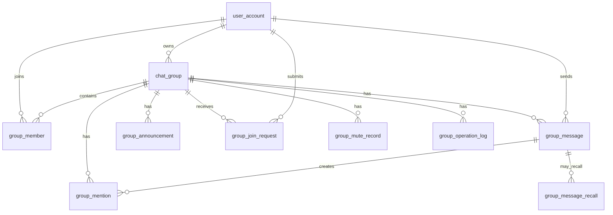

# 数据库详细设计文档

## 1. 文档说明

### 1.1 文档目的

本文档用于说明 GroupFlow 群聊系统的数据库设计方案，包括核心业务表、字段设计、索引设计、约束设计、核心查询方式、事务边界、大群性能优化和后续分库分表预留。

GroupFlow 是一个面向大群与高并发场景设计的实时群聊系统，当前系统只关注群聊，不设计单聊。

### 1.2 设计目标

数据库设计需要满足以下目标：

1. 支持群聊完整功能。
2. 支持群主、管理员、普通成员等角色权限。
3. 支持大群成员分页查询。
4. 支持群消息按 sequence 有序存储。
5. 支持历史消息游标分页。
6. 支持消息发送幂等。
7. 支持消息撤回。
8. 支持未读数计算。
9. 支持加群审批。
10. 支持群公告。
11. 支持禁言和慢速模式。
12. 为后续大群分表、归档、搜索预留扩展空间。

------

## 2. 数据库选型

### 2.1 主数据库

使用 MySQL 作为主数据库。

MySQL 负责存储：

1. 用户信息。
2. 群信息。
3. 群成员关系。
4. 群消息。
5. 群公告。
6. 加群申请。
7. 禁言记录。
8. @提醒记录。
9. 消息撤回记录。
10. 群操作审计记录。

### 2.2 缓存与高频状态

Redis 不作为主数据库，但会承担部分高频状态：

1. 群消息 sequence。
2. 群最大 sequence。
3. 用户在线状态。
4. WebSocket 连接路由。
5. 群配置缓存。
6. 慢速模式限流。
7. @所有人限频。

MySQL 是最终数据源，Redis 用于提升性能。

------

## 3. 数据库命名规范

### 3.1 表命名

表名使用小写下划线风格。

示例：

```text
chat_group
group_member
group_message
group_announcement
```

### 3.2 字段命名

字段名使用小写下划线风格。

示例：

```text
group_id
user_id
message_id
client_message_id
created_at
updated_at
```

### 3.3 索引命名

唯一索引：

```text
uk_字段名
```

普通索引：

```text
idx_字段名
```

联合索引：

```text
idx_字段1_字段2
```

示例：

```text
uk_group_user
idx_group_sequence
idx_user_status
```

------

## 4. 核心实体关系

### 4.1 实体列表

系统核心实体包括：

| 实体       | 表名                 | 说明               |
| ---------- | -------------------- | ------------------ |
| 用户       | user_account         | 系统用户           |
| 群         | chat_group           | 群基础信息         |
| 群成员     | group_member         | 用户与群的成员关系 |
| 群消息     | group_message        | 群内消息           |
| 群公告     | group_announcement   | 群公告             |
| 加群申请   | group_join_request   | 用户申请加入群     |
| 禁言记录   | group_mute_record    | 群成员禁言记录     |
| @提醒      | group_mention        | @某人或@所有人记录 |
| 消息撤回   | group_message_recall | 消息撤回记录       |
| 群操作日志 | group_operation_log  | 群管理操作审计     |

### 4.2 实体关系



------

## 5. 用户表：user_account

### 5.1 表说明

用户表用于保存系统用户基础信息。

当前项目重点是群聊，用户系统可以保持简单，主要用于登录、显示昵称、头像和关联群成员关系。

### 5.2 建表 SQL

```sql
CREATE TABLE user_account (
    id BIGINT PRIMARY KEY AUTO_INCREMENT COMMENT '用户ID',
    username VARCHAR(64) NOT NULL COMMENT '用户名',
    nickname VARCHAR(64) NOT NULL COMMENT '用户昵称',
    avatar VARCHAR(255) DEFAULT NULL COMMENT '头像地址',
    status VARCHAR(32) NOT NULL DEFAULT 'normal' COMMENT '用户状态：normal/banned/deleted',
    created_at DATETIME NOT NULL COMMENT '创建时间',
    updated_at DATETIME NOT NULL COMMENT '更新时间',

    UNIQUE KEY uk_username (username),
    INDEX idx_status (status)
) ENGINE=InnoDB DEFAULT CHARSET=utf8mb4 COMMENT='用户表';
```

### 5.3 字段说明

| 字段       | 类型         | 说明       |
| ---------- | ------------ | ---------- |
| id         | BIGINT       | 用户 ID    |
| username   | VARCHAR(64)  | 登录用户名 |
| nickname   | VARCHAR(64)  | 展示昵称   |
| avatar     | VARCHAR(255) | 用户头像   |
| status     | VARCHAR(32)  | 用户状态   |
| created_at | DATETIME     | 创建时间   |
| updated_at | DATETIME     | 更新时间   |

### 5.4 状态说明

| 状态    | 说明   |
| ------- | ------ |
| normal  | 正常   |
| banned  | 被封禁 |
| deleted | 已删除 |

------

## 6. 群表：chat_group

### 6.1 表说明

群表用于保存群基础信息、群配置和群状态。

### 6.2 建表 SQL

```sql
CREATE TABLE chat_group (
    id BIGINT PRIMARY KEY AUTO_INCREMENT COMMENT '群ID',
    name VARCHAR(64) NOT NULL COMMENT '群名称',
    avatar VARCHAR(255) DEFAULT NULL COMMENT '群头像',
    description VARCHAR(255) DEFAULT NULL COMMENT '群简介',
    owner_id BIGINT NOT NULL COMMENT '群主用户ID',

    group_type VARCHAR(32) NOT NULL DEFAULT 'normal' COMMENT '群类型：normal/large',
    join_mode VARCHAR(32) NOT NULL DEFAULT 'approval' COMMENT '入群方式：direct/approval/invite',
    status VARCHAR(32) NOT NULL DEFAULT 'normal' COMMENT '群状态：normal/dismissed/banned/archived',

    mute_all TINYINT NOT NULL DEFAULT 0 COMMENT '是否全员禁言：0否，1是',
    slow_mode_seconds INT NOT NULL DEFAULT 0 COMMENT '慢速模式秒数，0表示关闭',
    allow_member_invite TINYINT NOT NULL DEFAULT 1 COMMENT '是否允许普通成员邀请：0否，1是',
    mention_all_role VARCHAR(32) NOT NULL DEFAULT 'admin' COMMENT '@所有人权限：owner/admin/disabled',

    member_count INT NOT NULL DEFAULT 1 COMMENT '群成员数量',
    max_member_count INT NOT NULL DEFAULT 500 COMMENT '最大成员数量',

    created_at DATETIME NOT NULL COMMENT '创建时间',
    updated_at DATETIME NOT NULL COMMENT '更新时间',

    INDEX idx_owner_id (owner_id),
    INDEX idx_status (status),
    INDEX idx_group_type (group_type),
    INDEX idx_updated_at (updated_at)
) ENGINE=InnoDB DEFAULT CHARSET=utf8mb4 COMMENT='群表';
```

### 6.3 字段说明

| 字段                | 说明                 |
| ------------------- | -------------------- |
| id                  | 群 ID                |
| name                | 群名称               |
| avatar              | 群头像               |
| description         | 群简介               |
| owner_id            | 群主 ID              |
| group_type          | 群类型，普通群或大群 |
| join_mode           | 入群方式             |
| status              | 群状态               |
| mute_all            | 是否全员禁言         |
| slow_mode_seconds   | 慢速模式配置         |
| allow_member_invite | 是否允许成员邀请     |
| mention_all_role    | @所有人的权限        |
| member_count        | 群成员数量           |
| max_member_count    | 最大成员数量         |

### 6.4 群类型

| 类型   | 说明   |
| ------ | ------ |
| normal | 普通群 |
| large  | 大群   |

### 6.5 入群方式

| 方式     | 说明     |
| -------- | -------- |
| direct   | 直接加入 |
| approval | 审批加入 |
| invite   | 邀请加入 |

### 6.6 群状态

| 状态      | 说明       |
| --------- | ---------- |
| normal    | 正常       |
| dismissed | 已解散     |
| banned    | 被系统封禁 |
| archived  | 已归档     |

### 6.7 设计原因

1. `group_type` 用于区分普通群和大群，大群会限制已读详情、成员列表加载和 @所有人频率。
2. `mute_all` 用于快速判断全员禁言，不需要额外查配置表。
3. `slow_mode_seconds` 用于支持大群慢速模式。
4. `member_count` 用于快速展示群人数，避免每次 count 群成员表。
5. `max_member_count` 用于控制群规模。
6. `mention_all_role` 用于控制 @所有人权限。

------

## 7. 群成员表：group_member

### 7.1 表说明

群成员表用于保存用户与群的成员关系、角色、成员状态、禁言状态和读取位置。

这是群聊系统的核心表之一。

### 7.2 建表 SQL

```sql
CREATE TABLE group_member (
    id BIGINT PRIMARY KEY AUTO_INCREMENT COMMENT '主键ID',
    group_id BIGINT NOT NULL COMMENT '群ID',
    user_id BIGINT NOT NULL COMMENT '用户ID',

    role VARCHAR(32) NOT NULL DEFAULT 'member' COMMENT '角色：owner/admin/member',
    nickname VARCHAR(64) DEFAULT NULL COMMENT '群内昵称',
    status VARCHAR(32) NOT NULL DEFAULT 'normal' COMMENT '成员状态：normal/exited/kicked',

    last_read_sequence BIGINT NOT NULL DEFAULT 0 COMMENT '最后已读消息序号',
    mute_until DATETIME DEFAULT NULL COMMENT '禁言截止时间，NULL表示未禁言',

    joined_at DATETIME NOT NULL COMMENT '入群时间',
    exited_at DATETIME DEFAULT NULL COMMENT '退群时间',
    created_at DATETIME NOT NULL COMMENT '创建时间',
    updated_at DATETIME NOT NULL COMMENT '更新时间',

    UNIQUE KEY uk_group_user (group_id, user_id),
    INDEX idx_user_status (user_id, status),
    INDEX idx_group_role (group_id, role),
    INDEX idx_group_status_id (group_id, status, id),
    INDEX idx_group_last_read (group_id, last_read_sequence)
) ENGINE=InnoDB DEFAULT CHARSET=utf8mb4 COMMENT='群成员表';
```

### 7.3 字段说明

| 字段               | 说明                              |
| ------------------ | --------------------------------- |
| group_id           | 群 ID                             |
| user_id            | 用户 ID                           |
| role               | 群内角色                          |
| nickname           | 群内昵称                          |
| status             | 成员状态                          |
| last_read_sequence | 用户在该群最后读到的消息 sequence |
| mute_until         | 禁言截止时间                      |
| joined_at          | 入群时间                          |
| exited_at          | 退群或被踢时间                    |

### 7.4 角色说明

| 角色   | 说明     |
| ------ | -------- |
| owner  | 群主     |
| admin  | 管理员   |
| member | 普通成员 |

### 7.5 成员状态

| 状态   | 说明     |
| ------ | -------- |
| normal | 正常     |
| exited | 已退出   |
| kicked | 已被踢出 |

### 7.6 核心索引说明

| 索引                | 作用                                   |
| ------------------- | -------------------------------------- |
| uk_group_user       | 保证一个用户在一个群里只有一条成员关系 |
| idx_user_status     | 查询用户加入的群列表                   |
| idx_group_role      | 查询群管理员                           |
| idx_group_status_id | 群成员分页                             |
| idx_group_last_read | 计算某条消息已读人数                   |

### 7.7 设计原因

1. 使用 `last_read_sequence` 记录用户读取位置，避免每条消息都写一条已读记录。
2. 使用 `mute_until` 支持单人成员禁言。
3. 使用 `status` 保留退群、踢出记录，便于审计和后续扩展。
4. 使用 `uk_group_user` 避免重复加入群。

------

## 8. 群消息表：group_message

### 8.1 表说明

群消息表用于存储群内所有消息，包括文本消息、系统消息、撤回后的消息记录。

这是系统中数据量最大的表。

### 8.2 建表 SQL

```sql
CREATE TABLE group_message (
    id BIGINT PRIMARY KEY AUTO_INCREMENT COMMENT '主键ID',
    message_id VARCHAR(64) NOT NULL COMMENT '服务端消息ID',
    group_id BIGINT NOT NULL COMMENT '群ID',
    sender_id BIGINT NOT NULL COMMENT '发送者用户ID',

    client_message_id VARCHAR(128) NOT NULL COMMENT '客户端消息ID，用于幂等',
    message_type VARCHAR(32) NOT NULL COMMENT '消息类型：text/system/image/file/quote',
    content TEXT DEFAULT NULL COMMENT '消息内容',

    sequence BIGINT NOT NULL COMMENT '群内递增消息序号',
    status VARCHAR(32) NOT NULL DEFAULT 'normal' COMMENT '消息状态：normal/recalled/deleted',

    mention_all TINYINT NOT NULL DEFAULT 0 COMMENT '是否@所有人',
    mention_user_ids JSON DEFAULT NULL COMMENT '@用户ID列表',

    recalled_at DATETIME DEFAULT NULL COMMENT '撤回时间',
    created_at DATETIME NOT NULL COMMENT '创建时间',
    updated_at DATETIME NOT NULL COMMENT '更新时间',

    UNIQUE KEY uk_message_id (message_id),
    UNIQUE KEY uk_sender_client_msg (sender_id, client_message_id),
    UNIQUE KEY uk_group_sequence (group_id, sequence),
    INDEX idx_group_sequence (group_id, sequence),
    INDEX idx_group_created (group_id, created_at),
    INDEX idx_sender_created (sender_id, created_at)
) ENGINE=InnoDB DEFAULT CHARSET=utf8mb4 COMMENT='群消息表';
```

### 8.3 字段说明

| 字段                                                         | 说明                |
| ------------------------------------------------------------ | ------------------- |
| message_id                                                   | 服务端生成的消息 ID |
| group_id                                                     | 群 ID               |
| sender_id                                                    | 发送者 ID           |
| client_message_id                                            | 客户端生成的消息 ID |
| message_type                                                 | 消息类型            |
| content                                                      | 消息内容            |
| sequence                                                     | 群内递增消息序号    |
| status                                                       | 消息状态            |
| xxxxxxxxxx 1. 数据库设计文档2. WebSocket 协议设计文档3. 消息发送与投递链路设计文档4. 大群性能优化设计文档5. 压测方案设计文档6. 前后端开发任务拆解文档text | 是否 @所有人        |
| mention_user_ids                                             | @用户列表           |
| recalled_at                                                  | 消息撤回时间        |

### 8.4 消息类型

| 类型   | 说明               |
| ------ | ------------------ |
| text   | 文本消息           |
| system | 系统消息           |
| image  | 图片消息，后续扩展 |
| file   | 文件消息，后续扩展 |
| quote  | 引用消息，后续扩展 |

### 8.5 消息状态

| 状态     | 说明   |
| -------- | ------ |
| normal   | 正常   |
| recalled | 已撤回 |
| deleted  | 已删除 |

### 8.6 核心索引说明

| 索引                 | 作用                         |
| -------------------- | ---------------------------- |
| uk_message_id        | 根据 messageId 查询消息      |
| uk_sender_client_msg | 保证消息发送幂等             |
| uk_group_sequence    | 保证同一个群内 sequence 唯一 |
| idx_group_sequence   | 历史消息游标分页             |
| idx_group_created    | 按时间查询群消息             |
| idx_sender_created   | 查询用户发送记录             |

### 8.7 设计原因

1. `sequence` 是群内消息顺序的唯一依据，不能依赖 `created_at` 排序。
2. `client_message_id` 用于解决客户端超时重试导致的重复发送问题。
3. `uk_sender_client_msg` 保证同一个发送者的同一个客户端消息只会落库一次。
4. `status` 用于撤回和删除，不建议物理删除消息。
5. `mention_user_ids` 存 JSON 适合初期实现；如果需要复杂查询，使用 `group_mention` 表。

------

## 9. 群公告表：group_announcement

### 9.1 表说明

群公告表用于保存群公告内容。

### 9.2 建表 SQL

```sql
CREATE TABLE group_announcement (
    id BIGINT PRIMARY KEY AUTO_INCREMENT COMMENT '公告ID',
    group_id BIGINT NOT NULL COMMENT '群ID',
    creator_id BIGINT NOT NULL COMMENT '创建人ID',
    title VARCHAR(128) DEFAULT NULL COMMENT '公告标题',
    content TEXT NOT NULL COMMENT '公告内容',
    pinned TINYINT NOT NULL DEFAULT 0 COMMENT '是否置顶',
    status VARCHAR(32) NOT NULL DEFAULT 'normal' COMMENT '状态：normal/deleted',
    created_at DATETIME NOT NULL COMMENT '创建时间',
    updated_at DATETIME NOT NULL COMMENT '更新时间',

    INDEX idx_group_status_created (group_id, status, created_at)
) ENGINE=InnoDB DEFAULT CHARSET=utf8mb4 COMMENT='群公告表';
```

### 9.3 设计原因

1. 公告可以多条保存，方便查看历史公告。
2. `pinned` 用于展示当前置顶公告。
3. 大群公告读多写少，最新公告可以缓存到 Redis。

------

## 10. 加群申请表：group_join_request

### 10.1 表说明

加群申请表用于保存用户申请加入群的记录。

### 10.2 建表 SQL

```sql
CREATE TABLE group_join_request (
    id BIGINT PRIMARY KEY AUTO_INCREMENT COMMENT '申请ID',
    group_id BIGINT NOT NULL COMMENT '群ID',
    user_id BIGINT NOT NULL COMMENT '申请人ID',
    reason VARCHAR(255) DEFAULT NULL COMMENT '申请理由',

    status VARCHAR(32) NOT NULL DEFAULT 'pending' COMMENT '状态：pending/approved/rejected/canceled',
    reviewer_id BIGINT DEFAULT NULL COMMENT '审批人ID',
    review_remark VARCHAR(255) DEFAULT NULL COMMENT '审批备注',
    review_time DATETIME DEFAULT NULL COMMENT '审批时间',

    created_at DATETIME NOT NULL COMMENT '创建时间',
    updated_at DATETIME NOT NULL COMMENT '更新时间',

    INDEX idx_group_status_created (group_id, status, created_at),
    INDEX idx_user_status_created (user_id, status, created_at)
) ENGINE=InnoDB DEFAULT CHARSET=utf8mb4 COMMENT='加群申请表';
```

### 10.3 状态说明

| 状态     | 说明   |
| -------- | ------ |
| pending  | 待审批 |
| approved | 已通过 |
| rejected | 已拒绝 |
| canceled | 已取消 |

### 10.4 设计原因

1. 支持管理员审批加群。
2. 保留审批记录，方便追溯。
3. 避免重复 pending 申请可以在业务层控制，也可以增加约束表辅助控制。

------

## 11. 禁言记录表：group_mute_record

### 11.1 表说明

禁言记录表用于保存成员禁言和解除禁言操作记录。

当前是否禁言以 `group_member.mute_until` 为准，`group_mute_record` 负责记录历史操作。

### 11.2 建表 SQL

```sql
CREATE TABLE group_mute_record (
    id BIGINT PRIMARY KEY AUTO_INCREMENT COMMENT '禁言记录ID',
    group_id BIGINT NOT NULL COMMENT '群ID',
    user_id BIGINT NOT NULL COMMENT '被禁言用户ID',
    operator_id BIGINT NOT NULL COMMENT '操作人ID',

    action VARCHAR(32) NOT NULL COMMENT '操作：mute/unmute',
    mute_until DATETIME DEFAULT NULL COMMENT '禁言截止时间',
    reason VARCHAR(255) DEFAULT NULL COMMENT '原因',

    created_at DATETIME NOT NULL COMMENT '创建时间',

    INDEX idx_group_user_created (group_id, user_id, created_at),
    INDEX idx_operator_created (operator_id, created_at)
) ENGINE=InnoDB DEFAULT CHARSET=utf8mb4 COMMENT='群禁言记录表';
```

### 11.3 设计原因

1. `group_member.mute_until` 用于快速判断是否禁言。
2. `group_mute_record` 用于保存操作历史。
3. 禁言操作属于管理行为，应保留审计记录。

------

## 12. @提醒表：group_mention

### 12.1 表说明

@提醒表用于记录哪些用户被某条消息 @。

如果只需要简单展示，可以直接使用 `group_message.mention_user_ids`。如果需要做“@我列表”“未读 @提醒”“点击跳转到消息”，建议使用独立表。

### 12.2 建表 SQL

```sql
CREATE TABLE group_mention (
    id BIGINT PRIMARY KEY AUTO_INCREMENT COMMENT '@记录ID',
    group_id BIGINT NOT NULL COMMENT '群ID',
    message_id VARCHAR(64) NOT NULL COMMENT '消息ID',
    sequence BIGINT NOT NULL COMMENT '消息序号',
    user_id BIGINT NOT NULL COMMENT '被@用户ID',

    mention_type VARCHAR(32) NOT NULL DEFAULT 'user' COMMENT '类型：user/all',
    read_status TINYINT NOT NULL DEFAULT 0 COMMENT '是否已读：0未读，1已读',

    created_at DATETIME NOT NULL COMMENT '创建时间',
    updated_at DATETIME NOT NULL COMMENT '更新时间',

    UNIQUE KEY uk_message_user (message_id, user_id),
    INDEX idx_user_group_read (user_id, group_id, read_status),
    INDEX idx_group_sequence (group_id, sequence)
) ENGINE=InnoDB DEFAULT CHARSET=utf8mb4 COMMENT='群@提醒表';
```

### 12.3 设计原因

1. 支持群列表展示“有人@我”。
2. 支持点击 @提醒跳转到具体消息。
3. 支持统计当前用户未读 @消息。
4. `mention_all` 可以按需要展开为多条用户提醒，也可以只存一条特殊提醒记录。

### 12.4 大群注意事项

大群中 @所有人不建议给每个成员都插入一条 `group_mention` 记录，否则会造成写放大。

推荐策略：

1. @某人：为被 @ 的用户插入记录。
2. @所有人：不展开到所有成员，只在消息表记录 `mention_all = 1`，并在群会话层做提示。
3. 如果必须做 @所有人提醒，可以异步生成摘要，不进行同步批量插入。

------

## 13. 消息撤回记录表：group_message_recall

### 13.1 表说明

消息撤回记录表用于保存撤回操作历史。

当前消息是否撤回以 `group_message.status = recalled` 为准，撤回表用于审计。

### 13.2 建表 SQL

```sql
CREATE TABLE group_message_recall (
    id BIGINT PRIMARY KEY AUTO_INCREMENT COMMENT '撤回记录ID',
    group_id BIGINT NOT NULL COMMENT '群ID',
    message_id VARCHAR(64) NOT NULL COMMENT '消息ID',
    operator_id BIGINT NOT NULL COMMENT '操作人ID',
    sender_id BIGINT NOT NULL COMMENT '原发送人ID',
    reason VARCHAR(255) DEFAULT NULL COMMENT '撤回原因',
    created_at DATETIME NOT NULL COMMENT '创建时间',

    UNIQUE KEY uk_message_id (message_id),
    INDEX idx_group_created (group_id, created_at),
    INDEX idx_operator_created (operator_id, created_at)
) ENGINE=InnoDB DEFAULT CHARSET=utf8mb4 COMMENT='群消息撤回记录表';
```

### 13.3 设计原因

1. `group_message.status` 控制消息展示。
2. `group_message_recall` 保存撤回审计。
3. 管理员撤回他人消息时可以记录原因。

------

## 14. 群操作日志表：group_operation_log

### 14.1 表说明

群操作日志表用于记录关键群管理行为，方便审计和排查问题。

### 14.2 建表 SQL

```sql
CREATE TABLE group_operation_log (
    id BIGINT PRIMARY KEY AUTO_INCREMENT COMMENT '日志ID',
    group_id BIGINT NOT NULL COMMENT '群ID',
    operator_id BIGINT NOT NULL COMMENT '操作人ID',
    target_user_id BIGINT DEFAULT NULL COMMENT '目标用户ID',

    operation_type VARCHAR(64) NOT NULL COMMENT '操作类型',
    operation_detail JSON DEFAULT NULL COMMENT '操作详情',

    created_at DATETIME NOT NULL COMMENT '创建时间',

    INDEX idx_group_created (group_id, created_at),
    INDEX idx_operator_created (operator_id, created_at),
    INDEX idx_target_user_created (target_user_id, created_at)
) ENGINE=InnoDB DEFAULT CHARSET=utf8mb4 COMMENT='群操作日志表';
```

### 14.3 操作类型示例

| 类型           | 说明         |
| -------------- | ------------ |
| create_group   | 创建群       |
| update_group   | 修改群信息   |
| dismiss_group  | 解散群       |
| join_group     | 加入群       |
| leave_group    | 退出群       |
| kick_member    | 踢出成员     |
| set_admin      | 设置管理员   |
| unset_admin    | 取消管理员   |
| mute_member    | 禁言成员     |
| unmute_member  | 解除禁言     |
| mute_all       | 全员禁言     |
| unmute_all     | 解除全员禁言 |
| recall_message | 撤回消息     |

------

## 15. 核心查询设计

## 15.1 查询用户群列表

### 业务场景

用户登录后，需要查询自己加入的群。

### SQL 示例

```sql
SELECT
    g.id,
    g.name,
    g.avatar,
    g.group_type,
    g.status,
    m.role,
    m.last_read_sequence
FROM group_member m
JOIN chat_group g ON m.group_id = g.id
WHERE m.user_id = ?
  AND m.status = 'normal'
ORDER BY m.updated_at DESC
LIMIT ?;
```

### 依赖索引

```text
group_member.idx_user_status
chat_group.PRIMARY
```

------

## 15.2 查询群成员列表

### 业务场景

群成员管理页面分页展示成员。

### SQL 示例

```sql
SELECT
    m.id,
    m.group_id,
    m.user_id,
    m.role,
    m.nickname,
    m.status,
    m.mute_until,
    m.joined_at
FROM group_member m
WHERE m.group_id = ?
  AND m.status = 'normal'
  AND m.id > ?
ORDER BY m.id ASC
LIMIT ?;
```

### 依赖索引

```text
group_member.idx_group_status_id
```

### 设计原因

使用游标分页，不使用深分页。

不推荐：

```sql
SELECT *
FROM group_member
WHERE group_id = ?
LIMIT 100000, 50;
```

------

## 15.3 查询最近历史消息

### 业务场景

用户进入群聊时加载最近 20 条消息。

### SQL 示例

```sql
SELECT *
FROM group_message
WHERE group_id = ?
ORDER BY sequence DESC
LIMIT ?;
```

前端展示时需要按 sequence 升序排列。

### 依赖索引

```text
group_message.idx_group_sequence
```

------

## 15.4 向上加载更早消息

### 业务场景

用户向上滚动加载历史消息。

### SQL 示例

```sql
SELECT *
FROM group_message
WHERE group_id = ?
  AND sequence < ?
ORDER BY sequence DESC
LIMIT ?;
```

### 依赖索引

```text
group_message.idx_group_sequence
```

------

## 15.5 断线后补拉消息

### 业务场景

用户 WebSocket 断线后重新连接，需要补拉遗漏消息。

### SQL 示例

```sql
SELECT *
FROM group_message
WHERE group_id = ?
  AND sequence > ?
ORDER BY sequence ASC
LIMIT ?;
```

### 依赖索引

```text
group_message.idx_group_sequence
```

------

## 15.6 消息幂等查询

### 业务场景

客户端发送消息后 ACK 丢失，用户点击重试。

### SQL 示例

```sql
SELECT *
FROM group_message
WHERE sender_id = ?
  AND client_message_id = ?
LIMIT 1;
```

### 依赖索引

```text
group_message.uk_sender_client_msg
```

------

## 15.7 计算未读数

### 业务场景

群列表展示未读数。

### 计算方式

```text
unread_count = group_max_sequence - last_read_sequence
```

其中：

1. `last_read_sequence` 来自 `group_member`。
2. `group_max_sequence` 建议来自 Redis。
3. 如果 Redis 缺失，可以查询 `group_message` 最大 sequence。

### MySQL 兜底查询

```sql
SELECT MAX(sequence)
FROM group_message
WHERE group_id = ?;
```

### 依赖索引

```text
group_message.idx_group_sequence
```

------

## 15.8 查询某条消息已读人数

### 业务场景

普通群展示某条消息的已读人数。

### SQL 示例

```sql
SELECT COUNT(*)
FROM group_member
WHERE group_id = ?
  AND status = 'normal'
  AND last_read_sequence >= ?;
```

### 依赖索引

```text
group_member.idx_group_last_read
```

### 大群限制

大群不建议频繁执行该查询，也不建议展示完整已读名单。

------

## 16. 核心写入流程

## 16.1 创建群

### 操作步骤

1. 插入 `chat_group`。
2. 插入 `group_member`，角色为 owner。
3. 插入一条系统消息到 `group_message`。
4. 插入群操作日志。

### 事务要求

以上操作必须在同一个事务中完成。

### 原因

避免出现群创建成功但群主成员关系不存在的问题。

------

## 16.2 发送群消息

### 操作步骤

1. 校验用户是否是群成员。
2. 校验群状态。
3. 校验禁言状态。
4. 检查 `sender_id + client_message_id` 是否已存在。
5. 从 Redis 获取 group sequence。
6. 插入 `group_message`。
7. 更新 Redis 群最大 sequence。
8. 写入 Kafka 投递事件。

### MySQL 写入

```sql
INSERT INTO group_message (
    message_id,
    group_id,
    sender_id,
    client_message_id,
    message_type,
    content,
    sequence,
    status,
    mention_all,
    mention_user_ids,
    created_at,
    updated_at
) VALUES (?, ?, ?, ?, ?, ?, ?, 'normal', ?, ?, NOW(), NOW());
```

### 幂等处理

如果插入时触发唯一索引 `uk_sender_client_msg`，说明该消息已经处理过。

此时应该查询原消息并返回原结果，而不是报错给客户端。

------

## 16.3 更新已读位置

### 操作步骤

1. 校验用户是群成员。
2. 校验传入 sequence 大于当前 `last_read_sequence`。
3. 更新 `group_member.last_read_sequence`。
4. 可同步更新 Redis 缓存。

### SQL 示例

```sql
UPDATE group_member
SET last_read_sequence = ?,
    updated_at = NOW()
WHERE group_id = ?
  AND user_id = ?
  AND last_read_sequence < ?;
```

### 设计原因

`last_read_sequence` 只能前进，不能倒退。

------

## 16.4 审批加群

### 操作步骤

1. 查询加群申请。
2. 校验申请状态为 pending。
3. 校验审批人是群主或管理员。
4. 更新申请状态。
5. 如果审批通过，插入或更新 `group_member`。
6. 更新 `chat_group.member_count`。
7. 插入系统消息。
8. 插入群操作日志。

### 事务要求

审批状态更新、成员关系写入、群人数更新需要在同一个事务中完成。

------

## 16.5 踢出成员

### 操作步骤

1. 校验操作者权限。
2. 校验目标成员存在。
3. 校验不能踢出群主。
4. 更新 `group_member.status = kicked`。
5. 更新 `chat_group.member_count`。
6. 插入系统消息。
7. 插入群操作日志。

### 事务要求

成员状态更新、群人数更新、系统消息、操作日志建议放在同一个事务内。

------

## 16.6 撤回消息

### 操作步骤

1. 查询消息。
2. 校验消息属于该群。
3. 校验撤回权限。
4. 更新 `group_message.status = recalled`。
5. 插入 `group_message_recall`。
6. 插入系统消息或发送撤回事件。
7. 写入 Kafka 推送撤回事件。

### SQL 示例

```sql
UPDATE group_message
SET status = 'recalled',
    recalled_at = NOW(),
    updated_at = NOW()
WHERE message_id = ?
  AND status = 'normal';
```

------

## 17. 事务边界设计

### 17.1 必须使用事务的场景

| 场景     | 原因                           |
| -------- | ------------------------------ |
| 创建群   | 群和群主成员关系必须一致       |
| 审批加群 | 申请状态和成员关系必须一致     |
| 踢出成员 | 成员状态和群人数必须一致       |
| 解散群   | 群状态和系统消息必须一致       |
| 禁言成员 | 成员禁言状态和禁言记录必须一致 |
| 撤回消息 | 消息状态和撤回记录必须一致     |

### 17.2 不建议放入事务的操作

以下操作不建议放入 MySQL 事务：

1. Redis 写入。
2. Kafka 投递。
3. WebSocket 推送。
4. 外部服务调用。

### 17.3 原因

事务内执行外部依赖会导致事务时间过长，增加锁等待和死锁风险。

对于 Kafka 投递可靠性，可以后续使用 Outbox 模式解决。

------

## 18. 大群场景数据库优化

## 18.1 群成员分页

大群成员必须使用游标分页。

推荐：

```sql
SELECT *
FROM group_member
WHERE group_id = ?
  AND status = 'normal'
  AND id > ?
ORDER BY id ASC
LIMIT ?;
```

不推荐：

```sql
SELECT *
FROM group_member
WHERE group_id = ?
ORDER BY id ASC
LIMIT 100000, 50;
```

------

## 18.2 历史消息分页

历史消息必须通过 `group_id + sequence` 游标分页。

推荐：

```sql
SELECT *
FROM group_message
WHERE group_id = ?
  AND sequence < ?
ORDER BY sequence DESC
LIMIT ?;
```

------

## 18.3 未读数设计

不为每个用户每条消息写已读记录。

推荐：

```text
group_member.last_read_sequence
```

未读数：

```text
group_max_sequence - last_read_sequence
```

------

## 18.4 @所有人设计

大群中 @所有人不展开成所有成员的提醒记录。

推荐：

1. 在 `group_message` 中设置 `mention_all = 1`。
2. 群列表根据消息状态展示 @所有人。
3. 必要时异步生成少量摘要记录。
4. 不同步插入几十万条 `group_mention`。

------

## 18.5 群消息表分表预留

`group_message` 是数据量最大的表，需要预留分表方案。

可选方案：

### 方案一：按 group_id 哈希分表

```text
group_message_00
group_message_01
...
group_message_63
```

路由规则：

```text
table_index = group_id % 64
```

优点：

1. 单表数据量可控。
2. 按群查询性能稳定。
3. 符合群消息查询模式。

缺点：

1. 超级大群可能形成单表热点。
2. 跨群统计不方便。

### 方案二：按时间分表

```text
group_message_2026_01
group_message_2026_02
```

优点：

1. 便于历史归档。
2. 便于删除过期数据。

缺点：

1. 查询某个群的连续消息可能跨表。
2. 需要处理跨月份查询。

### 推荐

初期使用单表，代码层通过 repository 封装。

后续优先考虑：

```text
按 group_id 哈希分表 + 历史消息归档
```

------

## 19. Redis 与 MySQL 数据关系

### 19.1 Redis 存储内容

| Redis Key                    | MySQL 来源             | 说明                |
| ---------------------------- | ---------------------- | ------------------- |
| group:{groupId}:sequence     | group_message.sequence | 当前群 sequence     |
| group:{groupId}:max_sequence | group_message.sequence | 当前群最大 sequence |
| group:{groupId}:config       | chat_group             | 群配置缓存          |
| online:user:{userId}         | 无                     | 在线状态            |
| rate_limit:*                 | 无                     | 限流状态            |

### 19.2 Redis 不是最终数据源

Redis 数据丢失后，应可以从 MySQL 恢复：

1. 群配置从 `chat_group` 恢复。
2. 群最大 sequence 从 `group_message` 查询 `MAX(sequence)` 恢复。
3. 在线状态不需要恢复，用户重连后重新注册。
4. 限流状态不需要恢复。

------

## 20. 数据一致性设计

### 20.1 群人数一致性

`chat_group.member_count` 是冗余字段。

更新场景：

1. 用户加入群，member_count + 1。
2. 用户退出群，member_count - 1。
3. 用户被踢出，member_count - 1。

需要定期校准：

```sql
SELECT COUNT(*)
FROM group_member
WHERE group_id = ?
  AND status = 'normal';
```

### 20.2 消息 sequence 一致性

sequence 由 Redis `INCR` 生成。

可能出现的问题：

1. Redis sequence 增加成功，但 MySQL 写入失败，导致 sequence 跳号。
2. 跳号不影响消息顺序，但客户端如果严格检测连续 sequence，需要特殊处理。

建议：

1. 允许 sequence 跳号。
2. 客户端发现缺口后补拉。
3. 如果补拉不到缺失 sequence，服务端返回无更多消息，客户端继续展示。

如果必须保证无跳号，需要引入更复杂的 sequence 服务，不建议初期实现。

### 20.3 消息投递一致性

消息发送成功以 MySQL 落库为准。

Kafka 投递失败时，用户仍可通过历史消息补拉。

后续可以通过 Outbox 表提升投递可靠性。

------

## 21. Outbox 事件表预留

### 21.1 表说明

Outbox 表用于解决“数据库写入成功，但 Kafka 发送失败”的问题。

初期可以不实现，但建议预留设计。

### 21.2 建表 SQL

```sql
CREATE TABLE message_outbox (
    id BIGINT PRIMARY KEY AUTO_INCREMENT COMMENT '事件ID',
    event_id VARCHAR(64) NOT NULL COMMENT '事件唯一ID',
    event_type VARCHAR(64) NOT NULL COMMENT '事件类型',
    aggregate_type VARCHAR(64) NOT NULL COMMENT '聚合类型，例如 group_message',
    aggregate_id VARCHAR(64) NOT NULL COMMENT '聚合ID，例如 message_id',
    payload JSON NOT NULL COMMENT '事件内容',

    status VARCHAR(32) NOT NULL DEFAULT 'pending' COMMENT '状态：pending/sent/failed',
    retry_count INT NOT NULL DEFAULT 0 COMMENT '重试次数',
    next_retry_at DATETIME DEFAULT NULL COMMENT '下次重试时间',

    created_at DATETIME NOT NULL COMMENT '创建时间',
    updated_at DATETIME NOT NULL COMMENT '更新时间',

    UNIQUE KEY uk_event_id (event_id),
    INDEX idx_status_retry (status, next_retry_at)
) ENGINE=InnoDB DEFAULT CHARSET=utf8mb4 COMMENT='消息事件Outbox表';
```

### 21.3 使用流程

1. 在消息落库事务中同时写入 Outbox 事件。
2. 后台任务扫描 pending 事件。
3. 发送 Kafka。
4. 发送成功后更新 status = sent。
5. 发送失败后增加 retry_count，并设置 next_retry_at。

------

## 22. 初始化建表顺序

推荐建表顺序：

```text
1. user_account
2. chat_group
3. group_member
4. group_message
5. group_announcement
6. group_join_request
7. group_mute_record
8. group_mention
9. group_message_recall
10. group_operation_log
11. message_outbox
```

------

## 23. 一期必须实现的表

一期建议必须实现：

```text
user_account
chat_group
group_member
group_message
group_join_request
group_announcement
group_mute_record
group_message_recall
group_operation_log
```

可选实现：

```text
group_mention
message_outbox
```

如果一期想做 @我提醒，建议实现 `group_mention`。

如果一期想训练可靠消息事件投递，建议实现 `message_outbox`。

------

## 24. 总结

GroupFlow 的数据库设计核心是：

1. `chat_group` 保存群基础信息和群配置。
2. `group_member` 保存成员关系、角色、状态和 lastReadSequence。
3. `group_message` 保存群消息，并通过 groupId + sequence 保证顺序。
4. `client_message_id` 解决消息发送幂等问题。
5. `last_read_sequence` 解决群未读数问题，避免每条消息每个用户写一条已读记录。
6. 历史消息查询必须使用 groupId + sequence 游标分页。
7. 大群成员查询必须使用游标分页。
8. 大群 @所有人不能同步展开成海量提醒记录。
9. 群消息表需要预留按 group_id 哈希分表方案。
10. Redis 负责高频状态，MySQL 负责最终持久化。
11. Kafka 投递可靠性可通过 Outbox 表增强。

这套数据库设计可以支撑 GroupFlow 的群聊核心能力，并为后续大群、高并发和分布式架构演进预留空间。