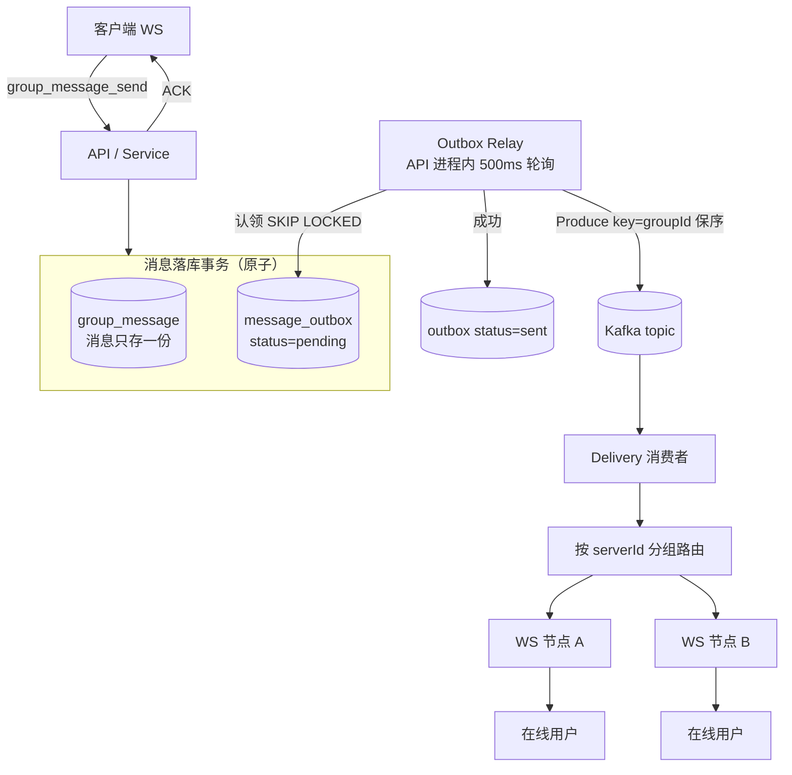
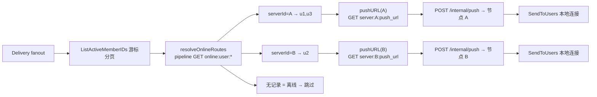
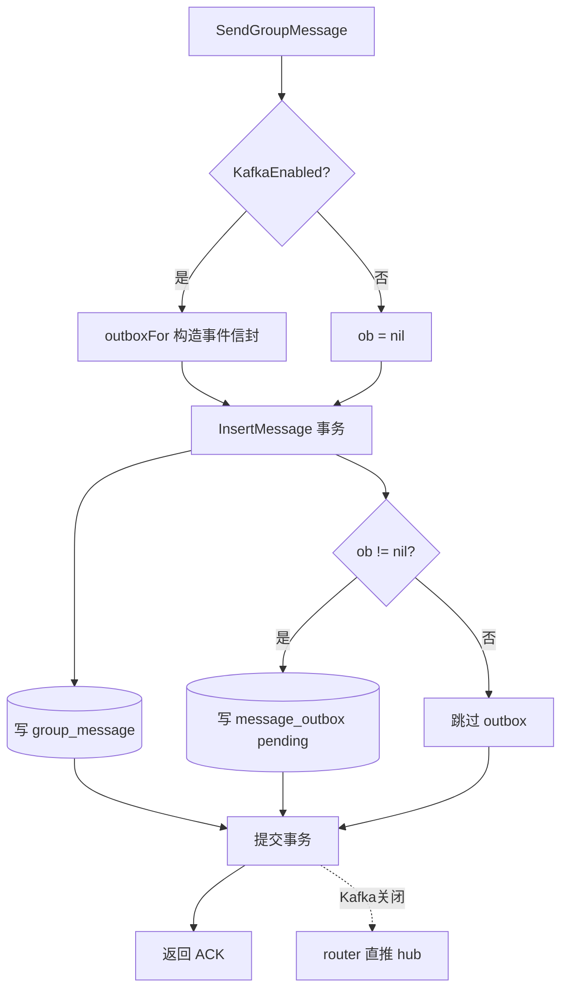
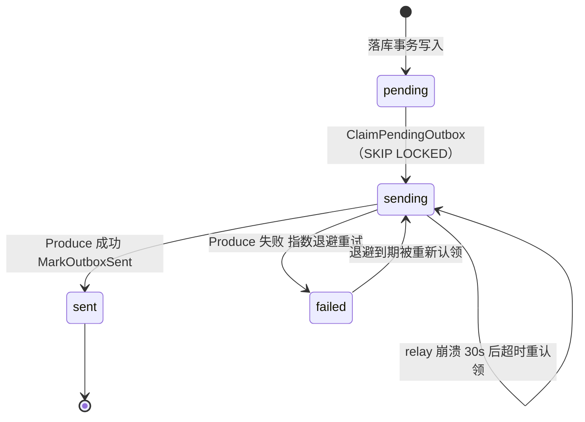
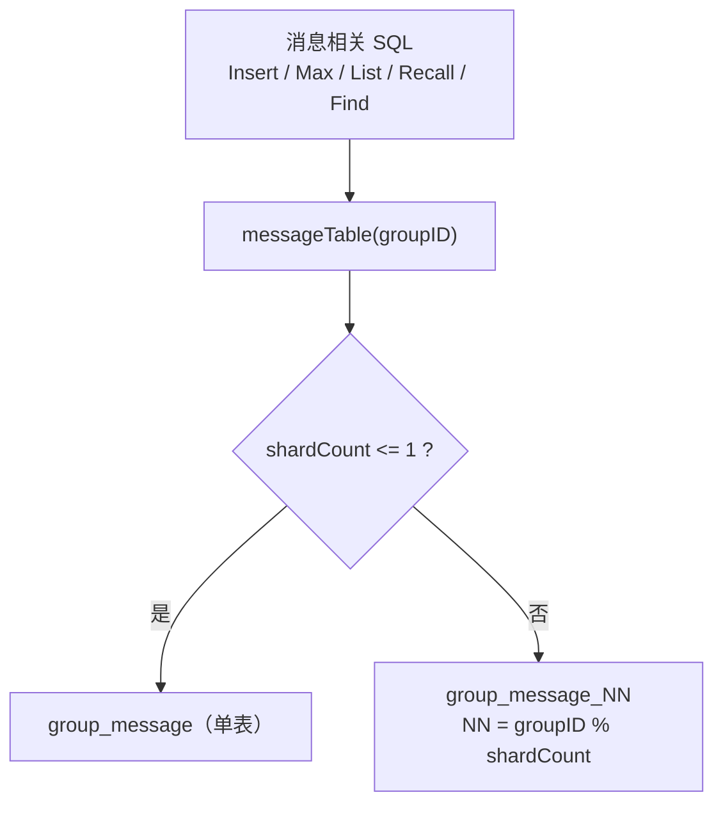

# 大群投递可靠性、多节点在线路由与分表预留增强

## 背景

针对大群投递链路的代码审查发现，"消息只存一份 / Kafka 异步投递 / Delivery 批量推送 / Redis 在线路由 /
游标分页 / 慢速模式限流 / Repository 分表预留" 七项能力中，有几处实现与设计意图存在偏差，
在多节点部署或故障场景下会导致消息漏推、重复送达失败或序号冲突。本次修改在保持 **完全向后兼容**
（默认 `KAFKA_ENABLED=false`、`MESSAGE_SHARD_COUNT=1`、单节点时行为不变）的前提下，补齐这些短板。

## 解决的主要问题

### 一、正确性修复

1. **群内 sequence 冷启动竞态**：`nextSequence` 原先 `SetNX(key,0)` 后再异步 `Set(key, dbMax)`，
   并发请求会在置 0 与回填 dbMax 之间 `INCR` 拿到 `sequence=1`，与已有消息冲突，触发
   `uk_group_sequence` 唯一键冲突导致发送偶发失败。
2. **群公告游标分页失效**：`ListAnnouncements` 用 `id>cursor` 配 `ORDER BY id DESC`，方向相反，
   第二页会重复第一页数据（数据量小时偶然"看起来正常"）。
3. **死配置 / 死写入**：`DIRECT_PUSH_WHEN_KAFKA_DISABLED` 从未被读取（直推实际只看 `KafkaEnabled`）；
   `group:%d:max_sequence` 这个 Redis key 只写不读。

### 二、Kafka 投递可靠性（无 Outbox → 有 Outbox）

原先消息落库后同步 `Produce` 到 Kafka，失败仅打日志即吞掉；消费端 `handle` 失败也照常 commit。
Kafka 抖动会造成实时投递永久丢失（仅靠客户端 `afterSequence` 补拉兜底）。`message_outbox` 表已在
schema 预留但完全未使用。

### 三、Redis 在线路由名不副实

`online:user→serverId`、`connection:%s:server` 等路由元数据被写入，但 Delivery 只用 `online:user`
做存在性判断，然后把所有用户 POST 到 **单一** `InternalPushURL`。多节点部署时，连接在其它 WS 节点的
用户永远收不到推送。

### 四、Repository 无分表接缝

所有 SQL 硬编码 `FROM group_message`，没有表名路由钩子，后续分表需重写全部消息 SQL。

## 设计方案

### 总体数据流

> Kafka 关闭时不写 outbox、relay 为 no-op，由 router 在 API 进程内直推 hub（单节点行为不变）。

### A. 多节点在线路由（按 serverId 路由到用户所在节点）

- 新增配置 `WSAdvertisePushURL`（环境变量 `WS_ADVERTISE_PUSH_URL`，默认回退到 `InternalPushURL`），
  即"其它进程访问本节点 `/internal/push` 的地址"。
- WS Hub 在 `renewRedis` 中额外写入 `server:%s:push_url`（TTL 90s，随其余在线 key 一起续期）。
- Delivery 将 `filterOnline` 改为 `resolveOnlineRoutes`：按 `online:user:%d` 记录的 serverId 把在线
  用户分组；`pushURL(serverId)` 解析各节点的 `server:%s:push_url`（缺失回退默认地址）；`fanout`
  按节点分别批量（500/批）推送，并在单次 fanout 内缓存 URL。单节点下所有用户落在同一 serverId、
  同一 URL，行为与改造前一致。

### B. Outbox 事务消息 + 后台 relay

- 领域层新增 `OutboxEvent`（入库）与 `OutboxRow`（投递）。
- Repository：`InsertMessage` / `RecallMessage` 接受 `*OutboxEvent`，通过 `insertOutboxTx` 在
  **同一事务** 内写入 `message_outbox`，保证"消息已存储 ⇔ 事件已入队"原子性。新增
  `ClaimPendingOutbox`（`FOR UPDATE SKIP LOCKED` 认领 pending/failed/超时 sending 记录并置
  sending，30s 重认领窗口，多 relay 实例与崩溃恢复均安全）、`MarkOutboxSent`、`MarkOutboxRetry`。
- Service：以 `outboxFor` 取代原先的同步 `PublishEvent`（信封结构与消费端一致，Kafka 关闭时返回
  nil 走 router 直推）；新增 `RunOutboxRelay`（500ms 轮询，按 groupId 为 key 投递以保证群内有序，
  成功标记 sent，失败指数退避重试，上限 60s）。
- `cmd/api/main.go` 后台启动 `RunOutboxRelay`（Kafka 关闭时为 no-op）。

发送路径（Kafka 开关分支）：

Outbox 记录状态机（relay 驱动）：

### C. Repository 分表接缝（默认单表）

- 新增配置 `MessageShardCount`（环境变量 `MESSAGE_SHARD_COUNT`，默认 1）。
- `Repository` 持有 `shardCount`，`New(db, shardCount)`；`messageTable(groupID)` 在 count≤1 时返回
  `group_message`，否则按 `groupID % count` 路由到 `group_message_NN`。所有 `group_message` 相关
  SQL 经此路由；`FindMessageByID` / `FindMessageByClientID` 增加 `groupID` 入参以便选片。
- 不创建物理分表、不做数据迁移（仅接缝预留）；默认 1 时一切等价于改造前。开启 `>1` 前需先建
  `group_message_NN` 物理表。

## 涉及文件

- `backend/internal/config/config.go` — 新增 `WSAdvertisePushURL`、`MessageShardCount`；移除死配置 `DirectPush`
- `backend/internal/domain/models.go` — `OutboxEvent`、`OutboxRow`
- `backend/internal/ws/ws.go` — 广播 `server:%s:push_url`
- `backend/internal/delivery/delivery.go` — 按 serverId 路由 fanout、`push(url,...)`、`FindMessageByID` 带 groupId
- `backend/internal/repo/repo.go` — 分表 helper、签名调整、Outbox 方法与事务内写入、公告分页修正
- `backend/internal/service/service.go` — Outbox 构造与 relay、sequence 冷启动原子化、移除死写入与内联 produce
- `backend/cmd/api/main.go` / `backend/cmd/delivery/main.go` — 传入 shardCount、启动 relay

## 验证

- `cd backend && go build ./... && go vet ./...` 均通过。
- 默认配置（无 Kafka、单分片、单节点）行为与改造前一致：登录、WS 发消息、ACK、直推、历史分页正常。
- Kafka 开启：发消息后 `message_outbox` 出现 pending→sent；停 Kafka 期间消息照常落库、outbox 累积
  retry，恢复后 relay 排空为 sent。
- 多节点：A/B 用户分别连接不同 `SERVER_ID`，消息按各自 `server:%s:push_url` 分别投递。
