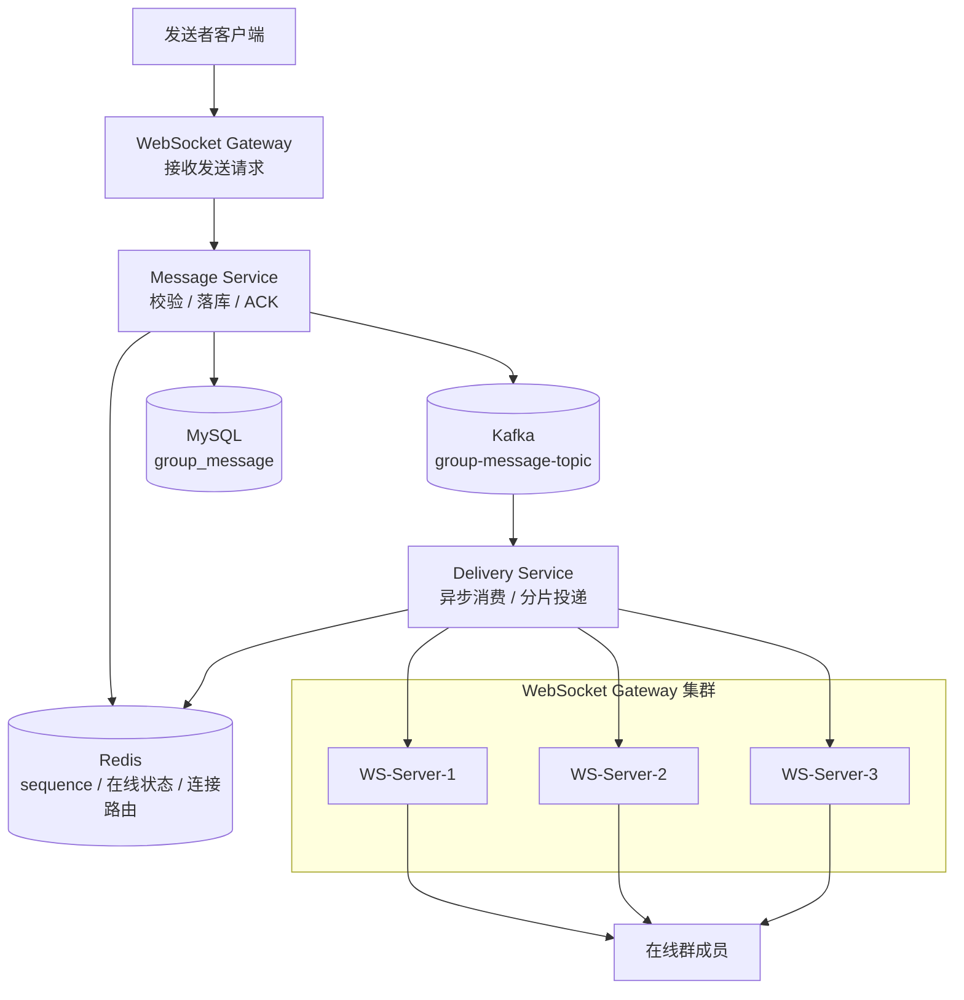

# 大群投递详细设计文档

## 1. 文档说明

### 1.1 文档目的

本文档用于说明 GroupFlow 群聊系统在大群场景下的消息投递设计。

大群投递是 GroupFlow 的核心高并发设计之一。普通群可以直接广播，但大群不能在消息发送链路中同步推送给所有成员，否则会导致发送延迟升高、WebSocket 服务压力过大、Redis 查询压力过高、数据库查询压力过高。

本文档重点说明：

1. 大群投递目标。
2. 大群与普通群投递差异。
3. Kafka 消息队列设计。
4. Delivery Service 消费设计。
5. 在线成员筛选。
6. Redis 连接路由。
7. 按 WebSocket 节点分片。
8. 批量推送。
9. 推送失败处理。
10. 热点群保护。
11. 大群限流与慢速模式。
12. 指标监控和压测目标。

------

## 2. 大群定义

### 2.1 大群判断标准

满足以下任一条件，可以认为是大群：

```text
1. 群成员数 >= 500
2. 群在线人数 >= 300
3. 群消息发送 QPS 超过阈值
4. 群被管理员手动设置为大群模式
```

### 2.2 大群等级

可以按规模划分：

| 类型   | 成员数       | 在线人数     | 说明                   |
| ------ | ------------ | ------------ | ---------------------- |
| 普通群 | 1 - 500      | 1 - 300      | 可直接投递             |
| 中型群 | 500 - 5000   | 300 - 2000   | 建议异步投递           |
| 大群   | 5000 - 50000 | 2000 - 10000 | 必须异步分片投递       |
| 超大群 | 50000+       | 10000+       | 需要热点保护和降级策略 |

------

## 3. 设计目标

### 3.1 功能目标

大群投递需要支持：

```text
在线用户实时收到消息
离线用户不上线时不生成离线消息
用户重连后可以补拉遗漏消息
消息按照 groupId + sequence 排序
服务端支持多 WebSocket 节点
消息投递支持异步削峰
推送失败不影响消息最终可见
```

### 3.2 性能目标

目标参考：

| 指标                         | 目标                   |
| ---------------------------- | ---------------------- |
| 1 万在线用户大群消息投递 P95 | < 1000ms               |
| 单群消息发送 ACK P95         | < 300ms                |
| WebSocket 单节点推送批量     | 500 - 1000 用户 / 批   |
| Kafka 消费延迟               | 可监控，不能持续堆积   |
| 推送失败率                   | 可观测，可通过补拉恢复 |

### 3.3 可靠性目标

大群消息可靠性遵循：

```text
消息成功落库后即认为发送成功。
实时投递失败时，用户可以通过历史消息补拉恢复。
不要求每个在线用户都强一致实时收到。
不为每个离线用户生成离线消息记录。
```

------

## 4. 大群投递核心原则

### 4.1 消息服务不直接广播

消息服务只负责：

```text
参数校验
权限校验
幂等处理
sequence 生成
消息落库
返回 ACK
写入 Kafka
```

消息服务不负责：

```text
查询所有群成员
查询所有在线用户
循环 WebSocket 推送
等待投递完成
```

原因：

1. 大群 fanout 高。
2. 同步广播会拉高发送接口耗时。
3. 发送者 ACK 会被投递耗时拖慢。
4. 容易导致消息服务线程堆积。

------

### 4.2 在线用户实时推送

只对在线用户做实时投递。

在线状态来自 Redis。

离线用户不上线时不做实时投递，也不生成独立收件箱。

------

### 4.3 离线用户上线后补拉

离线用户重新进入群聊时，通过历史消息接口补拉。

```text
GET /api/groups/{groupId}/messages?afterSequence={lastReceivedSequence}&limit=100
```

------

### 4.4 大群消息只存一份

群消息只存储在 `group_message` 表中。

不为每个成员复制消息。

未读数通过：

```text
group_max_sequence - last_read_sequence
```

计算。

------

### 4.5 按 WebSocket 节点分片推送

投递服务不会直接逐个连接推送，而是：

```text
在线用户列表
  ↓
根据 Redis 连接路由获取 serverId
  ↓
按 serverId 分组
  ↓
对每个 WebSocket 节点发起批量推送
```

------

## 5. 总体架构

### 5.1 架构图



### 5.2 投递链路

```text
消息落库成功
  ↓
Message Service 发送 Kafka 事件
  ↓
Delivery Service 消费 Kafka
  ↓
查询群在线成员
  ↓
查询用户连接路由
  ↓
按 serverId 分组
  ↓
分批调用 WebSocket Gateway 内部推送接口
  ↓
WebSocket Gateway 推送给本机连接
```

------

## 6. Kafka 设计

## 6.1 Topic 设计

大群消息投递使用 Topic：

```text
group-message-topic
```

后续可以拆分：

```text
group-message-normal-topic
group-message-large-topic
group-message-hot-topic
```

### 6.2 初期 Topic 推荐

一期建议先使用一个 Topic：

```text
group-message-topic
```

通过事件中的 `groupType` 或 `memberCount` 区分普通群和大群。

------

## 6.3 Kafka 消息结构

```json
{
  "eventId": "evt_100000001",
  "eventType": "group_message_created",
  "groupId": 10001,
  "groupType": "large",
  "message": {
    "messageId": "msg_100000001",
    "groupId": 10001,
    "senderId": 1001,
    "senderName": "张三",
    "senderAvatar": "https://example.com/avatar.png",
    "messageType": "text",
    "content": "大家好，今天讨论大群投递设计。",
    "sequence": 100201,
    "status": "normal",
    "mentionAll": false,
    "mentionUserIds": [1002, 1003],
    "createdAt": "2026-06-28T10:00:00.000Z"
  },
  "createdAt": "2026-06-28T10:00:00.000Z"
}
```

------

## 6.4 Kafka 分区 Key

推荐使用：

```text
groupId
```

原因：

1. 同一个群的消息进入同一个分区。
2. 同一个群消息消费顺序更稳定。
3. 有利于按 sequence 顺序投递。

### 6.5 潜在问题

如果某个群非常热，所有消息都进入同一个分区，可能形成热点。

后续优化方案：

1. 超级热点群单独 Topic。
2. 超级热点群单独分区策略。
3. 同群消息仍按 sequence 排序，但投递任务可以拆分并行。
4. 对热点群开启慢速模式降低 QPS。

------

## 7. Delivery Service 设计

## 7.1 模块职责

Delivery Service 是大群投递核心模块。

职责：

```text
消费 Kafka 消息
识别群类型
查询在线成员
查询连接路由
按 WebSocket 节点分组
分批推送
记录投递结果
处理失败和降级
```

------

## 7.2 内部结构

```text
Delivery Service
├── KafkaConsumer
├── GroupMemberResolver
├── OnlineUserResolver
├── RouteResolver
├── FanoutPlanner
├── PushDispatcher
├── RetryHandler
└── MetricsCollector
```

### 7.3 组件职责

| 组件                | 职责                            |
| ------------------- | ------------------------------- |
| KafkaConsumer       | 消费 Kafka 群消息事件           |
| GroupMemberResolver | 获取群成员或群在线成员          |
| OnlineUserResolver  | 判断成员是否在线                |
| RouteResolver       | 查询用户所在 WebSocket 节点     |
| FanoutPlanner       | 按 serverId 生成投递计划        |
| PushDispatcher      | 调用 WebSocket 节点内部推送接口 |
| RetryHandler        | 处理可重试失败                  |
| MetricsCollector    | 记录投递指标                    |

------

## 7.4 消费流程

```text
KafkaConsumer 收到事件
  ↓
解析事件
  ↓
校验事件类型
  ↓
根据 groupId 获取群配置
  ↓
判断普通群 / 大群 / 热点群
  ↓
获取目标在线用户
  ↓
按 serverId 分组
  ↓
分批推送
  ↓
记录指标
  ↓
提交 Kafka offset
```

------

## 8. 在线成员筛选设计

大群投递的关键问题是：

```text
如何快速知道这个群里哪些用户在线？
```

有几种方案。

------

## 8.1 方案一：查群成员 + 查在线状态

流程：

```text
查询 group_member 获取群成员
  ↓
批量查询 Redis online:user:{userId}
  ↓
过滤在线用户
```

### 优点

1. 实现简单。
2. 数据准确。
3. 不需要维护群在线集合。

### 缺点

1. 大群每条消息都查成员成本高。
2. 10 万成员大群查询压力很大。
3. Redis MGET key 数量过大。

### 适用场景

```text
普通群
中型群
一期版本
```

------

## 8.2 方案二：维护群在线成员集合

Redis Key：

```text
group:{groupId}:online_users
```

用户进入群或连接恢复时，加入集合：

```text
SADD group:{groupId}:online_users {userId}
```

用户离线或退出群时，移除集合：

```text
SREM group:{groupId}:online_users {userId}
```

投递时：

```text
SMEMBERS group:{groupId}:online_users
```

### 优点

1. 投递时不需要查全部成员。
2. 只处理在线用户。
3. 适合大群。

### 缺点

1. 维护成本高。
2. 异常断线可能导致脏数据。
3. 多端连接、切换群页面时状态复杂。
4. 超大群 SMEMBERS 也可能很大。

### 适用场景

```text
大群
活跃群
在线人数远小于成员总数的群
```

------

## 8.3 方案三：按 WebSocket 节点维护群在线集合

Redis Key：

```text
group:{groupId}:online_servers
group:{groupId}:server:{serverId}:users
```

示例：

```text
group:10001:online_servers = [ws-1, ws-2, ws-3]

group:10001:server:ws-1:users = [1001, 1002, 1003]
group:10001:server:ws-2:users = [2001, 2002]
```

投递时：

```text
1. 查询 group:{groupId}:online_servers
2. 对每个 serverId 查询对应在线用户集合
3. 直接生成按 serverId 分组的投递任务
```

### 优点

1. 投递天然按 WebSocket 节点分组。
2. 减少 RouteResolver 查询成本。
3. 适合大群分片推送。

### 缺点

1. 维护逻辑更复杂。
2. WebSocket 节点上下线时需要清理。
3. 用户多端连接时需要额外处理。
4. Redis 数据结构更多。

### 适用场景

```text
大群高并发版本
多 WebSocket 节点部署
```

------

## 8.4 推荐演进路径

一期：

```text
方案一：查成员 + 批量查在线状态
```

二期：

```text
方案二：维护 group online users
```

三期：

```text
方案三：按 serverId 维护群在线集合
```

推荐不要一开始就做方案三，复杂度较高。可以先把接口抽象好，后续替换实现。

------

## 9. Redis 连接路由设计

## 9.1 基础连接路由

如果每个用户只允许一个连接：

```text
online:user:{userId} -> serverId
```

示例：

```text
online:user:1001 -> ws-server-01
```

------

## 9.2 多端连接路由

如果允许多端在线，需要维护 connection 级别路由。

```text
online:user:{userId}:connections -> connectionId set
connection:{connectionId} -> serverId
```

示例：

```text
online:user:1001:connections = [conn_1, conn_2]

connection:conn_1 -> ws-server-01
connection:conn_2 -> ws-server-03
```

投递时需要把同一用户的多个连接都推送。

------

## 9.3 WebSocket 节点本机连接

每个 WebSocket Gateway 在内存中维护：

```text
connectionId -> Connection
userId -> connectionId list
```

投递服务不会直接拿到连接对象，只会调用对应 WS 节点的内部推送接口。

------

## 9.4 Redis Key TTL

连接路由建议设置 TTL，并由心跳续期。

原因：

1. 避免异常宕机导致在线状态永久残留。
2. 降低脏路由影响。
3. 用户重连后会重新写入路由。

示例：

```text
connection:{connectionId} TTL = 90s
online:user:{userId}:connections TTL = 90s
```

心跳成功后续期。

------

## 10. Fanout 投递计划设计

## 10.1 投递计划定义

投递计划是将一条群消息转换成多个 WebSocket 节点推送任务。

示例：

```json
{
  "groupId": 10001,
  "messageId": "msg_100000001",
  "sequence": 100201,
  "plans": [
    {
      "serverId": "ws-server-01",
      "targetUserIds": [1001, 1002, 1003]
    },
    {
      "serverId": "ws-server-02",
      "targetUserIds": [2001, 2002]
    }
  ]
}
```

------

## 10.2 计划生成流程

```text
获取在线用户
  ↓
查询用户连接路由
  ↓
过滤无路由用户
  ↓
按 serverId 分组
  ↓
按 batchSize 拆批
  ↓
生成 PushTask
```

------

## 10.3 PushTask 结构

```go
type PushTask struct {
    GroupID       int64
    MessageID     string
    Sequence      int64
    ServerID      string
    TargetUserIDs []int64
    Payload       WSMessage
}
```

------

## 10.4 批大小

推荐配置：

```text
普通群：100 - 500
大群：500 - 1000
超大群：根据压测动态调整
```

过小的问题：

1. 请求数量过多。
2. Delivery Service 调用 WS 节点压力大。

过大的问题：

1. 单次内部推送耗时长。
2. 出错影响范围大。
3. WS 节点瞬时压力高。

------

## 11. WebSocket Gateway 内部推送接口

## 11.1 内部推送接口

```text
POST /internal/ws/push
```

### 11.2 请求体

```json
{
  "requestId": "push_100000001",
  "groupId": 10001,
  "messageId": "msg_100000001",
  "sequence": 100201,
  "targetUserIds": [1001, 1002, 1003],
  "message": {
    "type": "group_message_receive",
    "requestId": "",
    "timestamp": 1710000000200,
    "data": {
      "groupId": 10001,
      "messageId": "msg_100000001",
      "senderId": 1008,
      "senderName": "张三",
      "messageType": "text",
      "content": "大家好",
      "sequence": 100201,
      "status": "normal",
      "createdAt": "2026-06-28T10:00:00.000Z"
    }
  }
}
```

### 11.3 响应体

```json
{
  "requestId": "push_100000001",
  "serverId": "ws-server-01",
  "successCount": 2,
  "failedCount": 1,
  "notFoundCount": 0,
  "successUserIds": [1001, 1002],
  "failedUserIds": [1003],
  "notFoundUserIds": []
}
```

------

## 11.4 内部推送处理流程

```text
WS 节点收到内部推送请求
  ↓
遍历 targetUserIds
  ↓
根据 userId 找本机连接
  ↓
找到连接则写入 SendChan
  ↓
写入失败则记录 failed
  ↓
找不到连接则记录 notFound
  ↓
返回推送结果
```

------

## 11.5 SendChan 设计

每个连接维护一个发送通道：

```go
type Connection struct {
    ConnID   string
    UserID   int64
    SendChan chan []byte
}
```

推送时不要直接阻塞写 WebSocket 网络连接。

推荐：

```text
Delivery -> WS 内部接口 -> SendChan -> 写协程 -> WebSocket 连接
```

------

## 11.6 SendChan 满了怎么办

如果某个连接的 SendChan 已满，说明该客户端消费能力不足。

处理策略：

1. 记录推送失败。
2. 可断开该慢连接。
3. 客户端重连后补拉。
4. 不要无限阻塞服务端。

推荐：

```text
写 SendChan 超过 100ms 失败，则认为该连接不可用。
```

------

## 12. 投递失败处理

## 12.1 失败类型

| 失败类型       | 说明             | 处理方式               |
| -------------- | ---------------- | ---------------------- |
| 连接不存在     | Redis 路由脏数据 | 清理路由，用户后续补拉 |
| SendChan 满    | 客户端消费慢     | 可断开连接             |
| WS 节点不可用  | 节点故障         | 记录失败，可短暂重试   |
| 内部请求超时   | 网络或节点压力   | 记录失败，可重试       |
| Kafka 重复消费 | 消息重复投递     | 客户端 messageId 去重  |

------

## 12.2 不强制投递到每个用户成功

大群场景不建议对每个用户强制投递成功。

原因：

1. 成本极高。
2. 容易放大故障。
3. 群消息已落库，用户可以补拉。
4. 大群实时性可以是最终可恢复，不是强一致。

------

## 12.3 短暂重试策略

对于 WS 节点级别失败，可以短暂重试。

推荐：

```text
最多重试 2 次
间隔 100ms / 300ms
```

不推荐无限重试。

### 12.4 用户级失败不重试

对于单个用户连接不存在、SendChan 满等问题，不做用户级重试。

原因：

1. 用户可能已离线。
2. 连接状态变化频繁。
3. 用户级重试会造成巨大任务量。
4. 补拉机制可以恢复。

------

## 13. 投递顺序设计

### 13.1 Kafka 消费顺序

Kafka 分区 Key 使用 `groupId`，同一个群消息尽量进入同一个分区。

这样可以保证同群消息的消费顺序。

------

### 13.2 投递顺序不做强保证

即使 Kafka 消费有序，以下因素仍可能导致客户端接收乱序：

1. 不同 WS 节点推送耗时不同。
2. 网络延迟不同。
3. 客户端处理速度不同。
4. 内部推送批次不同。

因此客户端必须按 `sequence` 排序。

------

### 13.3 客户端负责乱序修正

客户端收到消息后：

```text
1. 按 sequence 插入。
2. 检测 sequence 缺口。
3. 触发补拉。
4. 补拉不到则接受跳号。
```

------

## 14. 热点群保护设计

## 14.1 热点群判断

一个群可以被判定为热点群，如果满足：

```text
消息 QPS 高
在线人数高
fanout 数量高
Kafka lag 持续增加
Delivery Service 投递延迟高
WS 节点推送失败率高
```

### 14.2 热点指标

| 指标                 | 示例阈值 |
| -------------------- | -------- |
| group_message_qps    | > 100/s  |
| group_online_users   | > 10000  |
| fanout_per_second    | > 500000 |
| delivery_latency_p95 | > 2000ms |
| kafka_lag            | 持续增长 |
| push_failed_rate     | > 5%     |

------

## 14.3 保护手段

热点群可启用以下策略：

```text
自动开启慢速模式
限制 @所有人
降低推送优先级
批量合并非核心事件
只推送核心消息
关闭单条消息已读统计
限制普通成员发言频率
提示客户端进入大群模式
```

------

## 14.4 慢速模式

Redis Key：

```text
rate_limit:group:{groupId}:user:{userId}
```

规则：

```text
普通成员每 N 秒只能发送 1 条消息
```

慢速模式在 Message Service 发送前校验，不在 Delivery Service 处理。

------

## 14.5 @所有人限频

Redis Key：

```text
rate_limit:group:{groupId}:mention_all
rate_limit:user:{userId}:mention_all
```

规则示例：

```text
单群每小时最多 10 次 @所有人
单管理员每小时最多 3 次 @所有人
```

------

## 15. 大群降级设计

## 15.1 降级目标

当系统压力较大时，优先保证：

```text
消息成功落库
发送者收到 ACK
用户可以通过历史消息看到消息
```

可以牺牲：

```text
实时推送速度
单条已读详情
完整在线成员列表
非核心系统事件实时性
```

------

## 15.2 降级策略

| 场景            | 降级策略                       |
| --------------- | ------------------------------ |
| Kafka lag 高    | 开启慢速模式，限制发送 QPS     |
| WS 推送失败率高 | 减少非核心事件推送             |
| Redis 延迟高    | 降低在线人数精确统计频率       |
| 前端消息过多    | 客户端合并渲染，显示新消息提示 |
| 群过热          | 限制普通成员发言频率           |

------

## 15.3 非核心事件延迟

以下事件可以降低优先级：

```text
成员加入群
成员退出群
群公告更新提醒
在线人数变化
已读状态更新
```

以下事件必须优先：

```text
普通聊天消息
消息撤回事件
用户被踢事件
群解散事件
```

------

## 16. 数据结构设计

## 16.1 Kafka Event

```go
type GroupMessageCreatedEvent struct {
    EventID   string       `json:"eventId"`
    EventType string       `json:"eventType"`
    GroupID   int64        `json:"groupId"`
    GroupType string       `json:"groupType"`
    Message   GroupMessage `json:"message"`
    CreatedAt string       `json:"createdAt"`
}
```

## 16.2 GroupMessage

```go
type GroupMessage struct {
    MessageID      string  `json:"messageId"`
    GroupID        int64   `json:"groupId"`
    SenderID       int64   `json:"senderId"`
    SenderName     string  `json:"senderName"`
    SenderAvatar   string  `json:"senderAvatar,omitempty"`
    MessageType    string  `json:"messageType"`
    Content        string  `json:"content"`
    Sequence       int64   `json:"sequence"`
    Status         string  `json:"status"`
    MentionAll     bool    `json:"mentionAll"`
    MentionUserIDs []int64 `json:"mentionUserIds"`
    CreatedAt      string  `json:"createdAt"`
}
```

## 16.3 PushTask

```go
type PushTask struct {
    GroupID       int64
    MessageID     string
    Sequence      int64
    ServerID      string
    TargetUserIDs []int64
    Payload       WSMessage
}
```

## 16.4 PushResult

```go
type PushResult struct {
    ServerID        string
    SuccessCount    int
    FailedCount     int
    NotFoundCount   int
    SuccessUserIDs  []int64
    FailedUserIDs   []int64
    NotFoundUserIDs []int64
}
```

------

## 17. 关键伪代码

## 17.1 Delivery Service 主流程

```go
func HandleGroupMessageCreated(ctx context.Context, event GroupMessageCreatedEvent) error {
    groupID := event.GroupID

    targetUsers, err := targetResolver.ResolveOnlineUsers(ctx, groupID)
    if err != nil {
        return err
    }

    routeMap, err := routeResolver.BatchResolve(ctx, targetUsers)
    if err != nil {
        return err
    }

    tasks := fanoutPlanner.BuildTasks(ctx, groupID, event.Message.MessageID, event.Message.Sequence, routeMap, event.ToWSMessage())

    for _, task := range tasks {
        err := pushDispatcher.Dispatch(ctx, task)
        if err != nil {
            logger.Errorf("dispatch push task failed, groupId:%d, messageId:%s, serverId:%s, userCount:%d, err:%v",
                groupID, event.Message.MessageID, task.ServerID, len(task.TargetUserIDs), err)
            continue
        }
    }

    return nil
}
```

------

## 17.2 FanoutPlanner

```go
func BuildTasks(groupID int64, messageID string, sequence int64, routeMap map[int64]string, payload WSMessage) []PushTask {
    serverUsers := make(map[string][]int64)

    for userID, serverID := range routeMap {
        if serverID == "" {
            continue
        }
        serverUsers[serverID] = append(serverUsers[serverID], userID)
    }

    var tasks []PushTask
    for serverID, userIDs := range serverUsers {
        batches := SplitUserIDs(userIDs, 1000)
        for _, batch := range batches {
            tasks = append(tasks, PushTask{
                GroupID:       groupID,
                MessageID:     messageID,
                Sequence:      sequence,
                ServerID:      serverID,
                TargetUserIDs: batch,
                Payload:       payload,
            })
        }
    }

    return tasks
}
```

------

## 17.3 WebSocket 内部推送

```go
func PushToLocalUsers(ctx context.Context, req InternalPushRequest) (*PushResult, error) {
    result := &PushResult{
        ServerID: localServerID,
    }

    payloadBytes, err := json.Marshal(req.Message)
    if err != nil {
        return nil, err
    }

    for _, userID := range req.TargetUserIDs {
        conns := hub.GetConnectionsByUserID(userID)
        if len(conns) == 0 {
            result.NotFoundCount++
            result.NotFoundUserIDs = append(result.NotFoundUserIDs, userID)
            continue
        }

        pushed := false
        for _, conn := range conns {
            select {
            case conn.SendChan <- payloadBytes:
                pushed = true
            case <-time.After(100 * time.Millisecond):
                logger.Warnf("send channel timeout, userId:%d, connId:%s", userID, conn.ConnID)
            }
        }

        if pushed {
            result.SuccessCount++
            result.SuccessUserIDs = append(result.SuccessUserIDs, userID)
        } else {
            result.FailedCount++
            result.FailedUserIDs = append(result.FailedUserIDs, userID)
        }
    }

    return result, nil
}
```

------

## 18. Redis Key 设计

## 18.1 基础在线路由

```text
online:user:{userId}
value: serverId
ttl: 90s
```

## 18.2 多端连接

```text
online:user:{userId}:connections
type: set
value: connectionId
ttl: 90s

connection:{connectionId}:server
value: serverId
ttl: 90s
```

## 18.3 群在线成员集合

```text
group:{groupId}:online_users
type: set
value: userId
ttl: 可选
```

## 18.4 按节点维护群在线用户

```text
group:{groupId}:online_servers
type: set
value: serverId

group:{groupId}:server:{serverId}:users
type: set
value: userId
```

------

## 19. 配置项设计

```yaml
delivery:
  kafka_topic: group-message-topic
  batch_size: 1000
  push_timeout_ms: 500
  push_retry_count: 2
  push_retry_backoff_ms:
    - 100
    - 300
  large_group_member_threshold: 500
  large_group_online_threshold: 300
  hot_group_qps_threshold: 100
  hot_group_fanout_threshold: 500000
```

------

## 20. 指标设计

## 20.1 Delivery Service 指标

```text
delivery_message_consume_total
delivery_message_consume_failed_total
delivery_message_latency_ms
delivery_fanout_user_total
delivery_push_task_total
delivery_push_task_failed_total
delivery_push_user_success_total
delivery_push_user_failed_total
delivery_push_user_not_found_total
```

## 20.2 大群指标

```text
large_group_message_qps
large_group_online_user_count
large_group_fanout_total
large_group_delivery_latency_ms
large_group_push_failed_rate
large_group_hot_detected_total
```

## 20.3 Kafka 指标

```text
kafka_consume_lag
kafka_consume_latency_ms
kafka_rebalance_total
```

## 20.4 Redis 指标

```text
redis_route_query_latency_ms
redis_online_user_query_latency_ms
redis_mget_size
redis_error_total
```

------

## 21. 日志设计

## 21.1 投递日志字段

```json
{
  "traceId": "trace_001",
  "eventId": "evt_100000001",
  "groupId": 10001,
  "messageId": "msg_100000001",
  "sequence": 100201,
  "groupType": "large",
  "fanoutCount": 12000,
  "pushTaskCount": 18,
  "successCount": 11880,
  "failedCount": 80,
  "notFoundCount": 40,
  "durationMs": 823,
  "event": "large_group_delivery"
}
```

Go 日志示例：

```go
logger.Infof("large group delivery success, groupId:%d, messageId:%s, sequence:%d, fanoutCount:%d, durationMs:%d",
    groupID, messageID, sequence, fanoutCount, durationMs)
```

注意：日志输出使用格式化占位符，不使用字符串拼接。

------

## 22. 压测场景

## 22.1 场景一：普通群投递

```text
群数量：100
每群成员：100
在线比例：50%
消息 QPS：1000
```

观察：

1. ACK 延迟。
2. Delivery 消费延迟。
3. WebSocket 推送成功率。

------

## 22.2 场景二：单大群投递

```text
群数量：1
群成员：100000
在线人数：10000
消息 QPS：100
```

观察：

1. Kafka lag。
2. Delivery 投递耗时。
3. fanout 数量。
4. Redis 查询延迟。
5. WS 推送失败率。

------

## 22.3 场景三：多个大群同时活跃

```text
大群数量：10
每群成员：50000
每群在线：5000
每群消息 QPS：20
```

观察：

1. Delivery Service CPU。
2. Redis QPS。
3. Kafka 分区压力。
4. WS 节点负载是否均衡。

------

## 22.4 场景四：热点群保护

```text
一个群在线 20000
消息 QPS 从 100 增加到 500
```

观察：

1. 是否触发慢速模式。
2. Kafka lag 是否下降。
3. 推送失败率是否下降。
4. 用户 ACK 是否仍然稳定。

------

## 23. 一期实现范围

一期建议实现：

```text
Kafka group-message-topic
Delivery Service 消费
查 group_member 获取成员
批量查询 Redis 在线状态
按 serverId 分组
内部 HTTP 推送到 WebSocket Gateway
WebSocket Gateway 本机连接推送
推送失败记录日志
基础投递指标
```

一期可以暂缓：

```text
群在线成员集合
按 serverId 维护群在线用户
热点群自动降级
Outbox
复杂重试队列
超级热点群单独 Topic
```

------

## 24. 二期演进方向

二期重点优化：

```text
维护 group:{groupId}:online_users
减少每条消息查询 group_member
支持 Delivery Service 水平扩展
支持 WebSocket 节点批量推送
增加热点群识别
增加慢速模式自动开关
增加投递失败率告警
```

------

## 25. 三期演进方向

三期面向更高并发：

```text
按 serverId 维护群在线用户集合
超级热点群独立 Topic
热点群专用消费者组
投递任务分片并行
动态 batch size
消息合并推送
非核心事件延迟投递
多机压测和容量评估
```

------

## 26. 总结

大群投递的核心设计是：

1. 消息服务不直接广播。
2. 消息先落库，再 ACK，再进入 Kafka。
3. Delivery Service 异步消费 Kafka。
4. 投递服务只推送在线用户。
5. 离线用户不上线时不生成离线消息。
6. 用户上线后通过历史消息补拉。
7. 在线用户通过 Redis 查询连接路由。
8. 投递任务按 WebSocket 节点分组。
9. 每个 WebSocket 节点只推送自己的本机连接。
10. 推送失败不无限重试，依赖补拉恢复。
11. 大群需要限流、慢速模式和热点保护。
12. 客户端必须按 sequence 排序和去重。

这套设计可以让 GroupFlow 支撑万人级大群实时通信，同时保持发送链路稳定，避免大群广播拖垮消息服务。


