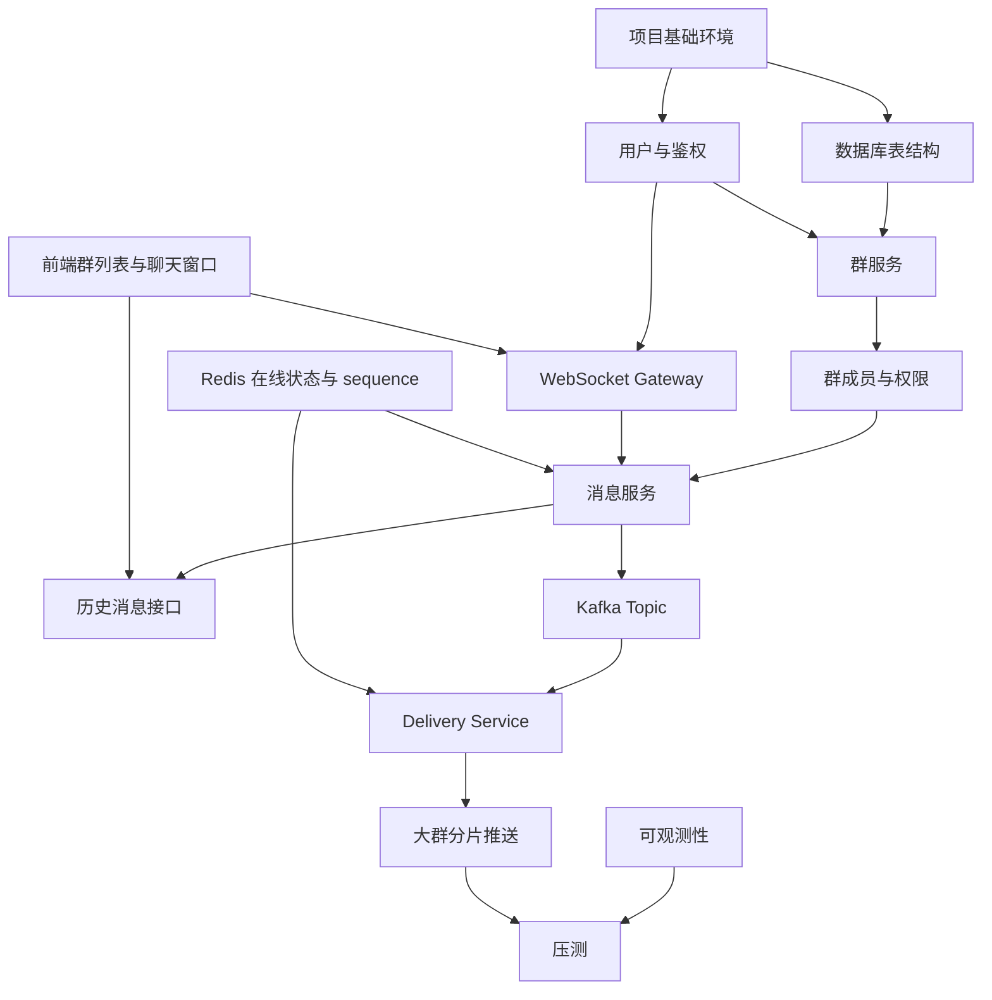

# 开发任务拆解与迭代计划文档

## 1. 文档说明

### 1.1 文档目的

本文档用于说明 GroupFlow 群聊系统的开发任务拆解与迭代计划，将前期完成的产品原型、技术架构、数据库设计、WebSocket 协议、消息投递、Redis Key、Kafka Topic、HTTP API、前端状态管理和压测方案拆解为可执行的研发任务。

本文档重点解决：

1. 先做什么。
2. 后做什么。
3. 各模块之间有什么依赖。
4. 每个阶段交付什么。
5. 每个任务的主要内容是什么。
6. 每个阶段如何验收。
7. 哪些能力一期必须实现，哪些能力后续演进。

### 1.2 项目目标

GroupFlow 是一个面向大群与高并发场景设计的实时群聊系统。

核心目标：

1. 支持群聊完整闭环。
2. 支持 WebSocket 实时通信。
3. 支持消息 ACK。
4. 支持 clientMessageId 幂等。
5. 支持 groupId + sequence 消息顺序。
6. 支持历史消息分页。
7. 支持断线补拉。
8. 支持 Redis 在线状态和连接路由。
9. 支持 Kafka 异步投递。
10. 支持大群分片推送。
11. 支持群成员、权限、禁言、公告、审批等群管理能力。
12. 支持压测和可观测性。

------

## 2. 技术栈范围

### 2.1 后端技术栈

```text
Go
Gin
Gorilla WebSocket
MySQL
Redis
Kafka
Zap / Logrus
Prometheus
Docker Compose
```

### 2.2 前端技术栈

```text
React
TypeScript
Vite
Zustand
Axios
原生 WebSocket 封装
虚拟列表
Ant Design 或自定义组件
```

### 2.3 基础设施

```text
MySQL
Redis
Kafka
Prometheus
Grafana
Loki 可选
Docker Compose
```

------

## 3. 总体迭代路线

### 3.1 阶段划分

| 阶段   | 名称           | 目标                                              |
| ------ | -------------- | ------------------------------------------------- |
| 阶段 0 | 项目基础搭建   | 建立前后端工程、Docker 环境、基础配置             |
| 阶段 1 | 群聊最小闭环   | 登录、建群、入群、群列表、WebSocket 发消息        |
| 阶段 2 | 消息可靠性     | ACK、幂等、sequence、历史消息、断线补拉           |
| 阶段 3 | 群管理完整能力 | 成员、角色、踢人、禁言、公告、审批、撤回          |
| 阶段 4 | 大群投递架构   | Redis 在线状态、Kafka、Delivery Service、分片推送 |
| 阶段 5 | 前端大群体验   | 虚拟列表、未读、@提醒、重连、UI 降级              |
| 阶段 6 | 可观测性与压测 | 指标、日志、压测脚本、瓶颈优化                    |
| 阶段 7 | 演进增强       | Outbox、热点群、搜索、文件、分表、多端优化        |

------

## 4. 模块依赖关系

### 4.1 核心依赖图



### 4.2 关键依赖说明

```text
数据库表结构是后端所有业务模块的基础。
用户与鉴权是 HTTP API 和 WebSocket 的基础。
群服务依赖用户鉴权和数据库。
消息服务依赖群成员权限、Redis sequence 和 MySQL 消息表。
WebSocket Gateway 依赖用户鉴权。
Kafka 和 Delivery Service 依赖消息服务先产出事件。
大群分片推送依赖 Redis 在线状态和 WebSocket 节点路由。
前端聊天窗口依赖 HTTP API、WebSocket 协议和消息状态设计。
压测依赖核心链路可运行和指标可观测。
```

------

# 5. 阶段 0：项目基础搭建

## 5.1 阶段目标

完成项目基础工程、开发环境和基础依赖搭建。

### 5.2 后端任务

| 编号    | 任务              | 说明                           |
| ------- | ----------------- | ------------------------------ |
| BE-0-1  | 创建后端项目结构  | 建立 cmd、internal、pkg 等目录 |
| BE-0-2  | 接入 Gin          | 初始化 HTTP 服务               |
| BE-0-3  | 接入配置管理      | 支持 config.yaml / env         |
| BE-0-4  | 接入 MySQL        | 初始化连接池                   |
| BE-0-5  | 接入 Redis        | 初始化 Redis 客户端            |
| BE-0-6  | 接入 Kafka 客户端 | 预留 producer / consumer       |
| BE-0-7  | 接入日志          | 结构化日志                     |
| BE-0-8  | 统一响应结构      | code、message、data、requestId |
| BE-0-9  | 统一错误码        | 定义业务错误码                 |
| BE-0-10 | Dockerfile        | 后端镜像构建                   |

### 5.3 前端任务

| 编号   | 任务                        | 说明                     |
| ------ | --------------------------- | ------------------------ |
| FE-0-1 | 创建 React + TS + Vite 项目 | 初始化前端工程           |
| FE-0-2 | 接入 React Router           | 配置页面路由             |
| FE-0-3 | 接入 Zustand                | 建立 Store 目录          |
| FE-0-4 | 接入 Axios                  | 封装 request.ts          |
| FE-0-5 | 建立基础 Layout             | 群聊页面布局             |
| FE-0-6 | 接入 UI 组件库              | Ant Design 或自定义组件  |
| FE-0-7 | 配置代理                    | 开发环境代理 /api 和 /ws |

### 5.4 基础设施任务

| 编号      | 任务                   | 说明                |
| --------- | ---------------------- | ------------------- |
| INFRA-0-1 | Docker Compose         | MySQL、Redis、Kafka |
| INFRA-0-2 | 初始化数据库           | init.sql            |
| INFRA-0-3 | Kafka Topic 初始化脚本 | 创建基础 Topic      |
| INFRA-0-4 | 本地启动文档           | README              |
| INFRA-0-5 | 环境变量说明           | .env.example        |

### 5.5 阶段验收

```text
1. 后端服务可以启动。
2. 前端服务可以启动。
3. MySQL、Redis、Kafka 可以通过 Docker Compose 启动。
4. 前端可以请求后端健康检查接口。
5. 后端可以连接 MySQL 和 Redis。
6. Kafka Topic 可以创建成功。
```

------

# 6. 阶段 1：群聊最小闭环

## 6.1 阶段目标

完成最小可运行群聊系统。

用户可以：

1. 登录。
2. 创建群。
3. 查看群列表。
4. 进入群聊。
5. 建立 WebSocket。
6. 发送文本消息。
7. 接收文本消息。
8. 查看历史消息。

------

## 6.2 数据库任务

| 编号   | 任务           | 表                                   |
| ------ | -------------- | ------------------------------------ |
| DB-1-1 | 用户表         | user_account                         |
| DB-1-2 | 群表           | chat_group                           |
| DB-1-3 | 群成员表       | group_member                         |
| DB-1-4 | 群消息表       | group_message                        |
| DB-1-5 | 基础索引       | uk_group_user、idx_group_sequence 等 |
| DB-1-6 | 初始化测试数据 | 用户、群、成员、消息                 |

------

## 6.3 后端任务

### 6.3.1 用户与认证

| 编号   | 任务                 | 说明             |
| ------ | -------------------- | ---------------- |
| BE-1-1 | 登录接口             | POST /auth/login |
| BE-1-2 | 当前用户接口         | GET /auth/me     |
| BE-1-3 | token 解析中间件     | HTTP 鉴权        |
| BE-1-4 | WebSocket token 鉴权 | WS 连接时校验    |

### 6.3.2 群服务

| 编号   | 任务             | 说明                  |
| ------ | ---------------- | --------------------- |
| BE-1-5 | 创建群接口       | POST /groups          |
| BE-1-6 | 查询群列表       | GET /groups           |
| BE-1-7 | 查询群详情       | GET /groups/{groupId} |
| BE-1-8 | 创建群主成员关系 | group_member owner    |
| BE-1-9 | 查询群成员身份   | members/me            |

### 6.3.3 消息服务

| 编号    | 任务             | 说明          |
| ------- | ---------------- | ------------- |
| BE-1-10 | 文本消息发送逻辑 | 基础校验      |
| BE-1-11 | 消息落库         | group_message |
| BE-1-12 | 历史消息接口     | GET /messages |
| BE-1-13 | 最近消息查询     | limit 20      |
| BE-1-14 | 消息 DTO         | 返回统一结构  |

### 6.3.4 WebSocket Gateway

| 编号    | 任务                       | 说明                       |
| ------- | -------------------------- | -------------------------- |
| BE-1-15 | WebSocket 连接建立         | /ws                        |
| BE-1-16 | 连接鉴权                   | token                      |
| BE-1-17 | 本机 Hub                   | connectionId -> connection |
| BE-1-18 | 接收 group_message_send    | 解析 WS 消息               |
| BE-1-19 | 推送 group_message_receive | 本机广播                   |
| BE-1-20 | ping / pong                | 心跳基础能力               |

------

## 6.4 前端任务

| 编号    | 任务             | 说明                     |
| ------- | ---------------- | ------------------------ |
| FE-1-1  | 登录页           | 用户名登录               |
| FE-1-2  | userStore        | token、currentUser       |
| FE-1-3  | 群列表页         | 展示我的群               |
| FE-1-4  | groupStore       | groups、currentGroup     |
| FE-1-5  | 聊天窗口         | 消息列表 + 输入框        |
| FE-1-6  | messageStore     | messagesByGroupId        |
| FE-1-7  | WebSocket Client | connect、send、onMessage |
| FE-1-8  | 发送文本消息     | 本地插入消息             |
| FE-1-9  | 接收群消息       | 插入消息列表             |
| FE-1-10 | 加载历史消息     | 最近 20 条               |

------

## 6.5 阶段验收

```text
1. 用户可以登录。
2. 用户可以创建群。
3. 用户可以看到自己加入的群列表。
4. 用户可以进入群聊页面。
5. WebSocket 可以连接成功。
6. 用户 A 发送消息，用户 B 可以实时收到。
7. 消息可以写入 MySQL。
8. 刷新页面后可以加载历史消息。
```

------

# 7. 阶段 2：消息可靠性

## 7.1 阶段目标

让消息发送具备可靠性基础，包括 ACK、幂等、sequence、失败重试、历史补拉和断线恢复。

------

## 7.2 后端任务

| 编号    | 任务                            | 说明                    |
| ------- | ------------------------------- | ----------------------- |
| BE-2-1  | clientMessageId 校验            | 必填                    |
| BE-2-2  | senderId + clientMessageId 幂等 | 唯一索引                |
| BE-2-3  | Redis group sequence            | INCR                    |
| BE-2-4  | group max sequence              | 落库后更新              |
| BE-2-5  | group_message_ack               | 发送成功 ACK            |
| BE-2-6  | group_message_failed            | 发送失败响应            |
| BE-2-7  | beforeSequence 查询             | 向上加载历史            |
| BE-2-8  | afterSequence 查询              | 断线补拉                |
| BE-2-9  | 已读上报接口                    | POST /groups/{id}/read  |
| BE-2-10 | 未读信息接口                    | GET /groups/{id}/unread |
| BE-2-11 | Redis 群配置缓存                | group:{groupId}:config  |
| BE-2-12 | 慢速模式基础限流                | rate_limit Key          |

------

## 7.3 前端任务

| 编号    | 任务                    | 说明                      |
| ------- | ----------------------- | ------------------------- |
| FE-2-1  | 生成 clientMessageId    | 每条消息唯一              |
| FE-2-2  | 本地 sending 状态       | 发送中                    |
| FE-2-3  | ACK 匹配                | 根据 clientMessageId 更新 |
| FE-2-4  | ACK 超时                | 5 秒                      |
| FE-2-5  | 失败重试                | 复用 clientMessageId      |
| FE-2-6  | messageId 去重          | 防止重复插入              |
| FE-2-7  | sequence 排序           | 按 sequence 升序          |
| FE-2-8  | sequence 缺口检测       | 触发补拉                  |
| FE-2-9  | afterSequence 补拉      | 重连后补消息              |
| FE-2-10 | beforeSequence 加载历史 | 向上滚动加载              |
| FE-2-11 | 已读上报                | 防抖上报                  |
| FE-2-12 | 未读数展示              | 群列表 badge              |

------

## 7.4 Redis 任务

| 编号      | 任务                | Key                                              |
| --------- | ------------------- | ------------------------------------------------ |
| REDIS-2-1 | 群 sequence         | group:{groupId}:sequence                         |
| REDIS-2-2 | 最大已落库 sequence | group:{groupId}:max_sequence                     |
| REDIS-2-3 | 群配置缓存          | group:{groupId}:config                           |
| REDIS-2-4 | 慢速模式限流        | rate_limit:group:{groupId}:user:{userId}         |
| REDIS-2-5 | 已读位置缓存        | group:{groupId}:user:{userId}:last_read_sequence |

------

## 7.5 阶段验收

```text
1. 消息发送后可以收到 ACK。
2. ACK 丢失后重试不会产生重复消息。
3. 消息具备群内 sequence。
4. 历史消息可以 beforeSequence 分页。
5. 断线后可以 afterSequence 补拉。
6. 群列表可以显示未读数。
7. 用户进入群聊后可以上报已读位置。
8. sequence 缺口可以触发补拉。
```

------

# 8. 阶段 3：群管理完整能力

## 8.1 阶段目标

完善群聊产品能力，包括成员管理、权限控制、公告、审批、禁言、撤回、系统消息。

------

## 8.2 数据库任务

| 编号   | 表                   | 说明        |
| ------ | -------------------- | ----------- |
| DB-3-1 | group_join_request   | 加群申请    |
| DB-3-2 | group_announcement   | 群公告      |
| DB-3-3 | group_mute_record    | 禁言记录    |
| DB-3-4 | group_message_recall | 撤回记录    |
| DB-3-5 | group_operation_log  | 操作日志    |
| DB-3-6 | group_mention        | @提醒，可选 |

------

## 8.3 后端任务

### 8.3.1 成员管理

| 编号   | 任务         | 接口                                    |
| ------ | ------------ | --------------------------------------- |
| BE-3-1 | 群成员分页   | GET /groups/{id}/members                |
| BE-3-2 | 退出群       | POST /groups/{id}/members/leave         |
| BE-3-3 | 踢出成员     | POST /groups/{id}/members/{userId}/kick |
| BE-3-4 | 设置管理员   | POST /set-admin                         |
| BE-3-5 | 取消管理员   | POST /unset-admin                       |
| BE-3-6 | 权限校验组件 | owner/admin/member                      |

### 8.3.2 加群审批

| 编号    | 任务             | 接口                     |
| ------- | ---------------- | ------------------------ |
| BE-3-7  | 提交加群申请     | POST /join-requests      |
| BE-3-8  | 查询申请列表     | GET /join-requests       |
| BE-3-9  | 审批申请         | POST /review             |
| BE-3-10 | 审批通过入群事务 | request + member + count |

### 8.3.3 公告

| 编号    | 任务     | 接口                       |
| ------- | -------- | -------------------------- |
| BE-3-11 | 公告列表 | GET /announcements         |
| BE-3-12 | 最新公告 | GET /announcements/latest  |
| BE-3-13 | 发布公告 | POST /announcements        |
| BE-3-14 | 修改公告 | PUT /announcements/{id}    |
| BE-3-15 | 删除公告 | DELETE /announcements/{id} |

### 8.3.4 禁言与慢速模式

| 编号    | 任务         | 接口                      |
| ------- | ------------ | ------------------------- |
| BE-3-16 | 全员禁言     | POST /mute-all            |
| BE-3-17 | 关闭全员禁言 | POST /unmute-all          |
| BE-3-18 | 单人禁言     | POST /members/{id}/mute   |
| BE-3-19 | 解除禁言     | POST /members/{id}/unmute |
| BE-3-20 | 设置慢速模式 | PUT /slow-mode            |

### 8.3.5 消息撤回

| 编号    | 任务         | 接口                       |
| ------- | ------------ | -------------------------- |
| BE-3-21 | 撤回消息接口 | POST /messages/{id}/recall |
| BE-3-22 | 撤回权限校验 | 发送者/管理员              |
| BE-3-23 | 更新消息状态 | status = recalled          |
| BE-3-24 | 写撤回记录   | group_message_recall       |
| BE-3-25 | 推送撤回事件 | group_message_recalled     |

------

## 8.4 前端任务

| 编号    | 任务           | 页面             |
| ------- | -------------- | ---------------- |
| FE-3-1  | 群成员列表页   | members          |
| FE-3-2  | 群设置页       | settings         |
| FE-3-3  | 群管理中心     | admin            |
| FE-3-4  | 加群审批页     | join-requests    |
| FE-3-5  | 公告页         | announcements    |
| FE-3-6  | 消息操作菜单   | 撤回、复制       |
| FE-3-7  | 被踢交互       | 禁用输入框       |
| FE-3-8  | 群解散交互     | 只读历史         |
| FE-3-9  | 全员禁言提示   | 输入框禁用       |
| FE-3-10 | 慢速模式倒计时 | 发送按钮倒计时   |
| FE-3-11 | @我提醒        | 群列表标记       |
| FE-3-12 | 系统消息展示   | 加群、踢人、公告 |

------

## 8.5 阶段验收

```text
1. 群主可以设置管理员。
2. 管理员可以踢人。
3. 用户可以退出群。
4. 群主可以解散群。
5. 可以提交和审批加群申请。
6. 可以发布和查看公告。
7. 可以开启全员禁言和单人禁言。
8. 慢速模式可以限制普通成员发送频率。
9. 用户可以撤回自己的消息。
10. 管理员可以撤回成员消息。
11. 被踢用户前端状态正确。
12. 群解散后不能继续发送消息。
```

------

# 9. 阶段 4：大群投递架构

## 9.1 阶段目标

引入 Redis 在线状态、Kafka、Delivery Service 和 WebSocket 节点分片推送，支撑大群实时消息投递。

------

## 9.2 Redis 在线状态任务

| 编号      | 任务             | Key                              |
| --------- | ---------------- | -------------------------------- |
| REDIS-4-1 | 用户在线状态     | online:user:{userId}             |
| REDIS-4-2 | 用户多端连接集合 | online:user:{userId}:connections |
| REDIS-4-3 | 连接所属用户     | connection:{connectionId}:user   |
| REDIS-4-4 | 连接所属节点     | connection:{connectionId}:server |
| REDIS-4-5 | 节点在线用户集合 | server:{serverId}:users          |
| REDIS-4-6 | 节点心跳         | server:{serverId}:heartbeat      |
| REDIS-4-7 | 活跃节点集合     | servers:ws:active                |
| REDIS-4-8 | 连接断开清理     | 删除连接路由                     |
| REDIS-4-9 | 心跳续期         | expire online keys               |

------

## 9.3 Kafka 任务

| 编号      | 任务               | Topic                      |
| --------- | ------------------ | -------------------------- |
| KAFKA-4-1 | 创建群消息 Topic   | group-message-topic        |
| KAFKA-4-2 | 创建系统事件 Topic | group-system-event-topic   |
| KAFKA-4-3 | 创建撤回事件 Topic | group-message-recall-topic |
| KAFKA-4-4 | Producer 封装      | EventPublisher             |
| KAFKA-4-5 | Consumer 封装      | ConsumerGroup              |
| KAFKA-4-6 | groupId 分区 Key   | 保持同群顺序               |
| KAFKA-4-7 | 生产失败日志       | produce_failed             |
| KAFKA-4-8 | 消费 lag 指标      | kafka_consume_lag          |

------

## 9.4 Delivery Service 任务

| 编号          | 任务                          | 说明                      |
| ------------- | ----------------------------- | ------------------------- |
| DELIVERY-4-1  | 新建 Delivery Service         | 独立进程或同进程模块      |
| DELIVERY-4-2  | 消费 group-message-topic      | 消费群消息                |
| DELIVERY-4-3  | 解析 GroupMessageCreatedEvent | 统一事件结构              |
| DELIVERY-4-4  | 查询群成员                    | 一期查 MySQL              |
| DELIVERY-4-5  | 批量查询在线状态              | MGET online:user:{userId} |
| DELIVERY-4-6  | 按 serverId 分组              | FanoutPlanner             |
| DELIVERY-4-7  | 拆分 PushTask                 | batchSize 500 - 1000      |
| DELIVERY-4-8  | 内部推送 WS 节点              | /internal/ws/push         |
| DELIVERY-4-9  | 记录推送结果                  | success/failed/notFound   |
| DELIVERY-4-10 | 推送失败处理                  | 不无限重试                |
| DELIVERY-4-11 | 投递指标                      | fanout、latency、failed   |

------

## 9.5 WebSocket Gateway 分片推送任务

| 编号   | 任务                   | 说明                    |
| ------ | ---------------------- | ----------------------- |
| WS-4-1 | 增加 serverId          | 每个 WS 节点唯一        |
| WS-4-2 | 注册节点心跳           | server heartbeat        |
| WS-4-3 | 连接注册 Redis         | online keys             |
| WS-4-4 | 连接断开清理 Redis     | cleanup                 |
| WS-4-5 | 内部推送接口           | POST /internal/ws/push  |
| WS-4-6 | 根据 userId 找本机连接 | Hub 查询                |
| WS-4-7 | 写入 SendChan          | 非阻塞                  |
| WS-4-8 | SendChan 满处理        | 失败或断开              |
| WS-4-9 | 返回 PushResult        | success/failed/notFound |

------

## 9.6 前端任务

| 编号   | 任务                   | 说明             |
| ------ | ---------------------- | ---------------- |
| FE-4-1 | 支持多 WS 节点透明连接 | 前端无感         |
| FE-4-2 | 消息重复推送去重       | messageId        |
| FE-4-3 | 接收乱序排序           | sequence         |
| FE-4-4 | 缺口补拉               | afterSequence    |
| FE-4-5 | 重连补拉               | reconnect 后执行 |
| FE-4-6 | 大群消息批量合并渲染   | pending queue    |

------

## 9.7 阶段验收

```text
1. 消息发送服务不再直接广播。
2. 消息落库后能写入 Kafka。
3. Delivery Service 可以消费 Kafka。
4. Delivery Service 可以查询在线用户。
5. Delivery Service 可以按 serverId 分组。
6. WebSocket 节点只推送本机连接。
7. 多 WebSocket 节点下消息可以正确投递。
8. 某个用户离线后不强制投递，重连后可以补拉。
9. 推送失败不会影响消息历史可见。
```

------

# 10. 阶段 5：前端大群体验优化

## 10.1 阶段目标

提升大群页面交互和性能，避免大量消息导致页面卡顿。

------

## 10.2 前端任务

| 编号    | 任务               | 说明                |
| ------- | ------------------ | ------------------- |
| FE-5-1  | 虚拟列表接入       | 动态高度消息        |
| FE-5-2  | 消息批量 flush     | 50ms - 100ms 合并   |
| FE-5-3  | 当前不在窗口不渲染 | 只更新群列表        |
| FE-5-4  | 本地消息缓存上限   | 大群保留最近 200 条 |
| FE-5-5  | 新消息悬浮按钮     | 用户不在底部        |
| FE-5-6  | 未读分割线         | 进入群时定位        |
| FE-5-7  | 99+ 未读展示       | 大群降级            |
| FE-5-8  | @所有人标记        | 不展开全员          |
| FE-5-9  | 已读详情降级       | 大群不展示完整已读  |
| FE-5-10 | 成员列表分页搜索   | 不全量加载          |
| FE-5-11 | 弱网重连提示       | 顶部 Banner         |
| FE-5-12 | 慢速模式交互       | 倒计时              |

------

## 10.3 阶段验收

```text
1. 大群消息列表不会因为几千条消息明显卡顿。
2. 向上加载历史消息时滚动位置稳定。
3. 当前不在群窗口时不会渲染消息列表。
4. 收到大量消息时 UI 不频繁抖动。
5. 大群未读数展示为 99+。
6. 大群不展示完整已读名单。
7. 慢速模式倒计时正常。
8. WebSocket 重连提示清晰。
```

------

# 11. 阶段 6：可观测性与压测

## 11.1 阶段目标

补齐日志、指标、链路追踪和压测能力。

------

## 11.2 日志任务

| 编号    | 任务              | 说明                         |
| ------- | ----------------- | ---------------------------- |
| OBS-6-1 | 统一 traceId      | HTTP / WS / Kafka            |
| OBS-6-2 | HTTP 请求日志     | method、path、duration       |
| OBS-6-3 | WS 连接日志       | connect/disconnect           |
| OBS-6-4 | 消息发送日志      | groupId、messageId、sequence |
| OBS-6-5 | Kafka 生产日志    | topic、partitionKey          |
| OBS-6-6 | Delivery 投递日志 | fanout、success、failed      |
| OBS-6-7 | Redis 慢操作日志  | route query、sequence        |
| OBS-6-8 | MySQL 慢查询日志  | message/member query         |

------

## 11.3 指标任务

| 编号        | 指标                             | 说明           |
| ----------- | -------------------------------- | -------------- |
| METRIC-6-1  | ws_online_connections            | WS 在线连接数  |
| METRIC-6-2  | ws_push_total                    | WS 推送数      |
| METRIC-6-3  | group_message_ack_latency_ms     | ACK 延迟       |
| METRIC-6-4  | group_message_persist_latency_ms | 落库耗时       |
| METRIC-6-5  | kafka_consume_lag                | Kafka lag      |
| METRIC-6-6  | delivery_latency_ms              | 投递延迟       |
| METRIC-6-7  | delivery_fanout_user_total       | fanout 用户数  |
| METRIC-6-8  | redis_route_query_latency_ms     | Redis 路由查询 |
| METRIC-6-9  | mysql_query_message_latency_ms   | 历史消息查询   |
| METRIC-6-10 | rate_limit_rejected_total        | 限流拒绝       |

------

## 11.4 压测任务

| 编号      | 任务             | 说明                |
| --------- | ---------------- | ------------------- |
| TEST-6-1  | HTTP 压测脚本    | k6                  |
| TEST-6-2  | WS 连接压测脚本  | Go 工具             |
| TEST-6-3  | 心跳压测         | 1 万连接            |
| TEST-6-4  | 小群消息压测     | 100 群 * 100 人     |
| TEST-6-5  | 历史消息查询压测 | before/after        |
| TEST-6-6  | 断线补拉压测     | 重连恢复            |
| TEST-6-7  | Redis 路由压测   | MGET / INCR         |
| TEST-6-8  | Kafka 基础压测   | producer / consumer |
| TEST-6-9  | 大群投递压测     | 万人在线            |
| TEST-6-10 | 压测报告模板     | 指标、瓶颈、优化    |

------

## 11.5 阶段验收

```text
1. 可以在 Grafana 查看 WS 连接数。
2. 可以查看消息 ACK 延迟。
3. 可以查看 Kafka lag。
4. 可以查看 Delivery fanout 和投递耗时。
5. 可以查看 Redis 路由查询耗时。
6. 可以查看 MySQL 慢查询。
7. 可以执行 HTTP 和 WS 压测脚本。
8. 能产出一份压测报告。
```

------

# 12. 阶段 7：演进增强

## 12.1 阶段目标

在核心系统稳定后，继续增强可靠性、性能和产品能力。

------

## 12.2 后端增强任务

| 编号     | 任务               | 说明                    |
| -------- | ------------------ | ----------------------- |
| ENH-7-1  | Outbox             | 保证 Kafka 事件最终发送 |
| ENH-7-2  | DLQ                | Kafka 死信队列          |
| ENH-7-3  | Retry Topic        | 异步重试                |
| ENH-7-4  | 热点群自动识别     | 基于 QPS / fanout       |
| ENH-7-5  | 热点群自动慢速模式 | 自动降级                |
| ENH-7-6  | group online users | 群在线成员集合          |
| ENH-7-7  | group server users | 按 WS 节点维护在线用户  |
| ENH-7-8  | 消息表分表         | 按 groupId hash         |
| ENH-7-9  | 搜索索引           | OpenSearch              |
| ENH-7-10 | 文件消息           | 对象存储                |

------

## 12.3 前端增强任务

| 编号   | 任务              | 说明         |
| ------ | ----------------- | ------------ |
| FE-7-1 | 图片消息          | 预览和懒加载 |
| FE-7-2 | 文件消息          | 上传和下载   |
| FE-7-3 | 消息搜索          | 搜索页       |
| FE-7-4 | @提醒列表         | mentionStore |
| FE-7-5 | 跳转指定 sequence | 定位消息     |
| FE-7-6 | IndexedDB 缓存    | 本地消息缓存 |
| FE-7-7 | 多端同步优化      | 重复消息合并 |
| FE-7-8 | 弱网队列          | 离线发送队列 |
| FE-7-9 | 管理后台          | 审计、统计   |

------

# 13. 任务优先级

## 13.1 P0 必须完成

```text
项目基础环境
数据库核心表
登录
创建群
群列表
群详情
WebSocket 连接
文本消息发送
消息落库
消息 ACK
clientMessageId 幂等
group sequence
历史消息分页
断线补拉
群成员分页
基础权限
Redis sequence
Redis 在线状态
```

## 13.2 P1 重要能力

```text
群管理
踢人
退群
设置管理员
禁言
慢速模式
公告
加群审批
消息撤回
Kafka
Delivery Service
WebSocket 多节点
大群分片推送
前端虚拟列表
未读数
@提醒
可观测性
```

## 13.3 P2 后续增强

```text
Outbox
DLQ
Retry Topic
热点群自动降级
搜索
图片消息
文件消息
IndexedDB
消息表分表
Redis Cluster
多端同步优化
```

------

# 14. 里程碑计划

## 14.1 里程碑 M1：最小群聊可运行

目标：

```text
登录 + 建群 + 群列表 + WebSocket 发消息 + 历史消息
```

交付物：

1. 后端基础服务。
2. 前端基础页面。
3. MySQL 核心表。
4. WebSocket 基础能力。
5. README 启动说明。

------

## 14.2 里程碑 M2：消息可靠性完成

目标：

```text
ACK + 幂等 + sequence + 补拉 + 未读
```

交付物：

1. WebSocket ACK。
2. clientMessageId 幂等。
3. Redis sequence。
4. 历史分页。
5. 断线补拉。
6. 未读数。

------

## 14.3 里程碑 M3：群管理能力完成

目标：

```text
成员、角色、权限、公告、审批、禁言、撤回
```

交付物：

1. 群成员管理。
2. 群权限校验。
3. 加群审批。
4. 群公告。
5. 禁言和慢速模式。
6. 消息撤回。

------

## 14.4 里程碑 M4：大群投递架构完成

目标：

```text
Kafka + Delivery Service + Redis 在线路由 + WS 分片推送
```

交付物：

1. Kafka Topic。
2. EventPublisher。
3. Delivery Service。
4. Redis 在线状态。
5. WebSocket 内部推送接口。
6. 大群异步投递链路。

------

## 14.5 里程碑 M5：大群体验和压测完成

目标：

```text
虚拟列表 + 重连补拉 + 指标监控 + 压测报告
```

交付物：

1. 前端虚拟列表。
2. 大群 UI 降级。
3. Prometheus 指标。
4. Grafana 面板。
5. 压测脚本。
6. 压测报告。

------

# 15. 推荐开发顺序

## 15.1 后端顺序

```text
1. 项目结构和配置
2. MySQL 表结构
3. 用户登录和鉴权
4. 群服务
5. 群成员服务
6. WebSocket Gateway
7. 消息服务
8. Redis sequence
9. 消息 ACK 和幂等
10. 历史消息分页
11. 已读未读
12. 群管理能力
13. Redis 在线状态
14. Kafka Producer
15. Delivery Service
16. WebSocket 内部推送
17. 可观测性
18. 压测优化
```

------

## 15.2 前端顺序

```text
1. 项目结构和路由
2. 登录页
3. Axios 封装
4. userStore
5. 群列表页
6. groupStore
7. 聊天窗口
8. messageStore
9. WebSocket Client
10. 发送消息
11. ACK 处理
12. 消息接收
13. 历史消息分页
14. 重连补拉
15. 未读数
16. 群成员页
17. 群设置页
18. 公告和审批页面
19. 虚拟列表
20. 大群 UI 降级
```

------

# 16. 风险与应对

## 16.1 WebSocket 连接过多

风险：

```text
单节点连接数过高导致内存和 fd 不足。
```

应对：

1. 多 WS 节点。
2. 调整 ulimit。
3. 连接心跳清理。
4. 慢连接断开。
5. 压测确认容量。

------

## 16.2 大群 fanout 过高

风险：

```text
一个大群消息导致大量在线用户推送，Delivery Service 压力过大。
```

应对：

1. Kafka 削峰。
2. 按 serverId 分片。
3. 批量推送。
4. 慢速模式。
5. 热点群降级。

------

## 16.3 Redis 大 Key

风险：

```text
group online users 或 server users 形成大 Key。
```

应对：

1. 初期不维护超大集合。
2. 二期使用 SSCAN。
3. 三期按 shard 拆分。
4. 监控 big key。

------

## 16.4 MySQL 消息表过大

风险：

```text
group_message 数据增长快，历史查询变慢。
```

应对：

1. 必须使用 groupId + sequence 索引。
2. 控制 limit。
3. 消息归档。
4. 按 groupId hash 分表。
5. 压测验证。

------

## 16.5 Kafka 单分区热点

风险：

```text
热点群使用 groupId 作为 key，可能导致单分区压力过高。
```

应对：

1. 慢速模式。
2. 热点群独立 Topic。
3. Delivery 内部分片并行。
4. 增加消费者资源。
5. 降级非核心事件。

------

# 17. 验收总标准

## 17.1 功能验收

```text
1. 用户可以完成完整群聊闭环。
2. 群消息可以实时发送和接收。
3. 消息发送有 ACK。
4. ACK 丢失重试不会重复消息。
5. 消息按 sequence 排序。
6. 用户断线后可以补拉遗漏消息。
7. 群主和管理员权限正确。
8. 禁言、慢速模式、公告、审批、撤回可用。
9. 大群场景下成员和消息分页正常。
10. WebSocket 多节点投递正常。
```

## 17.2 性能验收

```text
1. 小群消息 ACK P95 < 300ms。
2. 小群消息接收 P95 < 800ms。
3. 历史消息查询 P95 < 300ms。
4. 单 WS 节点连接数 >= 10000。
5. 大群投递 P95 < 1000ms。
6. Kafka lag 不持续增长。
7. Redis 路由查询 P95 < 100ms。
8. 推送失败率 < 1%。
```

## 17.3 稳定性验收

```text
1. 服务长时间运行无明显内存泄漏。
2. WebSocket 断线后可重连。
3. 重连后消息可补拉。
4. Delivery 推送失败不影响历史消息可见。
5. Redis 在线状态异常可通过 TTL 恢复。
6. Kafka 重复消费不会导致客户端重复消息。
```

------

# 18. 总结

GroupFlow 的开发建议按以下路线推进：

```text
先完成群聊最小闭环，
再补消息可靠性，
再补群管理完整能力，
再引入 Kafka 和大群投递，
再优化前端大群体验，
最后做可观测性、压测和架构演进。
```

最关键的工程主线是：

```text
用户鉴权
  ↓
群与成员关系
  ↓
WebSocket 长连接
  ↓
消息服务落库与 ACK
  ↓
Redis sequence 和在线状态
  ↓
Kafka 异步事件
  ↓
Delivery Service 分片投递
  ↓
前端去重、排序、补拉
  ↓
压测和优化
```

一期不要一开始就追求超级复杂的大群架构，应先完成稳定的群聊闭环，然后逐步替换和增强：

```text
单节点 WebSocket
  ↓
Redis 在线状态
  ↓
Kafka 异步投递
  ↓
多节点 WebSocket
  ↓
大群分片投递
  ↓
热点群保护
```

这样可以保证项目持续可运行，每个阶段都有明确交付物，也方便通过压测逐步发现瓶颈并优化。