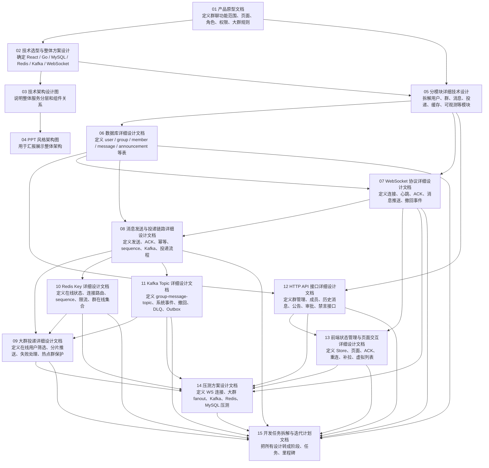
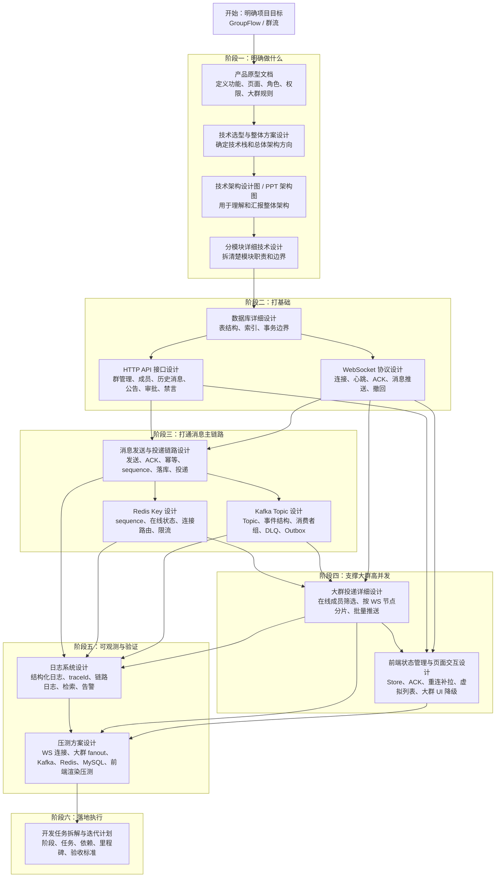

下面是 **GroupFlow / 群流** 目前这套文档之间的依赖关系图。
我把它分成三层：**产品与总体设计 → 后端核心设计 → 前端与验证落地**。其中你上传的《大群投递详细设计文档》属于核心链路文档，主要依赖 WebSocket、消息链路、Redis、Kafka，并被压测与开发计划引用。



如果按 **实施顺序** 看，可以理解成这条主线：



## 每份文档的核心依赖说明

| 文档                   | 主要依赖                                      | 主要产出                                 |
| ---------------------- | --------------------------------------------- | ---------------------------------------- |
| 产品原型文档           | 无                                            | 功能范围、页面、角色、权限、大群规则     |
| 技术选型与整体方案     | 产品原型                                      | 技术栈、整体架构方向                     |
| 技术架构设计图         | 技术选型                                      | 系统分层、组件关系                       |
| PPT 风格架构图         | 技术架构图                                    | 汇报用架构图                             |
| 分模块详细技术设计     | 产品原型、整体方案                            | 模块职责和边界                           |
| 数据库详细设计         | 分模块设计                                    | 表结构、索引、事务边界                   |
| WebSocket 协议设计     | 数据库、消息模型                              | WS 消息格式、ACK、心跳、推送协议         |
| 消息发送与投递链路设计 | 数据库、WebSocket、Redis、Kafka               | 从发送到投递的完整链路                   |
| 大群投递详细设计       | 消息链路、Redis、Kafka、WebSocket             | 大群 fanout、分片、失败恢复              |
| Redis Key 详细设计     | 消息链路、大群投递                            | 在线状态、连接路由、sequence、限流       |
| Kafka Topic 详细设计   | 消息链路、大群投递                            | Topic、事件结构、消费者组、DLQ、Outbox   |
| HTTP API 接口设计      | 数据库、群管理设计                            | 群、成员、消息查询、公告、审批、禁言接口 |
| 前端状态管理与交互设计 | HTTP API、WebSocket、大群投递                 | Store、页面、ACK、重连、补拉、虚拟列表   |
| 压测方案设计           | 大群投递、Redis、Kafka、WebSocket、HTTP、前端 | 压测场景、指标、验收标准                 |
| 开发任务拆解与迭代计划 | 所有设计文档                                  | 阶段计划、任务清单、里程碑               |
| 日志系统设计文档       | 支撑链路排查、压测分析、告警治理              |                                          |

## 最核心的依赖链

真正开发时，最重要的是这条链：

```text
数据库设计
  ↓
HTTP API + WebSocket 协议
  ↓
消息发送与投递链路
  ↓
Redis Key + Kafka Topic
  ↓
大群投递
  ↓
前端状态管理
  ↓
压测方案
  ↓
开发任务拆解
```

一句话总结：

**产品原型决定做什么，技术架构决定怎么分层，数据库/WebSocket/HTTP 决定基础能力，消息链路/Redis/Kafka/大群投递决定高并发核心，前端文档决定用户交互，压测文档验证设计是否扛得住，开发计划把所有文档落成任务。**