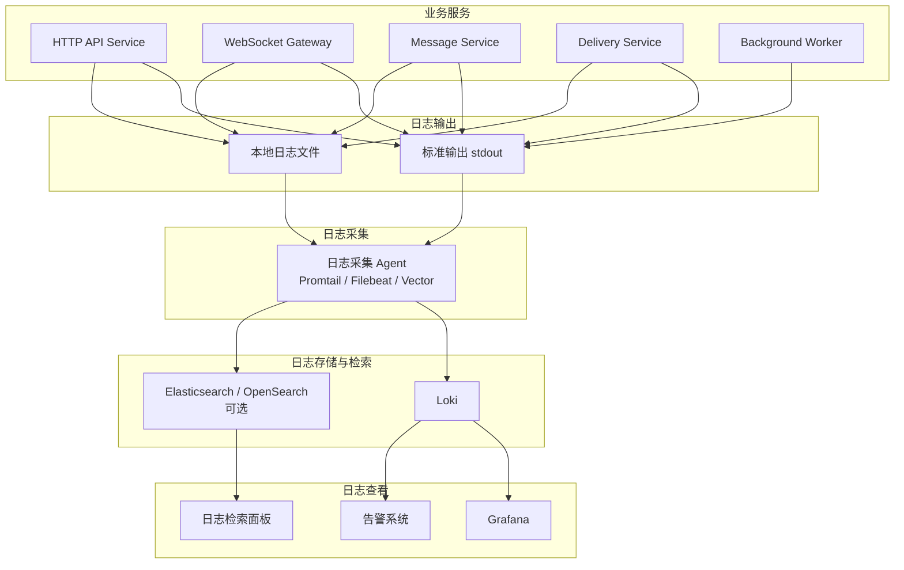

下面是 **GroupFlow 日志系统设计文档**。它会承接前面的 WebSocket、Kafka、Redis、大群投递、压测和开发计划设计；其中大群投递链路里的 fanout、PushTask、推送失败、Kafka lag 等都需要通过日志和指标共同定位。

# GroupFlow 日志系统设计文档

## 1. 文档说明

### 1.1 文档目的

本文档用于说明 GroupFlow 群聊系统的日志系统设计，包括日志目标、日志类型、日志字段规范、traceId 传播、HTTP 日志、WebSocket 日志、消息发送日志、Kafka 日志、Delivery Service 日志、Redis 日志、MySQL 日志、前端日志、日志采集、日志检索、日志告警和日志治理策略。

GroupFlow 是一个面向大群与高并发场景设计的实时群聊系统，核心链路包括：

1. HTTP API。
2. WebSocket 长连接。
3. 群消息发送。
4. 消息 ACK。
5. MySQL 消息落库。
6. Redis sequence 和在线状态。
7. Kafka 异步事件。
8. Delivery Service 大群分片投递。
9. WebSocket 节点批量推送。
10. 客户端接收、排序、补拉。

日志系统需要支撑问题排查、性能分析、链路追踪、压测分析和线上稳定性治理。

------

## 2. 设计目标

### 2.1 功能目标

日志系统需要支持：

1. 记录 HTTP 请求日志。
2. 记录 WebSocket 连接生命周期。
3. 记录群消息发送链路。
4. 记录 ACK 成功和失败。
5. 记录消息落库耗时。
6. 记录 Redis 关键操作耗时。
7. 记录 Kafka 生产和消费。
8. 记录 Delivery Service 大群投递结果。
9. 记录 WebSocket 推送成功和失败。
10. 记录业务异常。
11. 记录系统错误。
12. 支持 traceId 串联完整链路。
13. 支持按 userId、groupId、messageId、traceId 检索。
14. 支持压测后分析瓶颈。
15. 支持日志告警。

### 2.2 非功能目标

日志系统需要满足：

1. 结构化。
2. 可检索。
3. 可聚合。
4. 可采样。
5. 可脱敏。
6. 不影响主链路性能。
7. 不记录敏感明文。
8. 不因为日志写入失败影响业务。
9. 支持本地开发和生产模拟环境。

------

## 3. 日志系统总体架构

## 3.1 架构图



------

## 3.2 推荐方案

开发环境：

```text
服务直接输出 stdout + 本地文件
```

生产模拟环境：

```text
服务输出 stdout
  ↓
Docker / 容器日志
  ↓
Promtail / Vector / Filebeat
  ↓
Loki
  ↓
Grafana 检索
```

如果后续需要复杂全文搜索和长期归档，可以引入：

```text
Elasticsearch / OpenSearch
```

------

## 4. 日志类型

## 4.1 按层分类

| 日志类型           | 说明                             |
| ------------------ | -------------------------------- |
| HTTP 访问日志      | 记录 API 请求、响应、耗时        |
| WebSocket 连接日志 | 记录连接、断开、心跳、重连       |
| 业务操作日志       | 记录建群、踢人、禁言、公告、审批 |
| 消息链路日志       | 记录消息发送、ACK、落库、投递    |
| Kafka 日志         | 记录事件生产、消费、失败         |
| Delivery 日志      | 记录大群 fanout、分片、推送结果  |
| Redis 日志         | 记录关键 Redis 操作耗时和失败    |
| MySQL 日志         | 记录慢查询、事务、写入失败       |
| 系统错误日志       | 记录 panic、异常、依赖不可用     |
| 前端错误日志       | 记录 JS 错误、接口错误、WS 断开  |
| 压测日志           | 记录压测期间关键行为和瓶颈       |

------

## 4.2 按级别分类

| 级别  | 使用场景                             |
| ----- | ------------------------------------ |
| DEBUG | 开发调试，生产默认关闭               |
| INFO  | 正常业务事件                         |
| WARN  | 可恢复异常、降级、重试               |
| ERROR | 请求失败、依赖异常、业务不可恢复错误 |
| FATAL | 服务无法继续运行                     |

------

# 5. 日志字段规范

## 5.1 通用字段

所有日志尽量包含以下字段：

```json
{
  "timestamp": "2026-06-28T10:00:00.000Z",
  "level": "info",
  "service": "message-service",
  "env": "dev",
  "traceId": "trace_100000001",
  "spanId": "span_100000001",
  "requestId": "req_100000001",
  "event": "group_message_send",
  "message": "send group message success"
}
```

### 字段说明

| 字段      | 类型   | 说明        |
| --------- | ------ | ----------- |
| timestamp | string | 日志时间    |
| level     | string | 日志级别    |
| service   | string | 服务名称    |
| env       | string | 环境        |
| traceId   | string | 链路追踪 ID |
| spanId    | string | 当前操作 ID |
| requestId | string | 请求 ID     |
| event     | string | 事件名称    |
| message   | string | 日志描述    |

------

## 5.2 业务通用字段

```json
{
  "userId": 1001,
  "groupId": 10001,
  "messageId": "msg_100000001",
  "clientMessageId": "client_msg_100000001",
  "sequence": 100201
}
```

| 字段            | 说明          |
| --------------- | ------------- |
| userId          | 当前操作用户  |
| groupId         | 群 ID         |
| messageId       | 服务端消息 ID |
| clientMessageId | 客户端消息 ID |
| sequence        | 群内消息序号  |

------

## 5.3 性能字段

```json
{
  "durationMs": 23,
  "dbDurationMs": 8,
  "redisDurationMs": 3,
  "kafkaDurationMs": 4
}
```

| 字段            | 说明               |
| --------------- | ------------------ |
| durationMs      | 当前操作总耗时     |
| dbDurationMs    | 数据库耗时         |
| redisDurationMs | Redis 耗时         |
| kafkaDurationMs | Kafka 耗时         |
| pushDurationMs  | WebSocket 推送耗时 |
| fanoutCount     | fanout 用户数量    |
| batchSize       | 单批推送数量       |

------

# 6. traceId 设计

## 6.1 traceId 作用

traceId 用于串联一次请求或一条消息的完整链路。

例如一条群消息的链路：

```text
客户端发送消息
  ↓
WebSocket Gateway 接收
  ↓
Message Service 校验
  ↓
Redis INCR sequence
  ↓
MySQL 落库
  ↓
Kafka 生产事件
  ↓
Delivery Service 消费事件
  ↓
WebSocket Gateway 推送
  ↓
客户端接收消息
```

以上所有日志应该使用同一个 `traceId`。

------

## 6.2 traceId 生成规则

如果客户端传入 `requestId`，服务端可以基于 requestId 生成 traceId。

推荐服务端生成：

```text
trace_{timestamp}_{random}
```

示例：

```text
trace_1710000000000_a8f3
```

------

## 6.3 traceId 传播方式

### HTTP

客户端请求头：

```http
X-Trace-Id: trace_1710000000000_a8f3
```

如果没有，服务端生成。

### WebSocket

WebSocket 消息体中携带：

```json
{
  "type": "group_message_send",
  "requestId": "req_100001",
  "traceId": "trace_100001",
  "timestamp": 1710000000000,
  "data": {}
}
```

如果协议中不显式携带 traceId，可以由服务端在接收消息时生成，并在后续链路传播。

### Kafka

Kafka 事件中必须携带：

```json
{
  "eventId": "evt_100001",
  "traceId": "trace_100001",
  "eventType": "group_message_created",
  "payload": {}
}
```

### 内部 HTTP / RPC

Delivery Service 调用 WebSocket Gateway 内部推送接口时，需要在 Header 中携带：

```http
X-Trace-Id: trace_100001
```

------

# 7. HTTP 日志设计

## 7.1 HTTP 访问日志

每个 HTTP 请求都记录一条访问日志。

示例：

```json
{
  "timestamp": "2026-06-28T10:00:00.000Z",
  "level": "info",
  "service": "api-service",
  "traceId": "trace_100001",
  "requestId": "req_100001",
  "event": "http_request",
  "method": "GET",
  "path": "/api/v1/groups/10001/messages",
  "statusCode": 200,
  "userId": 1001,
  "groupId": 10001,
  "durationMs": 42,
  "clientIp": "127.0.0.1",
  "userAgent": "Mozilla/5.0"
}
```

------

## 7.2 慢请求日志

如果 HTTP 请求超过阈值，需要记录 WARN 日志。

推荐阈值：

```text
普通接口：500ms
历史消息接口：800ms
管理接口：1000ms
```

示例：

```json
{
  "level": "warn",
  "service": "api-service",
  "traceId": "trace_100001",
  "event": "http_slow_request",
  "method": "GET",
  "path": "/api/v1/groups/10001/messages",
  "durationMs": 1200,
  "userId": 1001,
  "groupId": 10001
}
```

------

## 7.3 HTTP 错误日志

接口返回 5xx 时记录 ERROR。

业务 4xx 错误通常记录 INFO 或 WARN。

示例：

```json
{
  "level": "error",
  "service": "api-service",
  "traceId": "trace_100001",
  "event": "http_request_failed",
  "method": "POST",
  "path": "/api/v1/groups/10001/messages/msg_1/recall",
  "statusCode": 500,
  "code": "INTERNAL_ERROR",
  "userId": 1001,
  "groupId": 10001,
  "messageId": "msg_1",
  "error": "database timeout",
  "durationMs": 3000
}
```

------

# 8. WebSocket 日志设计

## 8.1 连接建立日志

```json
{
  "timestamp": "2026-06-28T10:00:00.000Z",
  "level": "info",
  "service": "websocket-gateway",
  "traceId": "trace_conn_100001",
  "event": "ws_connected",
  "userId": 1001,
  "connectionId": "conn_100001",
  "serverId": "ws-server-01",
  "deviceId": "web_001",
  "clientType": "web",
  "clientIp": "127.0.0.1"
}
```

------

## 8.2 连接断开日志

```json
{
  "timestamp": "2026-06-28T10:10:00.000Z",
  "level": "info",
  "service": "websocket-gateway",
  "event": "ws_disconnected",
  "userId": 1001,
  "connectionId": "conn_100001",
  "serverId": "ws-server-01",
  "reason": "client_close",
  "onlineDurationSeconds": 600
}
```

------

## 8.3 心跳日志

心跳日志量很大，不建议每次都记录 INFO。

推荐策略：

1. DEBUG 级别记录。
2. 只记录异常心跳。
3. 按连接采样记录。

异常心跳示例：

```json
{
  "level": "warn",
  "service": "websocket-gateway",
  "event": "ws_heartbeat_timeout",
  "userId": 1001,
  "connectionId": "conn_100001",
  "serverId": "ws-server-01",
  "lastPingAt": "2026-06-28T10:00:00.000Z",
  "timeoutSeconds": 60
}
```

------

## 8.4 WebSocket 消息接收日志

```json
{
  "level": "info",
  "service": "websocket-gateway",
  "traceId": "trace_100001",
  "event": "ws_message_received",
  "type": "group_message_send",
  "requestId": "req_100001",
  "userId": 1001,
  "connectionId": "conn_100001",
  "groupId": 10001
}
```

注意：

不建议记录完整 `content` 字段，避免敏感信息和日志过大。

------

## 8.5 WebSocket 推送日志

```json
{
  "level": "info",
  "service": "websocket-gateway",
  "traceId": "trace_100001",
  "event": "ws_push",
  "type": "group_message_receive",
  "groupId": 10001,
  "messageId": "msg_100001",
  "sequence": 100201,
  "serverId": "ws-server-01",
  "targetUserCount": 1000,
  "successCount": 998,
  "failedCount": 2,
  "durationMs": 35
}
```

------

# 9. 群消息发送日志设计

## 9.1 消息发送成功日志

```json
{
  "timestamp": "2026-06-28T10:00:00.000Z",
  "level": "info",
  "service": "message-service",
  "traceId": "trace_100001",
  "event": "group_message_send_success",
  "userId": 1001,
  "groupId": 10001,
  "messageId": "msg_100001",
  "clientMessageId": "client_msg_100001",
  "messageType": "text",
  "sequence": 100201,
  "durationMs": 28,
  "redisDurationMs": 3,
  "dbDurationMs": 10,
  "kafkaDurationMs": 4
}
```

Go 日志示例：

```go
logger.Infof("send group message success, groupId:%d, userId:%d, messageId:%s, sequence:%d, durationMs:%d",
    groupID, userID, messageID, sequence, durationMs)
```

------

## 9.2 消息发送失败日志

```json
{
  "level": "warn",
  "service": "message-service",
  "traceId": "trace_100002",
  "event": "group_message_send_failed",
  "userId": 1001,
  "groupId": 10001,
  "clientMessageId": "client_msg_100002",
  "code": "GROUP_MEMBER_MUTED",
  "reason": "member muted",
  "retryable": false,
  "durationMs": 8
}
```

------

## 9.3 消息幂等命中日志

```json
{
  "level": "info",
  "service": "message-service",
  "traceId": "trace_100003",
  "event": "group_message_idempotent_hit",
  "userId": 1001,
  "groupId": 10001,
  "messageId": "msg_100001",
  "clientMessageId": "client_msg_100001",
  "sequence": 100201
}
```

------

## 9.4 ACK 日志

```json
{
  "level": "info",
  "service": "websocket-gateway",
  "traceId": "trace_100001",
  "event": "group_message_ack_sent",
  "userId": 1001,
  "connectionId": "conn_100001",
  "groupId": 10001,
  "messageId": "msg_100001",
  "clientMessageId": "client_msg_100001",
  "sequence": 100201,
  "durationMs": 3
}
```

------

# 10. Redis 日志设计

## 10.1 Redis 关键操作日志

Redis 高频操作不建议全部记录 INFO。

建议只记录：

1. 慢操作。
2. 失败操作。
3. 关键状态变更。
4. 大群投递中的批量查询耗时。

------

## 10.2 sequence INCR 慢日志

```json
{
  "level": "warn",
  "service": "message-service",
  "traceId": "trace_100001",
  "event": "redis_sequence_slow",
  "groupId": 10001,
  "key": "group:10001:sequence",
  "operation": "INCR",
  "durationMs": 120
}
```

------

## 10.3 在线路由查询日志

```json
{
  "level": "info",
  "service": "delivery-service",
  "traceId": "trace_100001",
  "event": "redis_route_query",
  "groupId": 10001,
  "messageId": "msg_100001",
  "queryUserCount": 12000,
  "onlineUserCount": 8000,
  "durationMs": 45
}
```

如果耗时超过阈值，记录 WARN。

------

## 10.4 Redis 操作失败日志

```json
{
  "level": "error",
  "service": "message-service",
  "traceId": "trace_100001",
  "event": "redis_operation_failed",
  "operation": "INCR",
  "key": "group:10001:sequence",
  "groupId": 10001,
  "error": "redis timeout",
  "durationMs": 3000
}
```

------

# 11. MySQL 日志设计

## 11.1 消息落库日志

```json
{
  "level": "info",
  "service": "message-service",
  "traceId": "trace_100001",
  "event": "mysql_insert_group_message",
  "groupId": 10001,
  "messageId": "msg_100001",
  "clientMessageId": "client_msg_100001",
  "sequence": 100201,
  "durationMs": 8
}
```

------

## 11.2 慢查询业务日志

```json
{
  "level": "warn",
  "service": "api-service",
  "traceId": "trace_100004",
  "event": "mysql_slow_query",
  "queryName": "list_group_messages_before_sequence",
  "groupId": 10001,
  "beforeSequence": 100201,
  "limit": 20,
  "durationMs": 900
}
```

------

## 11.3 事务失败日志

```json
{
  "level": "error",
  "service": "group-service",
  "traceId": "trace_100005",
  "event": "mysql_transaction_failed",
  "transactionName": "approve_join_request",
  "groupId": 10001,
  "userId": 1008,
  "operatorId": 1001,
  "error": "deadlock found when trying to get lock",
  "durationMs": 1200
}
```

------

# 12. Kafka 日志设计

## 12.1 Kafka Producer 成功日志

```json
{
  "level": "info",
  "service": "message-service",
  "traceId": "trace_100001",
  "event": "kafka_produce_success",
  "topic": "group-message-topic",
  "partitionKey": "10001",
  "eventId": "evt_100001",
  "eventType": "group_message_created",
  "groupId": 10001,
  "messageId": "msg_100001",
  "sequence": 100201,
  "durationMs": 5
}
```

------

## 12.2 Kafka Producer 失败日志

```json
{
  "level": "error",
  "service": "message-service",
  "traceId": "trace_100001",
  "event": "kafka_produce_failed",
  "topic": "group-message-topic",
  "partitionKey": "10001",
  "eventId": "evt_100001",
  "eventType": "group_message_created",
  "groupId": 10001,
  "messageId": "msg_100001",
  "sequence": 100201,
  "error": "kafka request timeout",
  "durationMs": 3000
}
```

------

## 12.3 Kafka Consumer 日志

```json
{
  "level": "info",
  "service": "delivery-service",
  "traceId": "trace_100001",
  "event": "kafka_consume_success",
  "topic": "group-message-topic",
  "partition": 3,
  "offset": 102331,
  "consumerGroup": "groupflow-delivery-group",
  "eventId": "evt_100001",
  "eventType": "group_message_created",
  "groupId": 10001,
  "messageId": "msg_100001",
  "durationMs": 6
}
```

------

## 12.4 Kafka 消费失败日志

```json
{
  "level": "error",
  "service": "delivery-service",
  "traceId": "trace_100001",
  "event": "kafka_consume_failed",
  "topic": "group-message-topic",
  "partition": 3,
  "offset": 102331,
  "consumerGroup": "groupflow-delivery-group",
  "eventId": "evt_100001",
  "error": "invalid event payload",
  "retryable": false
}
```

------

# 13. Delivery Service 日志设计

## 13.1 大群投递成功日志

```json
{
  "timestamp": "2026-06-28T10:00:00.000Z",
  "level": "info",
  "service": "delivery-service",
  "traceId": "trace_100001",
  "event": "large_group_delivery_success",
  "groupId": 10001,
  "messageId": "msg_100001",
  "sequence": 100201,
  "groupType": "large",
  "fanoutCount": 12000,
  "pushTaskCount": 18,
  "successCount": 11880,
  "failedCount": 80,
  "notFoundCount": 40,
  "durationMs": 823
}
```

Go 日志示例：

```go
logger.Infof("large group delivery success, groupId:%d, messageId:%s, sequence:%d, fanoutCount:%d, durationMs:%d",
    groupID, messageID, sequence, fanoutCount, durationMs)
```

------

## 13.2 PushTask 日志

```json
{
  "level": "info",
  "service": "delivery-service",
  "traceId": "trace_100001",
  "event": "delivery_push_task",
  "groupId": 10001,
  "messageId": "msg_100001",
  "sequence": 100201,
  "serverId": "ws-server-01",
  "targetUserCount": 1000,
  "successCount": 998,
  "failedCount": 1,
  "notFoundCount": 1,
  "durationMs": 42
}
```

------

## 13.3 投递失败日志

```json
{
  "level": "warn",
  "service": "delivery-service",
  "traceId": "trace_100001",
  "event": "delivery_push_failed",
  "groupId": 10001,
  "messageId": "msg_100001",
  "sequence": 100201,
  "serverId": "ws-server-03",
  "targetUserCount": 1000,
  "reason": "ws internal push timeout",
  "retryable": true,
  "durationMs": 500
}
```

------

## 13.4 路由不存在日志

该日志可能很多，建议聚合记录，不要逐个用户记录。

```json
{
  "level": "warn",
  "service": "delivery-service",
  "traceId": "trace_100001",
  "event": "delivery_route_not_found",
  "groupId": 10001,
  "messageId": "msg_100001",
  "queryUserCount": 12000,
  "notFoundCount": 320,
  "durationMs": 48
}
```

------

# 14. 群管理操作日志设计

## 14.1 操作日志与业务日志区别

业务日志写入日志系统，用于排查问题。

操作日志写入 MySQL `group_operation_log`，用于审计。

两者都需要。

------

## 14.2 踢人操作日志

业务日志：

```json
{
  "level": "info",
  "service": "group-service",
  "traceId": "trace_100010",
  "event": "group_member_kicked",
  "groupId": 10001,
  "operatorId": 1001,
  "targetUserId": 1005,
  "reason": "违反群规则"
}
```

审计表记录：

```json
{
  "groupId": 10001,
  "operatorId": 1001,
  "targetUserId": 1005,
  "operationType": "kick_member",
  "operationDetail": {
    "reason": "违反群规则"
  }
}
```

------

## 14.3 常见操作事件

```text
create_group
update_group
dismiss_group
join_group
leave_group
kick_member
set_admin
unset_admin
mute_member
unmute_member
mute_all
unmute_all
publish_announcement
recall_message
approve_join_request
reject_join_request
```

------

# 15. 前端日志设计

## 15.1 前端日志类型

前端需要记录：

1. JS 运行错误。
2. Promise 未捕获异常。
3. HTTP 请求失败。
4. WebSocket 连接失败。
5. WebSocket 断线重连。
6. 消息 ACK 超时。
7. 消息补拉失败。
8. 页面渲染性能异常。
9. 大群消息渲染卡顿。

------

## 15.2 前端错误日志结构

```json
{
  "timestamp": "2026-06-28T10:00:00.000Z",
  "level": "error",
  "service": "groupflow-web",
  "event": "frontend_error",
  "traceId": "trace_100001",
  "userId": 1001,
  "page": "/groups/10001/chat",
  "errorName": "TypeError",
  "errorMessage": "Cannot read property 'sequence' of undefined",
  "stack": "..."
}
```

------

## 15.3 ACK 超时前端日志

```json
{
  "level": "warn",
  "service": "groupflow-web",
  "event": "message_ack_timeout",
  "traceId": "trace_100001",
  "userId": 1001,
  "groupId": 10001,
  "clientMessageId": "client_msg_100001",
  "timeoutMs": 5000
}
```

------

## 15.4 前端日志上报接口

```http
POST /api/v1/client-logs
```

请求体：

```json
{
  "level": "error",
  "event": "frontend_error",
  "traceId": "trace_100001",
  "page": "/groups/10001/chat",
  "message": "Cannot read property 'sequence' of undefined",
  "extra": {}
}
```

### 注意事项

前端日志必须采样，不能无限上报。

推荐：

```text
ERROR 全量上报
WARN 采样上报
INFO 默认不上报
```

------

# 16. 日志采样策略

## 16.1 为什么需要采样

GroupFlow 是高并发系统，以下日志量可能非常大：

1. WebSocket 心跳。
2. 群消息推送。
3. Redis 在线状态查询。
4. Delivery PushTask。
5. 前端普通行为日志。

如果全部记录，会导致：

1. 磁盘压力大。
2. 日志系统成本高。
3. 检索变慢。
4. 影响服务性能。

------

## 16.2 推荐采样策略

| 日志类型           | 采样策略               |
| ------------------ | ---------------------- |
| ERROR              | 全量记录               |
| WARN               | 全量记录或高比例记录   |
| HTTP 访问日志      | 全量或按路径采样       |
| WebSocket 心跳     | 默认不记录，只记录异常 |
| 消息发送成功       | 一期全量，压测时可采样 |
| Delivery PushTask  | 大群场景聚合记录       |
| Redis 高频操作     | 只记录慢操作和失败     |
| Kafka produce 成功 | 可采样                 |
| Kafka produce 失败 | 全量                   |
| 前端 ERROR         | 全量                   |
| 前端 WARN          | 采样                   |

------

## 16.3 按群采样

对普通群可以低采样，对热点大群可以提高采样。

```text
普通群成功日志采样 10%
热点群成功日志采样 50%
失败日志 100%
```

------

# 17. 日志脱敏设计

## 17.1 不允许记录的内容

日志中不允许记录：

1. 用户密码。
2. token 原文。
3. 完整 Authorization Header。
4. 手机号完整明文。
5. 邮箱完整明文。
6. 私密聊天内容全文。
7. 文件真实下载签名 URL。
8. 身份证号等敏感信息。

------

## 17.2 消息内容处理

群消息内容 `content` 默认不记录全文。

推荐记录：

```text
contentLength
contentPreview
messageType
```

示例：

```json
{
  "messageType": "text",
  "contentLength": 128,
  "contentPreview": "今天讨论 Kafka..."
}
```

`contentPreview` 最多保留前 20 个字符，并可配置关闭。

------

## 17.3 token 脱敏

错误示例：

```json
{
  "token": "eyJhbGciOiJIUzI1Ni..."
}
```

正确示例：

```json
{
  "tokenHash": "sha256_xxx",
  "tokenPrefix": "eyJhbGci"
}
```

------

# 18. 日志落盘设计

## 18.1 开发环境

开发环境可以输出：

```text
stdout
logs/groupflow-api.log
logs/groupflow-ws.log
logs/groupflow-delivery.log
```

------

## 18.2 Docker 环境

推荐输出到 stdout，由容器运行时采集。

```text
应用 stdout
  ↓
Docker logs
  ↓
Promtail / Vector
  ↓
Loki
```

------

## 18.3 文件切割

如果使用文件日志，需要支持：

1. 按大小切割。
2. 按日期切割。
3. 保留天数。
4. 压缩归档。

推荐配置：

```yaml
log:
  level: info
  output: stdout
  file:
    enabled: true
    path: logs/groupflow.log
    max_size_mb: 100
    max_backups: 10
    max_age_days: 7
    compress: true
```

------

# 19. 日志检索设计

## 19.1 常用检索维度

必须支持按以下字段检索：

```text
traceId
requestId
userId
groupId
messageId
clientMessageId
sequence
event
service
level
serverId
topic
```

------

## 19.2 常见排查场景

### 场景一：用户说消息发送失败

检索：

```text
clientMessageId = client_msg_xxx
```

查看：

1. 前端是否发送。
2. WebSocket Gateway 是否收到。
3. Message Service 是否校验失败。
4. MySQL 是否落库。
5. 是否返回 ACK。
6. Kafka 是否生产成功。

------

### 场景二：用户说别人收不到消息

检索：

```text
messageId = msg_xxx
```

查看：

1. 消息是否落库。
2. Kafka 是否生产。
3. Delivery 是否消费。
4. fanoutCount 是否正确。
5. target user 是否在线。
6. WebSocket Gateway 是否推送。
7. 用户是否需要补拉。

------

### 场景三：大群消息延迟高

检索：

```text
groupId = 10001
event = large_group_delivery_success
```

查看：

1. fanoutCount。
2. pushTaskCount。
3. successCount。
4. failedCount。
5. durationMs。
6. Kafka lag。
7. Redis route query duration。

------

### 场景四：Kafka lag 高

检索：

```text
topic = group-message-topic
service = delivery-service
```

查看：

1. 消费是否失败。
2. Delivery 是否耗时过高。
3. Redis 查询是否慢。
4. WS 推送是否慢。
5. 是否存在热点群。

------

# 20. 日志告警设计

## 20.1 ERROR 日志告警

触发条件：

```text
5 分钟内 ERROR 日志数量 > 阈值
```

按服务区分：

1. api-service
2. websocket-gateway
3. message-service
4. delivery-service

------

## 20.2 消息发送失败告警

触发条件：

```text
group_message_send_failed 数量异常升高
```

排查方向：

1. Redis 是否异常。
2. MySQL 是否异常。
3. Kafka 是否异常。
4. 是否触发大面积限流。
5. 是否有权限校验异常。

------

## 20.3 大群投递失败告警

触发条件：

```text
delivery_push_failed_total 持续升高
push_failed_rate > 5%
```

排查方向：

1. WebSocket 节点是否异常。
2. Redis 路由是否脏。
3. SendChan 是否满。
4. 是否存在热点群。
5. Kafka lag 是否升高。

------

## 20.4 Kafka 生产失败告警

触发条件：

```text
kafka_produce_failed_total > 0
```

如果未实现 Outbox，该告警优先级更高。

原因：

```text
消息可能已落库，但实时投递事件未发出。
```

------

## 20.5 Redis 慢操作告警

触发条件：

```text
redis_operation_slow 数量持续升高
redis_route_query_latency_ms P95 > 100ms
```

------

# 21. Go 日志实现建议

## 21.1 推荐日志库

推荐：

```text
zap
```

原因：

1. 性能高。
2. 支持结构化字段。
3. 适合高并发服务。
4. 支持 JSON 输出。

------

## 21.2 Logger 初始化

```go
type LogConfig struct {
    Level  string
    Output string
}

func NewLogger(cfg LogConfig) (*zap.Logger, error) {
    config := zap.NewProductionConfig()
    config.Level = zap.NewAtomicLevelAt(zap.InfoLevel)
    return config.Build()
}
```

------

## 21.3 结构化日志示例

推荐：

```go
logger.Info("send group message success",
    zap.Int64("groupId", groupID),
    zap.Int64("userId", userID),
    zap.String("messageId", messageID),
    zap.Int64("sequence", sequence),
    zap.Int64("durationMs", durationMs),
)
```

如果使用格式化日志，也需要使用占位符：

```go
logger.Infof("send group message success, groupId:%d, userId:%d, sequence:%d", groupID, userID, sequence)
```

不要使用字符串拼接。

------

## 21.4 Context 中传递 traceId

```go
type TraceContext struct {
    TraceID   string
    RequestID string
    UserID    int64
}
```

从 HTTP Middleware、WebSocket Handler、Kafka Consumer 中解析或生成 traceId，然后放入 context。

------

# 22. 前端日志实现建议

## 22.1 捕获全局错误

```ts
window.addEventListener("error", (event) => {
  reportClientLog({
    level: "error",
    event: "frontend_error",
    message: event.message,
    extra: {
      filename: event.filename,
      lineno: event.lineno,
      colno: event.colno,
    },
  });
});
```

------

## 22.2 捕获 Promise 异常

```ts
window.addEventListener("unhandledrejection", (event) => {
  reportClientLog({
    level: "error",
    event: "frontend_unhandled_rejection",
    message: String(event.reason),
  });
});
```

------

## 22.3 WebSocket 异常上报

```ts
reportClientLog({
  level: "warn",
  event: "ws_reconnect",
  message: "websocket reconnecting",
  extra: {
    reconnectCount,
  },
});
```

------

# 23. 一期实现范围

一期必须实现：

1. 后端 JSON 结构化日志。
2. HTTP 访问日志。
3. HTTP 错误日志。
4. WebSocket 连接日志。
5. WebSocket 断开日志。
6. 消息发送成功日志。
7. 消息发送失败日志。
8. ACK 日志。
9. MySQL 慢查询业务日志。
10. Redis 慢操作日志。
11. Kafka produce 成功和失败日志。
12. Delivery Service 投递结果日志。
13. traceId 基础传播。
14. 本地日志文件或 stdout 输出。
15. Docker 环境日志可查看。

一期可以暂缓：

1. Loki / Grafana 完整日志检索。
2. Elasticsearch / OpenSearch。
3. 前端日志上报。
4. 日志采样配置中心。
5. DLQ 日志后台。
6. 自动化日志告警。

------

# 24. 二期演进

二期建议实现：

1. Promtail / Vector 日志采集。
2. Loki + Grafana 日志检索。
3. 前端日志上报接口。
4. traceId 贯穿 HTTP、WS、Kafka。
5. 大群投递日志 Dashboard。
6. Kafka lag 与日志联动排查。
7. ERROR 日志告警。
8. 慢请求告警。
9. Redis 慢操作告警。
10. Delivery 推送失败告警。

------

# 25. 三期演进

三期建议实现：

1. OpenTelemetry Trace。
2. Jaeger 链路追踪。
3. 日志、指标、Trace 三者关联。
4. 日志采样动态配置。
5. 日志脱敏规则配置化。
6. 审计日志后台。
7. DLQ 重放后台。
8. 热点群日志专题面板。
9. 压测日志自动分析报告。

------

# 26. 总结

GroupFlow 日志系统的核心设计是：

1. 所有服务输出结构化 JSON 日志。
2. 所有关键链路必须携带 traceId。
3. HTTP、WebSocket、Message Service、Kafka、Delivery Service 必须能通过 traceId 串起来。
4. 群消息排查必须支持按 groupId、messageId、clientMessageId、sequence 检索。
5. 大群投递排查必须记录 fanoutCount、pushTaskCount、successCount、failedCount、durationMs。
6. 高频日志必须采样，错误日志必须全量。
7. Redis、MySQL、Kafka 的慢操作和失败必须记录。
8. 不记录 token、密码和完整消息正文。
9. 日志不应该影响主链路性能。
10. 一期先完成 stdout / 文件日志和关键业务日志。
11. 二期接入 Loki / Grafana。
12. 三期引入 OpenTelemetry，实现日志、指标、Trace 联动。