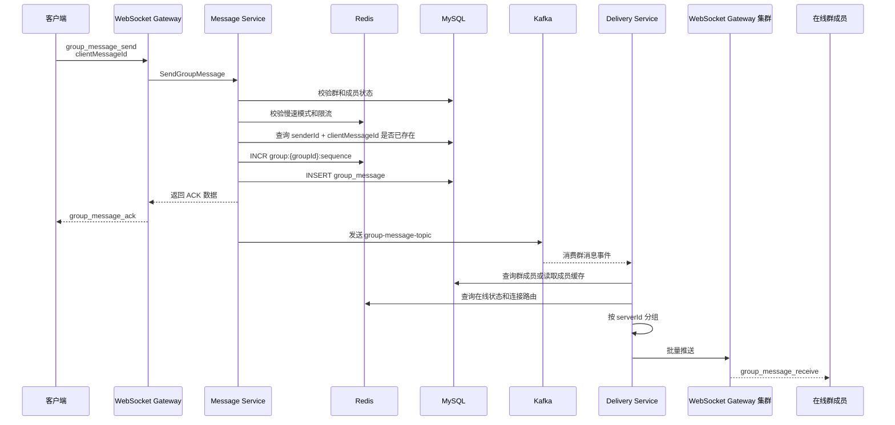

# GroupFlow 消息发送与投递链路详细设计文档

## 1. 文档说明

### 1.1 文档目的

本文档用于说明 GroupFlow 群聊系统中，群消息从客户端发送到服务端处理，再到在线群成员接收的完整技术链路。

本文档重点覆盖：

1. 客户端发送消息。
2. WebSocket Gateway 接收消息。
3. 消息服务校验。
4. 消息幂等处理。
5. 群内 sequence 生成。
6. 消息落库。
7. 服务端 ACK。
8. Kafka 异步投递。
9. 投递服务消费消息。
10. 在线用户筛选。
11. WebSocket 节点分片推送。
12. 客户端接收消息。
13. 断线补拉。
14. 失败场景处理。

### 1.2 设计目标

消息发送链路需要满足以下目标：

1. 消息不能重复。
2. 消息不能因为 WebSocket 推送失败而丢失。
3. 消息必须有群内顺序。
4. 客户端需要明确知道消息是否发送成功。
5. 大群消息不能阻塞发送请求。
6. 离线用户不做实时推送，重新上线后通过历史消息补拉。
7. 投递链路可以异步化、分片化、可观测。
8. 后续支持多 WebSocket 节点横向扩展。

------

## 2. 总体链路

### 2.1 简化流程

```text
客户端发送消息
  ↓
WebSocket Gateway 接收
  ↓
Message Service 校验
  ↓
生成 messageId 和 sequence
  ↓
写入 MySQL
  ↓
返回 ACK 给发送者
  ↓
写入 Kafka
  ↓
Delivery Service 消费
  ↓
查询在线成员
  ↓
按 WebSocket 节点分组
  ↓
推送给在线群成员
```

### 2.2 完整链路图



------

## 3. 核心设计原则

### 3.1 先落库，再 ACK

ACK 的语义是：

```text
服务端已经成功接收、校验并持久化该消息。
```

因此必须保证：

```text
消息写入 MySQL 成功后，才能返回 ACK。
```

不允许：

```text
先 ACK，再异步写库。
```

否则可能出现客户端显示发送成功，但历史消息查不到的问题。

------

### 3.2 ACK 不代表所有人收到

`group_message_ack` 只代表发送者的消息已经成功落库。

它不代表：

1. 所有在线成员已经收到。
2. 所有离线成员已经收到。
3. Kafka 投递一定成功。
4. 所有 WebSocket 节点推送成功。

群消息的最终可恢复性依赖 MySQL 历史消息补拉。

------

### 3.3 群消息只存一份

群消息只写入一条 `group_message`。

不为每个群成员复制消息。

错误设计：

```text
一个 10 万人群发送一条消息，给每个成员写一条 inbox 记录。
```

推荐设计：

```text
group_message 存一份消息。
group_member.last_read_sequence 记录每个用户读取位置。
```

------

### 3.4 在线实时推送，离线补拉

在线用户通过 WebSocket 实时接收消息。

离线用户不上线时不做实时投递。

离线用户重新进入群聊后，通过：

```text
GET /api/groups/{groupId}/messages?afterSequence=xxx
```

补拉遗漏消息。

------

### 3.5 大群异步投递

大群消息不能在发送链路里同步广播。

消息服务只负责：

1. 校验。
2. 幂等。
3. 生成 sequence。
4. 落库。
5. ACK。
6. 写入 Kafka。

投递服务负责异步广播。

------

## 4. 客户端发送消息设计

### 4.1 客户端发送数据

```json
{
  "type": "group_message_send",
  "requestId": "req_100001",
  "timestamp": 1710000000000,
  "data": {
    "groupId": 10001,
    "clientMessageId": "client_msg_1710000000000_a8f3",
    "messageType": "text",
    "content": "大家好，今天讨论大群广播设计。",
    "mentionAll": false,
    "mentionUserIds": [1002, 1003],
    "extra": {}
  }
}
```

### 4.2 客户端本地状态

用户点击发送后，客户端立即插入本地消息：

```json
{
  "clientMessageId": "client_msg_1710000000000_a8f3",
  "groupId": 10001,
  "senderId": 1001,
  "messageType": "text",
  "content": "大家好，今天讨论大群广播设计。",
  "status": "sending"
}
```

此时还没有：

1. `messageId`
2. `sequence`
3. `createdAt`

这些字段等待服务端 ACK 返回后填充。

------

### 4.3 ACK 超时

客户端发送消息后启动 ACK 计时器。

推荐超时时间：

```text
5 秒
```

如果超时未收到 ACK：

```text
status = failed
```

用户可以点击重试。

重试时必须复用原 `clientMessageId`。

------

## 5. WebSocket Gateway 处理设计

### 5.1 模块职责

WebSocket Gateway 不负责复杂业务。

它主要负责：

1. 连接鉴权。
2. 消息解析。
3. 根据 type 路由到业务服务。
4. 把业务服务返回结果写回客户端。
5. 把投递服务下发的消息推送给本机连接。

------

### 5.2 接收消息流程

```text
读取 WebSocket 消息
  ↓
反序列化 JSON
  ↓
校验 type
  ↓
校验连接是否已鉴权
  ↓
根据 type 分发
  ↓
group_message_send 调用 Message Service
```

### 5.3 Gateway 不直接写数据库

WebSocket Gateway 不应该直接操作：

1. `group_message`
2. `group_member`
3. `chat_group`

原因：

1. 业务逻辑容易分散。
2. 后续拆分服务困难。
3. 不利于统一做权限和幂等校验。

------

## 6. Message Service 处理设计

## 6.1 模块职责

Message Service 是发送链路的核心模块。

职责：

1. 校验发送者身份。
2. 校验群状态。
3. 校验成员状态。
4. 校验禁言和慢速模式。
5. 校验消息内容。
6. 处理幂等。
7. 生成 messageId。
8. 生成 group sequence。
9. 写入 MySQL。
10. 返回 ACK 数据。
11. 写入 Kafka 投递事件。

------

## 6.2 发送前校验顺序

推荐校验顺序：

```text
1. 校验 groupId 是否合法
2. 校验 content 是否为空
3. 校验 content 是否超长
4. 查询群信息
5. 校验群状态是否 normal
6. 查询群成员关系
7. 校验成员状态是否 normal
8. 校验全员禁言
9. 校验单人禁言
10. 校验慢速模式
11. 校验 @所有人权限
12. 校验 mentionUserIds 是否为群成员
13. 校验 clientMessageId 幂等
```

### 6.3 为什么先做基础参数校验

基础参数校验成本低，可以减少无效请求进入数据库。

例如：

1. 空消息。
2. 超长消息。
3. 非法 groupId。
4. 缺少 clientMessageId。

------

## 7. 消息幂等设计

### 7.1 幂等目标

解决以下问题：

```text
消息已经写入成功，但 ACK 在网络中丢失。
客户端以为失败，点击重试。
服务端不能重复生成两条消息。
```

### 7.2 幂等键

服务端使用：

```text
sender_id + client_message_id
```

作为唯一键。

数据库约束：

```sql
UNIQUE KEY uk_sender_client_msg(sender_id, client_message_id)
```

### 7.3 幂等处理流程

```text
收到发送请求
  ↓
查询 sender_id + client_message_id 是否存在
  ↓
如果存在
      返回原 messageId、sequence、createdAt
  ↓
如果不存在
      继续生成 sequence 并写入新消息
```

### 7.4 插入冲突处理

即使发送前查了一次，也可能存在并发重复请求。

因此插入时也需要处理唯一键冲突。

流程：

```text
INSERT group_message
  ↓
如果成功
      返回新消息 ACK
  ↓
如果 uk_sender_client_msg 冲突
      查询原消息
      返回原消息 ACK
```

### 7.5 客户端重试要求

客户端点击重试时：

```text
必须复用原 clientMessageId
```

如果重新生成 clientMessageId，服务端会认为是新消息，从而产生重复消息。

------

## 8. Sequence 生成设计

### 8.1 sequence 作用

`sequence` 是群内消息顺序号。

用途：

1. 消息排序。
2. 历史消息游标分页。
3. 未读数计算。
4. 断线补拉。
5. 消息缺口检测。
6. 消息撤回定位。

------

### 8.2 Redis 生成方案

使用 Redis INCR：

```text
INCR group:{groupId}:sequence
```

示例：

```text
group:10001:sequence -> 100201
```

### 8.3 初始化 sequence

如果 Redis 中不存在该群 sequence，需要从 MySQL 初始化：

```sql
SELECT MAX(sequence)
FROM group_message
WHERE group_id = ?;
```

然后设置：

```text
SET group:{groupId}:sequence {maxSequence}
```

再执行 INCR。

------

### 8.4 sequence 跳号问题

可能出现：

```text
Redis INCR 成功，得到 sequence = 100201
MySQL INSERT 失败
```

此时 sequence 100201 没有对应消息。

这是允许的。

原因：

1. sequence 的主要作用是排序，不是连续无缺口编号。
2. 强行保证无跳号会显著增加系统复杂度。
3. 客户端发现缺口后可以补拉确认。
4. 补拉不到缺失消息时，客户端应接受跳号。

------

### 8.5 sequence 不使用 MySQL 自增的原因

不使用全局自增 ID 做群内顺序，原因：

1. 全局 ID 不能直接表示群内连续顺序。
2. 按群分页时需要 groupId + sequence。
3. Redis INCR 按群生成更清晰。
4. 后续分表后仍然可以按群维护 sequence。

------

## 9. 消息落库设计

### 9.1 插入 group_message

```sql
INSERT INTO group_message (
    message_id,
    group_id,
    sender_id,
    client_message_id,
    message_type,
    content,
    sequence,
    status,
    mention_all,
    mention_user_ids,
    created_at,
    updated_at
) VALUES (?, ?, ?, ?, ?, ?, ?, 'normal', ?, ?, NOW(), NOW());
```

### 9.2 写库成功后的操作

写库成功后：

1. 更新 Redis 群最大 sequence。
2. 构造 ACK。
3. 返回给 WebSocket Gateway。
4. 构造投递事件。
5. 写入 Kafka。

Redis 更新：

```text
SET group:{groupId}:max_sequence {sequence}
```

------

### 9.3 写库失败处理

写库失败可能原因：

1. MySQL 异常。
2. 唯一键冲突。
3. 字段长度异常。
4. 数据库连接池耗尽。

处理规则：

| 失败原因       | 处理方式               |
| -------------- | ---------------------- |
| 幂等唯一键冲突 | 查询原消息，返回原 ACK |
| 临时数据库异常 | 返回可重试错误         |
| 参数非法       | 返回不可重试错误       |
| 服务端异常     | 返回可重试错误         |

------

## 10. ACK 返回设计

### 10.1 成功 ACK

```json
{
  "type": "group_message_ack",
  "requestId": "req_100001",
  "timestamp": 1710000000100,
  "data": {
    "groupId": 10001,
    "clientMessageId": "client_msg_1710000000000_a8f3",
    "messageId": "msg_100000001",
    "sequence": 100201,
    "messageType": "text",
    "status": "success",
    "createdAt": "2026-06-28T10:00:00.000Z"
  }
}
```

### 10.2 失败响应

```json
{
  "type": "group_message_failed",
  "requestId": "req_100001",
  "timestamp": 1710000000100,
  "data": {
    "groupId": 10001,
    "clientMessageId": "client_msg_1710000000000_a8f3",
    "code": "MESSAGE_RATE_LIMITED",
    "message": "发送过于频繁，请稍后再试",
    "retryable": true
  }
}
```

------

### 10.3 常见错误码

| 错误码                   | 说明           | 是否可重试 |
| ------------------------ | -------------- | ---------- |
| GROUP_NOT_FOUND          | 群不存在       | 否         |
| GROUP_DISMISSED          | 群已解散       | 否         |
| GROUP_MEMBER_NOT_FOUND   | 用户不是群成员 | 否         |
| GROUP_MEMBER_KICKED      | 用户已被踢出   | 否         |
| GROUP_MEMBER_MUTED       | 用户被禁言     | 否         |
| GROUP_MUTE_ALL           | 群已全员禁言   | 否         |
| MESSAGE_CONTENT_EMPTY    | 消息为空       | 否         |
| MESSAGE_CONTENT_TOO_LONG | 消息过长       | 否         |
| MESSAGE_RATE_LIMITED     | 发送频率过高   | 是         |
| MESSAGE_INTERNAL_ERROR   | 服务内部错误   | 是         |

------

## 11. Kafka 投递事件设计

### 11.1 Topic

```text
group-message-topic
```

### 11.2 分区 Key

推荐使用：

```text
groupId
```

原因：

1. 同一个群的消息进入同一个分区。
2. 有利于保持同群消息消费顺序。
3. Delivery Service 处理同群消息更简单。

### 11.3 事件结构

```json
{
  "eventId": "evt_100000001",
  "eventType": "group_message_created",
  "groupId": 10001,
  "messageId": "msg_100000001",
  "sequence": 100201,
  "senderId": 1001,
  "messageType": "text",
  "createdAt": "2026-06-28T10:00:00.000Z"
}
```

### 11.4 是否携带完整消息内容

有两种方案。

#### 方案一：事件只携带 messageId

投递服务根据 messageId 查询 MySQL。

优点：

1. Kafka 消息更小。
2. 数据以 MySQL 为准。
3. 消息内容修改后可读取最新状态。

缺点：

1. 投递服务需要查库。
2. 大群高 QPS 下数据库压力增加。

#### 方案二：事件携带完整消息内容

优点：

1. 投递服务不需要再次查 MySQL。
2. 投递延迟更低。
3. 减少数据库读压力。

缺点：

1. Kafka 消息变大。
2. 消息内容在事件中冗余。
3. 如果消息被快速撤回，需要额外处理撤回事件。

#### 推荐

一期推荐方案二，事件携带完整消息内容。

原因：

1. 实现简单。
2. 投递链路更快。
3. 对大群广播更友好。

事件示例：

```json
{
  "eventId": "evt_100000001",
  "eventType": "group_message_created",
  "groupId": 10001,
  "message": {
    "messageId": "msg_100000001",
    "groupId": 10001,
    "senderId": 1001,
    "senderName": "张三",
    "senderAvatar": "https://example.com/avatar.png",
    "messageType": "text",
    "content": "大家好，今天讨论大群广播设计。",
    "sequence": 100201,
    "status": "normal",
    "mentionAll": false,
    "mentionUserIds": [1002, 1003],
    "createdAt": "2026-06-28T10:00:00.000Z"
  }
}
```

------

## 12. Kafka 投递可靠性设计

### 12.1 基础方案

消息落库成功后，Message Service 发送 Kafka 事件。

```text
MySQL INSERT 成功
  ↓
返回 ACK
  ↓
发送 Kafka
```

这个方案简单，但存在问题：

```text
MySQL 成功，Kafka 发送失败。
```

此时实时推送会丢失，但消息仍在 MySQL 中，用户可以补拉。

------

### 12.2 强化方案：Outbox

为了保证 Kafka 事件可靠，可以引入 Outbox。

流程：

```text
MySQL 事务中：
  1. 插入 group_message
  2. 插入 message_outbox

事务提交后：
  后台任务扫描 outbox
  发送 Kafka
  成功后更新 outbox.status = sent
```

### 12.3 Outbox 表

```sql
CREATE TABLE message_outbox (
    id BIGINT PRIMARY KEY AUTO_INCREMENT COMMENT '事件ID',
    event_id VARCHAR(64) NOT NULL COMMENT '事件唯一ID',
    event_type VARCHAR(64) NOT NULL COMMENT '事件类型',
    aggregate_type VARCHAR(64) NOT NULL COMMENT '聚合类型',
    aggregate_id VARCHAR(64) NOT NULL COMMENT '聚合ID',
    payload JSON NOT NULL COMMENT '事件内容',
    status VARCHAR(32) NOT NULL DEFAULT 'pending' COMMENT '状态：pending/sent/failed',
    retry_count INT NOT NULL DEFAULT 0 COMMENT '重试次数',
    next_retry_at DATETIME DEFAULT NULL COMMENT '下次重试时间',
    created_at DATETIME NOT NULL COMMENT '创建时间',
    updated_at DATETIME NOT NULL COMMENT '更新时间',

    UNIQUE KEY uk_event_id (event_id),
    INDEX idx_status_retry (status, next_retry_at)
) ENGINE=InnoDB DEFAULT CHARSET=utf8mb4 COMMENT='消息事件Outbox表';
```

### 12.4 一期建议

一期可以先不实现 Outbox，采用简单 Kafka 发送。

但代码结构中要保留事件发布接口：

```go
type EventPublisher interface {
    PublishGroupMessageCreated(ctx context.Context, event GroupMessageCreatedEvent) error
}
```

后续可以把实现从直接 Kafka 替换成 Outbox。

------

## 13. Delivery Service 设计

## 13.1 模块职责

Delivery Service 负责从 Kafka 消费群消息事件，并推送给在线群成员。

核心职责：

1. 消费 `group-message-topic`。
2. 解析消息事件。
3. 查询群成员。
4. 查询在线状态。
5. 过滤离线成员。
6. 按 WebSocket 节点分组。
7. 批量投递给对应 WebSocket Gateway。
8. 记录投递延迟和失败数量。

------

## 13.2 消费流程

```text
消费 Kafka 消息
  ↓
解析 groupId 和 message
  ↓
查询群类型
  ↓
查询群成员或在线成员
  ↓
过滤发送者策略
  ↓
查询 Redis 连接路由
  ↓
按 serverId 分组
  ↓
调用 WS 节点内部推送接口
  ↓
提交 Kafka offset
```

------

## 13.3 群成员查询策略

### 普通群

普通群成员数量较少，可以查询全部成员：

```sql
SELECT user_id
FROM group_member
WHERE group_id = ?
  AND status = 'normal';
```

### 大群

大群不建议每条消息都查 MySQL 全量成员。

更推荐：

1. 查询在线用户集合。
2. 判断在线用户是否属于群成员。
3. 或维护群在线成员集合。

可选 Redis Key：

```text
group:{groupId}:online_users
```

但超大群维护精确集合也有成本。

一期可以先用 MySQL 查询成员，后续压测后优化。

------

## 13.4 在线状态查询

Redis 连接路由：

```text
online:user:{userId} -> serverId
```

如果支持多端连接：

```text
online:user:{userId}:connections -> connectionId set
connection:{connectionId} -> serverId
```

Delivery Service 根据用户列表批量查询在线状态。

推荐批量查询：

```text
MGET online:user:{userId1} online:user:{userId2} ...
```

不要逐个用户查 Redis。

------

## 13.5 按 WebSocket 节点分组

查询在线路由后得到：

```text
user_1001 -> ws-server-01
user_1002 -> ws-server-01
user_1003 -> ws-server-02
user_1004 -> ws-server-03
```

分组后：

```text
ws-server-01: [1001, 1002]
ws-server-02: [1003]
ws-server-03: [1004]
```

然后对每个 WebSocket 节点发送一次批量推送请求。

------

## 14. WebSocket Gateway 内部推送设计

### 14.1 内部推送接口

Delivery Service 可以通过内部 HTTP 或 RPC 调用 WS 节点。

示例：

```text
POST /internal/ws/push
```

请求：

```json
{
  "targetUserIds": [1001, 1002, 1003],
  "message": {
    "type": "group_message_receive",
    "requestId": "",
    "timestamp": 1710000000200,
    "data": {
      "groupId": 10001,
      "messageId": "msg_100000001",
      "senderId": 1001,
      "senderName": "张三",
      "messageType": "text",
      "content": "大家好",
      "sequence": 100201,
      "status": "normal",
      "createdAt": "2026-06-28T10:00:00.000Z"
    }
  }
}
```

### 14.2 Gateway 推送流程

```text
收到内部推送请求
  ↓
遍历 targetUserIds
  ↓
查找本机连接
  ↓
写入连接 SendChan
  ↓
返回推送结果
```

### 14.3 推送结果

```json
{
  "successUserIds": [1001, 1002],
  "failedUserIds": [1003],
  "notFoundUserIds": [1004]
}
```

### 14.4 不强制重试到成功

如果某个用户推送失败，不需要无限重试。

原因：

1. 群消息已经落库。
2. 用户可以通过补拉恢复。
3. 无限重试会放大系统压力。
4. 大群场景下推送失败应以可恢复为主，而不是强一致投递。

------

## 15. 在线与离线用户处理

### 15.1 在线用户

在线用户需要实时推送。

处理方式：

```text
Delivery Service 查询 Redis 在线状态
  ↓
找到用户所在 WS 节点
  ↓
调用 WS 节点推送
```

### 15.2 离线用户

离线用户不做实时投递。

不写离线 inbox 表。

用户上线后：

```text
根据 group_member.last_read_sequence 或客户端 lastReceivedSequence 补拉历史消息。
```

### 15.3 为什么不存离线消息表

如果为每个离线成员写离线消息：

```text
10 万人群
8 万人离线
发送 1 条消息
产生 8 万条离线记录
```

这会造成严重写放大。

推荐：

```text
群消息存一份。
离线用户上线后按 sequence 拉取。
```

------

## 16. 发送者推送策略

### 16.1 是否推送给发送者

建议推送给发送者的所有在线连接。

原因：

1. 多端同步。
2. 发送者其他设备需要收到消息。
3. 当前设备可根据 ACK 和 receive 做去重。

### 16.2 当前设备去重

当前设备已经通过 ACK 更新了本地消息。

如果又收到 `group_message_receive`，客户端需要：

```text
根据 messageId 或 clientMessageId 判断是否已存在。
存在则更新，不重复插入。
```

### 16.3 多端场景

如果用户 A 在 Web 和手机同时在线：

1. Web 发送消息。
2. Web 收到 ACK。
3. 手机收到 `group_message_receive`。
4. Web 也可能收到 `group_message_receive`，但要去重。

------

## 17. 大群投递设计

## 17.1 大群瓶颈

大群消息投递瓶颈主要来自：

1. 群成员数量大。
2. 在线用户数量大。
3. 单条消息 fanout 高。
4. Redis 查询压力大。
5. WebSocket 推送压力大。
6. 前端渲染压力大。

------

## 17.2 大群投递原则

```text
消息服务不直接广播。
投递服务异步广播。
只推在线用户。
按 WS 节点分片。
批量推送。
失败允许补拉恢复。
```

------

## 17.3 大群投递流程

```text
Kafka 消息
  ↓
Delivery Service 消费
  ↓
识别 group_type = large
  ↓
查询在线成员
  ↓
按 serverId 分组
  ↓
分批推送给 WS 节点
  ↓
记录 fanout 数量和耗时
```

### 17.4 分批大小

推荐每批：

```text
500 - 1000 个用户
```

根据压测调整。

### 17.5 分片任务示例

```text
ws-server-01: 2300 人
  batch-1: 1000
  batch-2: 1000
  batch-3: 300

ws-server-02: 1800 人
  batch-1: 1000
  batch-2: 800
```

------

## 18. 消息顺序设计

### 18.1 服务端顺序

服务端通过 `sequence` 保证消息顺序。

同一个群：

```text
sequence 1001
sequence 1002
sequence 1003
```

客户端按 sequence 排序。

### 18.2 Kafka 顺序

Kafka 分区 Key 使用 `groupId`。

同一个群消息进入同一个 Kafka 分区，有利于保持消费顺序。

### 18.3 推送顺序

即使 Kafka 消费有序，WebSocket 网络传输仍可能造成客户端接收乱序。

因此客户端必须：

1. 按 sequence 排序。
2. 检测 sequence 缺口。
3. 必要时补拉。

------

## 19. 客户端接收消息设计

### 19.1 接收消息结构

```json
{
  "type": "group_message_receive",
  "requestId": "",
  "timestamp": 1710000000200,
  "data": {
    "groupId": 10001,
    "messageId": "msg_100000001",
    "senderId": 1001,
    "senderName": "张三",
    "messageType": "text",
    "content": "大家好",
    "sequence": 100201,
    "status": "normal",
    "mentionAll": false,
    "mentionUserIds": [],
    "createdAt": "2026-06-28T10:00:00.000Z"
  }
}
```

### 19.2 客户端处理流程

```text
收到 group_message_receive
  ↓
检查 messageId 是否已存在
  ↓
如果存在，更新消息状态，不重复插入
  ↓
如果不存在，按 sequence 插入
  ↓
检查 sequence 是否连续
  ↓
如果不连续，触发补拉
  ↓
更新群列表最后一条消息
  ↓
更新未读数
```

### 19.3 当前群和非当前群处理

如果当前正在查看该群：

```text
插入消息列表。
如果用户在底部，自动滚动。
延迟上报 lastReadSequence。
```

如果当前不在该群：

```text
更新群列表最后一条消息。
未读数 + 1。
如果 @ 当前用户，展示 @我。
```

------

## 20. 断线补拉设计

### 20.1 断线场景

可能出现：

1. 客户端网络断开。
2. WebSocket 服务重启。
3. Nginx 超时断开。
4. 客户端切换网络。
5. 服务端心跳超时关闭。

### 20.2 客户端维护状态

每个群维护：

```text
lastReceivedSequence
lastReadSequence
```

### 20.3 重连后补拉

```text
WebSocket 重连成功
  ↓
对当前打开的群调用补拉接口
  ↓
GET /api/groups/{groupId}/messages?afterSequence={lastReceivedSequence}&limit=100
  ↓
合并返回消息
```

### 20.4 补拉接口

```text
GET /api/groups/{groupId}/messages?afterSequence=100201&limit=100
```

响应：

```json
{
  "groupId": 10001,
  "messages": [
    {
      "messageId": "msg_100000002",
      "sequence": 100202,
      "content": "断线期间的消息"
    }
  ],
  "hasMore": false,
  "maxSequence": 100202
}
```

------

## 21. 失败场景处理

## 21.1 ACK 丢失

场景：

```text
消息落库成功。
服务端返回 ACK。
ACK 在网络中丢失。
客户端显示 failed。
用户点击重试。
```

处理：

```text
客户端复用 clientMessageId。
服务端根据 senderId + clientMessageId 查到原消息。
返回原 ACK。
不会产生重复消息。
```

------

## 21.2 Kafka 发送失败

场景：

```text
消息落库成功。
ACK 已返回。
Kafka 发送失败。
在线成员没有实时收到。
```

处理：

1. 一期允许这种情况存在。
2. 用户可以通过补拉恢复。
3. 后续使用 Outbox 保证 Kafka 事件最终发送。

------

## 21.3 WebSocket 推送失败

场景：

```text
Delivery Service 推送到 WS 节点。
WS 节点发现连接不存在。
```

处理：

1. 清理 Redis 在线状态。
2. 记录推送失败指标。
3. 不无限重试。
4. 用户重新连接后补拉。

------

## 21.4 Redis sequence 成功但 MySQL 写入失败

场景：

```text
Redis INCR 得到 sequence = 100203。
MySQL INSERT 失败。
```

结果：

```text
sequence 100203 跳号。
```

处理：

1. 允许跳号。
2. 客户端发现缺口后补拉。
3. 补拉不到则跳过。

------

## 21.5 投递服务重复消费

Kafka 可能发生重复消费。

处理：

1. 客户端根据 messageId 去重。
2. WebSocket Gateway 可以不做复杂去重。
3. Delivery Service 可以记录 eventId 去重，但一期不是必须。

------

## 22. 关键接口设计

## 22.1 WebSocket 发送消息

```text
type = group_message_send
```

请求数据：

```json
{
  "groupId": 10001,
  "clientMessageId": "client_msg_001",
  "messageType": "text",
  "content": "hello",
  "mentionAll": false,
  "mentionUserIds": []
}
```

------

## 22.2 HTTP 补拉消息

```text
GET /api/groups/{groupId}/messages?afterSequence=100201&limit=100
```

------

## 22.3 内部推送接口

```text
POST /internal/ws/push
```

请求：

```json
{
  "targetUserIds": [1001, 1002],
  "message": {
    "type": "group_message_receive",
    "timestamp": 1710000000200,
    "data": {}
  }
}
```

------

## 23. 核心伪代码

## 23.1 Message Service 发送消息

```go
func SendGroupMessage(ctx context.Context, req SendGroupMessageRequest) (*SendGroupMessageResult, error) {
    if strings.TrimSpace(req.Content) == "" {
        return nil, NewBizError("MESSAGE_CONTENT_EMPTY", "消息内容为空")
    }

    if len(req.Content) > 2000 {
        return nil, NewBizError("MESSAGE_CONTENT_TOO_LONG", "消息内容过长")
    }

    group, err := groupRepo.GetByID(ctx, req.GroupID)
    if err != nil {
        return nil, err
    }

    if group.Status != "normal" {
        return nil, NewBizError("GROUP_NOT_AVAILABLE", "群不可用")
    }

    member, err := memberRepo.GetMember(ctx, req.GroupID, req.SenderID)
    if err != nil {
        return nil, err
    }

    if member.Status != "normal" {
        return nil, NewBizError("GROUP_MEMBER_NOT_FOUND", "用户不是正常群成员")
    }

    oldMsg, err := messageRepo.GetBySenderAndClientMsgID(ctx, req.SenderID, req.ClientMessageID)
    if err == nil && oldMsg != nil {
        return BuildAck(oldMsg), nil
    }

    sequence, err := sequenceService.Next(ctx, req.GroupID)
    if err != nil {
        return nil, err
    }

    msg := &GroupMessage{
        MessageID:       idgen.NewMessageID(),
        GroupID:         req.GroupID,
        SenderID:        req.SenderID,
        ClientMessageID: req.ClientMessageID,
        MessageType:     req.MessageType,
        Content:         req.Content,
        Sequence:        sequence,
        Status:          "normal",
        CreatedAt:       time.Now(),
        UpdatedAt:       time.Now(),
    }

    err = messageRepo.Insert(ctx, msg)
    if IsDuplicateClientMessageError(err) {
        oldMsg, findErr := messageRepo.GetBySenderAndClientMsgID(ctx, req.SenderID, req.ClientMessageID)
        if findErr != nil {
            return nil, findErr
        }
        return BuildAck(oldMsg), nil
    }

    if err != nil {
        return nil, err
    }

    _ = redisClient.Set(ctx, fmt.Sprintf("group:%d:max_sequence", req.GroupID), sequence, 0)

    event := BuildGroupMessageCreatedEvent(msg)
    if publishErr := eventPublisher.Publish(ctx, event); publishErr != nil {
        logger.Errorf("publish group message event failed, groupId:%d, messageId:%s, err:%v", req.GroupID, msg.MessageID, publishErr)
    }

    return BuildAck(msg), nil
}
```

------

## 23.2 Delivery Service 消费消息

```go
func HandleGroupMessageCreated(ctx context.Context, event GroupMessageCreatedEvent) error {
    groupID := event.GroupID

    members, err := memberRepo.ListNormalMemberIDs(ctx, groupID)
    if err != nil {
        return err
    }

    onlineRoutes, err := onlineService.BatchGetUserRoutes(ctx, members)
    if err != nil {
        return err
    }

    serverGroups := make(map[string][]int64)
    for userID, serverID := range onlineRoutes {
        serverGroups[serverID] = append(serverGroups[serverID], userID)
    }

    for serverID, userIDs := range serverGroups {
        batches := SplitUserIDs(userIDs, 1000)
        for _, batch := range batches {
            err := wsInternalClient.Push(ctx, serverID, batch, event.ToWSMessage())
            if err != nil {
                logger.Errorf("push group message failed, groupId:%d, serverId:%s, userCount:%d, err:%v", groupID, serverID, len(batch), err)
            }
        }
    }

    return nil
}
```

------

## 24. 指标与日志

## 24.1 指标

消息发送指标：

```text
group_message_send_total
group_message_send_failed_total
group_message_ack_latency_ms
group_message_persist_latency_ms
```

投递指标：

```text
group_message_delivery_total
group_message_delivery_failed_total
group_message_delivery_latency_ms
group_message_fanout_total
```

Kafka 指标：

```text
kafka_group_message_produce_total
kafka_group_message_consume_total
kafka_group_message_consume_lag
```

WebSocket 指标：

```text
ws_push_total
ws_push_failed_total
ws_online_connections
```

------

## 24.2 日志字段

发送链路日志字段：

```json
{
  "traceId": "trace_001",
  "userId": 1001,
  "groupId": 10001,
  "clientMessageId": "client_msg_001",
  "messageId": "msg_100001",
  "sequence": 100201,
  "event": "group_message_send",
  "durationMs": 23
}
```

Go 日志示例：

```go
logger.Infof("send group message success, groupId:%d, userId:%d, sequence:%d", groupID, userID, sequence)
```

------

## 25. 一期实现范围

一期必须实现：

1. WebSocket 发送消息。
2. Message Service 校验。
3. clientMessageId 幂等。
4. Redis group sequence。
5. MySQL 消息落库。
6. 服务端 ACK。
7. Kafka 事件发送，或预留事件发布接口。
8. Delivery Service 基础消费。
9. WebSocket Gateway 本机推送。
10. HTTP 历史消息补拉。
11. 客户端 ACK 超时与重试。
12. 客户端 messageId 去重。
13. 客户端 sequence 排序。

一期可以简化：

1. 先单 WebSocket 节点。
2. Delivery Service 可以和主服务同进程。
3. Kafka 可以在阶段一后半段接入。
4. Outbox 可以暂缓。
5. 大群在线成员精确优化可以后置。

------

## 26. 后续演进

后续可以继续增强：

1. Outbox 保证 Kafka 事件可靠发布。
2. 多 WebSocket 节点连接路由。
3. 大群在线成员集合优化。
4. 按 serverId 分片投递。
5. 热点群限流。
6. 投递任务重试队列。
7. Kafka 消费者水平扩展。
8. 消息表分表。
9. 消息搜索索引。
10. 多端同步。

------

## 27. 总结

GroupFlow 消息发送与投递链路的核心设计是：

1. 客户端发送消息时生成 clientMessageId。
2. 服务端使用 senderId + clientMessageId 保证幂等。
3. 服务端使用 Redis INCR 生成群内 sequence。
4. 消息成功写入 MySQL 后，服务端返回 ACK。
5. ACK 只代表消息已落库，不代表所有成员已收到。
6. 消息落库后写入 Kafka。
7. Delivery Service 消费 Kafka 并异步投递。
8. 投递服务只推送在线用户。
9. 离线用户不上线时不生成离线消息。
10. 用户上线后通过历史消息补拉恢复。
11. 大群通过 Kafka 削峰、分片投递、批量推送降低压力。
12. WebSocket 推送失败不影响消息最终可见性，因为消息已持久化。

这条链路保证了消息发送可靠、群内顺序可控、大群投递可扩展，并且为后续分布式 WebSocket 集群和高并发压测预留了空间。