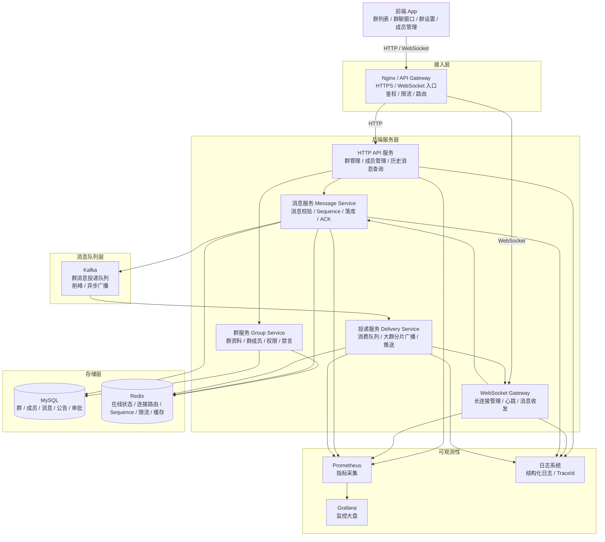
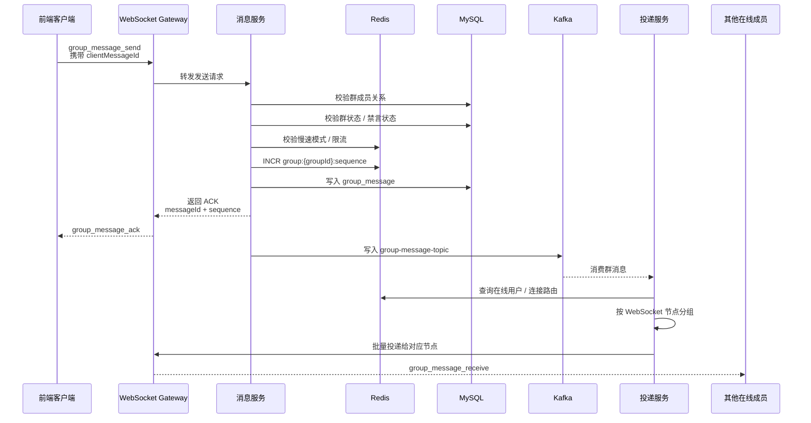
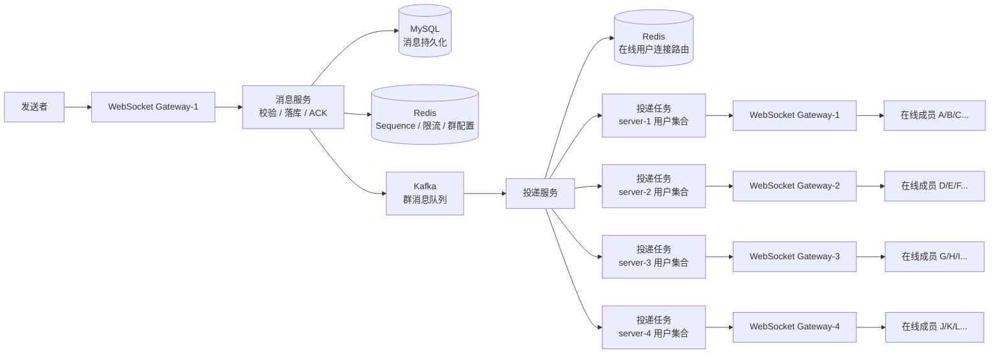
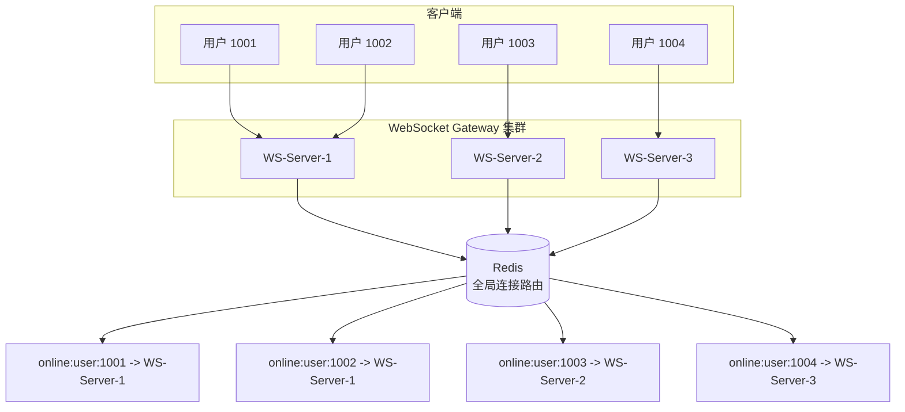
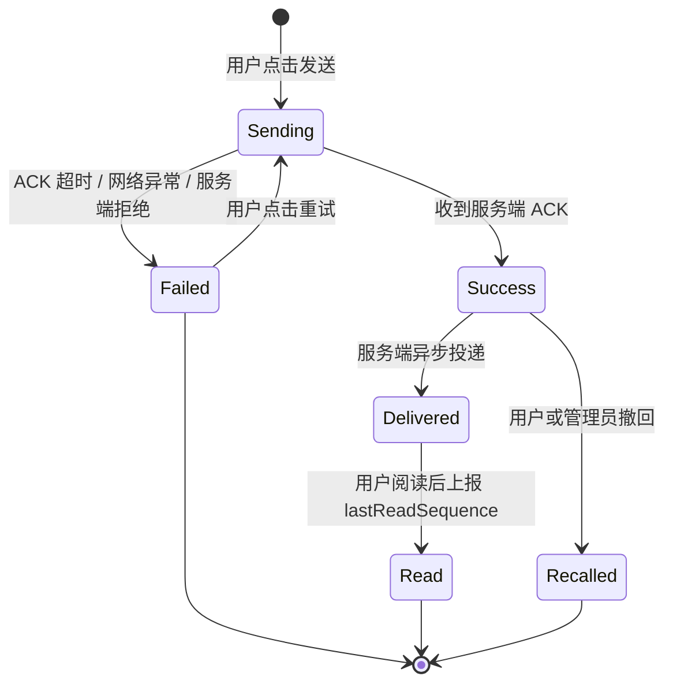
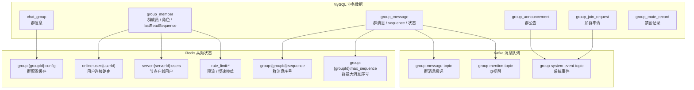
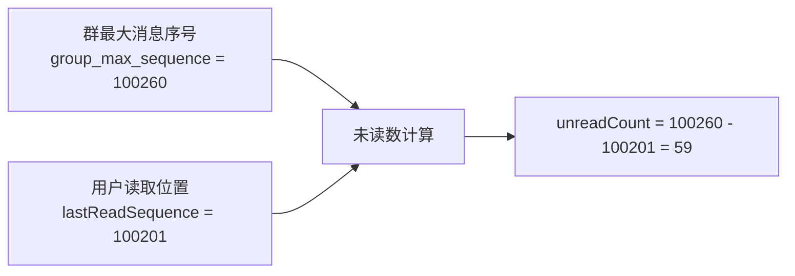
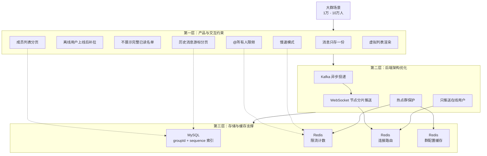
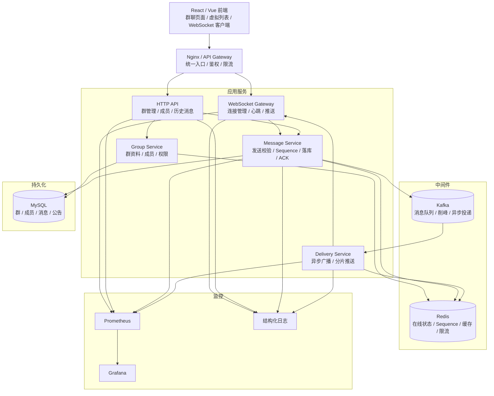

下面给你一套**群聊系统技术架构设计图**，重点围绕：

```text
群聊
WebSocket 长连接
大群消息广播
消息可靠性
Redis 在线状态
Kafka 异步投递
MySQL 持久化
大群性能优化
```

------

# 1. 总体技术架构图



------

# 2. 架构分层说明

## 2.1 前端层

负责群聊交互：

```text
群列表
群聊消息窗口
消息输入框
群成员列表
群设置
群管理中心
消息搜索
群公告
群文件
大群性能提示
```

前端重点能力：

```text
WebSocket 自动重连
心跳保活
消息 ACK 等待
发送失败重试
消息本地临时展示
历史消息分页
虚拟列表渲染
未读数展示
@我提醒
```

------

## 2.2 接入层

接入层统一处理：

```text
HTTP 请求
WebSocket 连接
鉴权
限流
负载均衡
跨域
TLS
```

可以使用：

```text
Nginx
API Gateway
Kong
Traefik
```

学习阶段直接用 Nginx 即可。

------

## 2.3 WebSocket Gateway

WebSocket Gateway 是群聊系统的核心入口。

负责：

```text
用户连接建立
Token 鉴权
连接注册
心跳检测
断线清理
接收客户端消息
向客户端推送消息
```

内部维护本机连接：

```text
connectionId -> WebSocket连接
userId -> connectionId列表
```

同时把全局连接状态写入 Redis：

```text
online:user:{userId} -> serverId
server:{serverId}:users -> userId集合
```

------

## 2.4 群服务 Group Service

群服务负责群管理能力：

```text
创建群
修改群信息
群成员分页
加群审批
踢人
退群
设置管理员
群公告
禁言
解散群
大群模式配置
慢速模式配置
```

群服务主要读写：

```text
chat_group
group_member
group_join_request
group_announcement
```

------

## 2.5 消息服务 Message Service

消息服务负责消息发送的核心逻辑：

```text
校验用户是否在群内
校验群状态
校验用户是否禁言
校验慢速模式
生成 messageId
生成 group sequence
消息落库
返回 ACK
写入 Kafka
```

消息服务遵循原则：

```text
先校验
再生成 sequence
再落库
再 ACK
再异步投递
```

------

## 2.6 投递服务 Delivery Service

投递服务负责把消息真正推给在线成员。

职责：

```text
消费 Kafka 消息
查询群成员
过滤在线成员
按 WebSocket 节点分组
批量推送
失败重试
记录投递指标
```

大群时不能同步逐个推送，必须异步分片。

------

## 2.7 Redis

Redis 用于高频状态和缓存：

```text
用户在线状态
WebSocket 连接路由
群最大 sequence
群配置缓存
群成员缓存
限流计数器
慢速模式控制
@所有人频率控制
```

典型 Key：

```text
online:user:{userId}
server:{serverId}:users
group:{groupId}:sequence
group:{groupId}:config
group:{groupId}:max_sequence
rate_limit:group:{groupId}:user:{userId}
rate_limit:group:{groupId}:mention_all
```

------

## 2.8 MySQL

MySQL 存储核心业务数据：

```text
群信息
群成员
群消息
群公告
加群申请
禁言记录
撤回记录
```

核心表：

```text
chat_group
group_member
group_message
group_announcement
group_join_request
group_mute_record
```

------

## 2.9 Kafka

Kafka 用于消息异步投递：

```text
群消息投递
系统消息投递
@提醒投递
大群广播削峰
后续消息搜索索引构建
```

建议 Topic：

```text
group-message-topic
group-system-event-topic
group-mention-topic
```

------

# 3. 群消息发送链路图



------

# 4. 大群消息广播架构图



核心思想：

```text
消息服务不直接广播大群消息。
消息服务只负责校验、落库、ACK、写队列。
真正的广播由投递服务异步完成。
投递服务按 WebSocket 节点分片推送。
```

------

# 5. WebSocket 多节点连接路由图



当投递服务要推送消息给用户时：

```text
1. 先查 Redis，知道用户在哪台 WebSocket 节点上。
2. 按 serverId 聚合用户。
3. 把消息发给对应 WebSocket 节点。
4. WebSocket 节点只负责推送自己本机连接。
```

------

# 6. 消息可靠性设计图



消息可靠性依赖三个关键设计：

```text
clientMessageId：防止重复发送
server ACK：确认服务端已成功处理
sequence：保证群内消息顺序
```

------

# 7. 存储架构图



------

# 8. 未读数设计图



设计原则：

```text
不为每个用户、每条消息都写已读记录。
每个用户在每个群只维护一个 lastReadSequence。
未读数通过群最大 sequence 减去用户 lastReadSequence 得到。
```

这样适合大群。

------

# 9. 大群性能优化架构图



------

# 10. 推荐最终技术架构总结图



------

# 11. 一句话说明这张架构图

这套架构的核心是：

```text
前端通过 WebSocket 发送和接收群消息；
WebSocket Gateway 负责长连接；
消息服务负责校验、生成 sequence、落库和 ACK；
Kafka 负责大群消息削峰；
投递服务负责异步分片广播；
Redis 负责在线状态、连接路由、限流和缓存；
MySQL 负责群、成员、消息等核心数据持久化。
```

项目初期即使不马上拆成多个微服务，也建议**代码结构按这个架构拆模块**，这样后续做大群、多节点、压测和扩展时，不需要推翻重做。